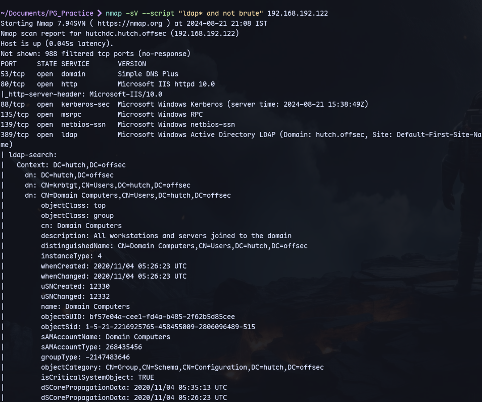
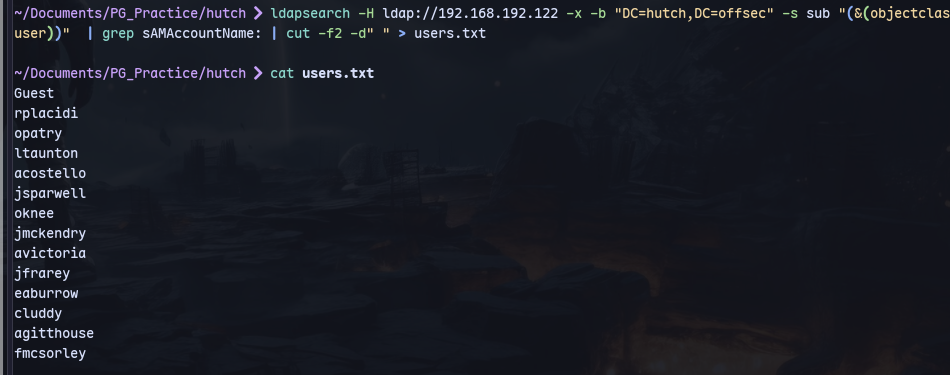
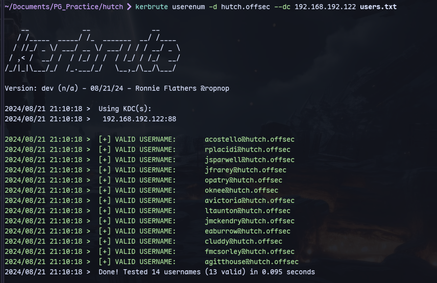
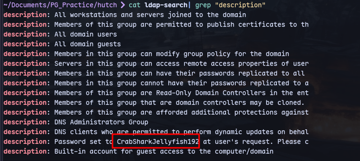
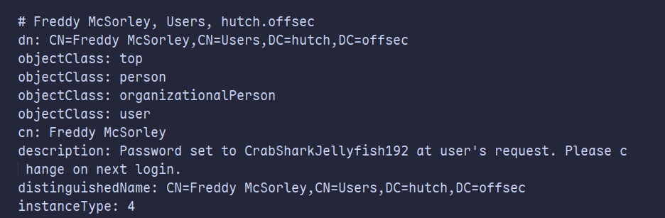
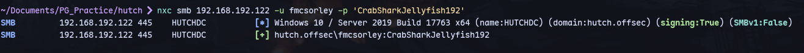

Using nmap:
```
nmap -sV --script "ldap* and not brute" 192.168.192.122
```

We get a lot of info.

We can use ldapsearch to get users list:
```
ldapsearch -H ldap://192.168.192.122 -x -b "DC=hutch,DC=offsec" -s sub "(&(objectclass=user))"  | grep sAMAccountName: | cut -f2 -d" " > users.txt
```


Now using kerbrute:
```
kerbrute userenum -d hutch.offsec --dc 192.168.192.122 users.txt
```


Only Guest isn't valid

Now checking additional info in ldap:
```
ldapsearch -x -H ldap://192.168.192.122 -D '' -w '' -b "DC=hutch,DC=offsec" > ldap-search
```
Now we can check the description for each users:
```
cat ldap-search| grep "description"
```


Checking the user:

It's frank mcsorley.

Checking the password:


