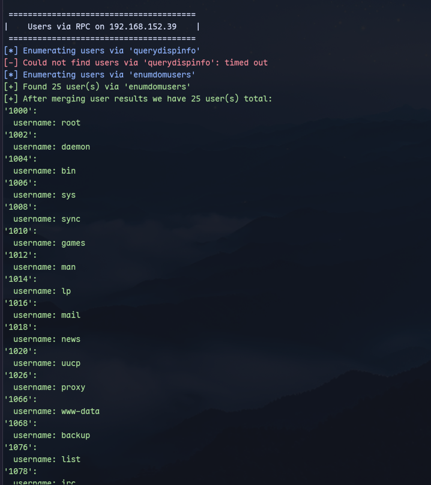

We can get users:
```
enum4linux-ng 192.168.152.39
```

To put it into a file:
```
rpcclient -U "" 192.168.152.39 -N -c "enumdomusers" | grep -oP '\[.*?\]' | grep "0x" -v | tr -d '[]' > userlist.txt
```
