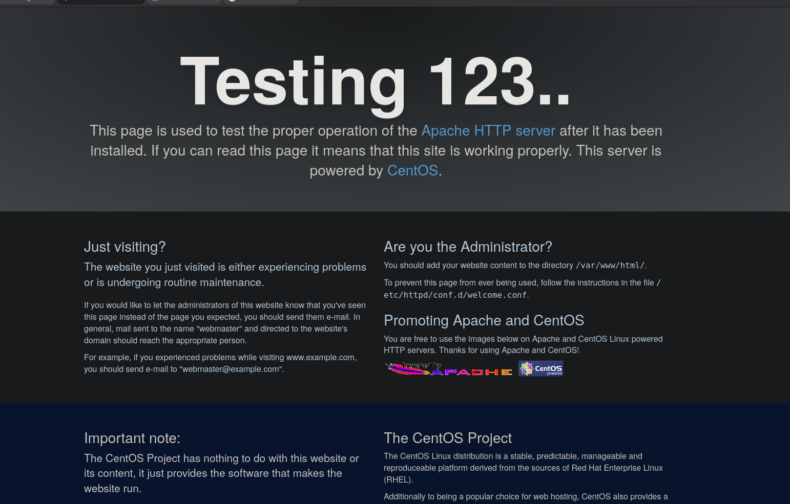

# Mapping
**robots.txt:**
```

```
**.svn:**
```

```
**.DS_STORE**
```

```

# Directory Busting
```
gobuster dir -u ${ip} -w /usr/share/wordlists/dirb/common.txt -t 5
```
```
dirbuster
```
```
feroxbuster -u http://host.domain.tld:80/ -x php -C 404 -A --wordlist '/usr/share/seclists/Discovery/Web-Content/directory-list-2.3-big.txt' -B --auto-tune
```
# PHP

**Check phpinfo or phpmyadmin:**


