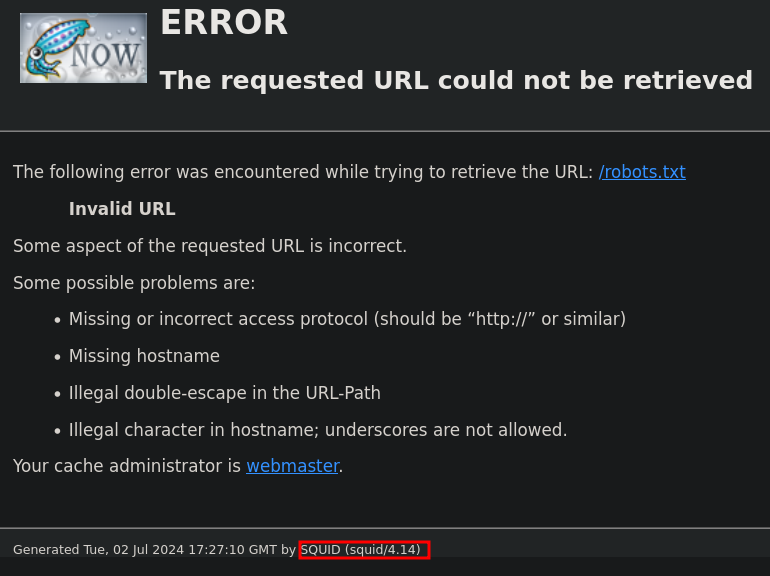
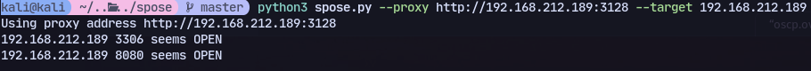

Found a website running squid
http://192.168.212.189:3128/

Try spose:
https://github.com/aancw/spose
```
python3 spose.py --proxy http://192.168.212.189:3128 --target 192.168.212.189
```
We found 8080 and 3306