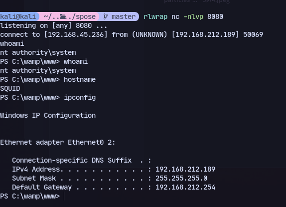

# Host:
```
192.168.212.189
```

# Nmap
```
PORT      STATE SERVICE       REASON          VERSION
135/tcp   open  msrpc         syn-ack ttl 125 Microsoft Windows RPC
139/tcp   open  netbios-ssn   syn-ack ttl 125 Microsoft Windows netbios-ssn
445/tcp   open  microsoft-ds? syn-ack ttl 125
3128/tcp  open  http-proxy    syn-ack ttl 125 Squid http proxy 4.14
|_http-title: ERROR: The requested URL could not be retrieved
|_http-server-header: squid/4.14
49666/tcp open  msrpc         syn-ack ttl 125 Microsoft Windows RPC
49667/tcp open  msrpc         syn-ack ttl 125 Microsoft Windows RPC
```

We got access through exploiting phpmyadmin through port 8080 at http://192.168.212.189:8080/phpmyadmin/server_sql.php
