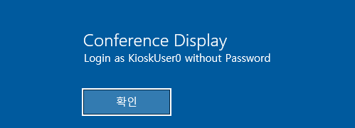
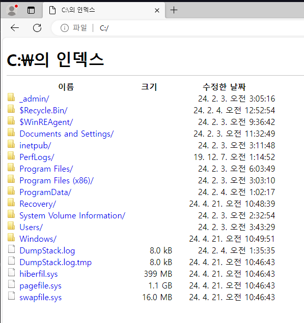
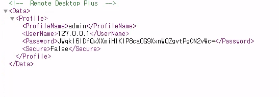
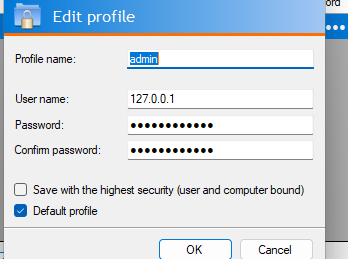
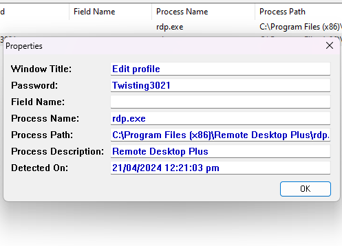
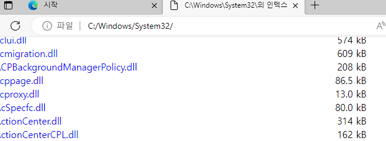
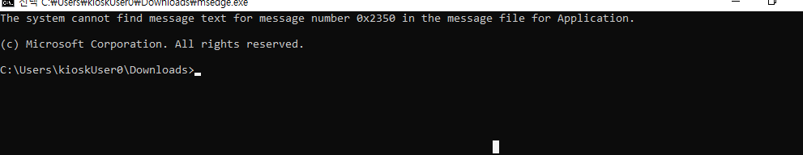
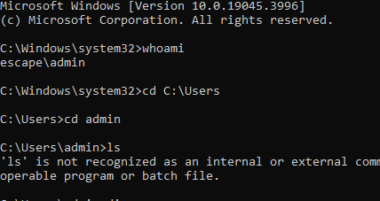

# Enumeration

Using rdesktop we get a display:


We are in kiosk mode as soon as login so opening edge:


We have an encrypted password:


Now transfering the profile to windows and open the profile in remote desktop plus and edit it. With the bulletpass
Now use BulletsPassView and view the password:


But we cant login as we are not in the remote desktop group.

We can try to download cmd.exe from here and rename to msedge


That spawns a cmd shell.


Since we have the admin password we can use runas to run commands
```
runas /user:admin "cmd.exe"
```

Now we get an admin shell:

But we don't have privileges even though we are in administrators group.

To get UAC use:
```
start-process cmd.exe -verb runas
```

Now we get UAC and get an admin shell.


