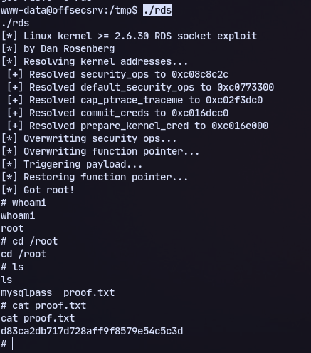

# Host:
```
192.168.212.41
```

# Nmap
```
PORT     STATE SERVICE REASON         VERSION
22/tcp   open  ssh     syn-ack ttl 61 OpenSSH 5.3p1 Debian 3ubuntu7 (Ubuntu 
23/tcp   open  ipp     syn-ack ttl 61 CUPS 1.4
| http-methods: 
|   Supported Methods: GET HEAD OPTIONS POST PUT
|_  Potentially risky methods: PUT
|_http-title: 403 Forbidden
|_http-server-header: CUPS/1.4
80/tcp   open  http    syn-ack ttl 61 Apache httpd 2.2.14 ((Ubuntu))
| http-methods: 
|_  Supported Methods: GET HEAD POST OPTIONS
|_http-title: Site doesn't have a title (text/html).
|_http-server-header: Apache/2.2.14 (Ubuntu)
3306/tcp open  mysql   syn-ack ttl 61 MySQL (unauthorized)
```
UDP?

This one is unusual. After hours of linpeas observation we tried the following exploit:
https://www.exploit-db.com/exploits/15285
```
gcc rds.c -o rds
```
```
./rds
```

We got root.
